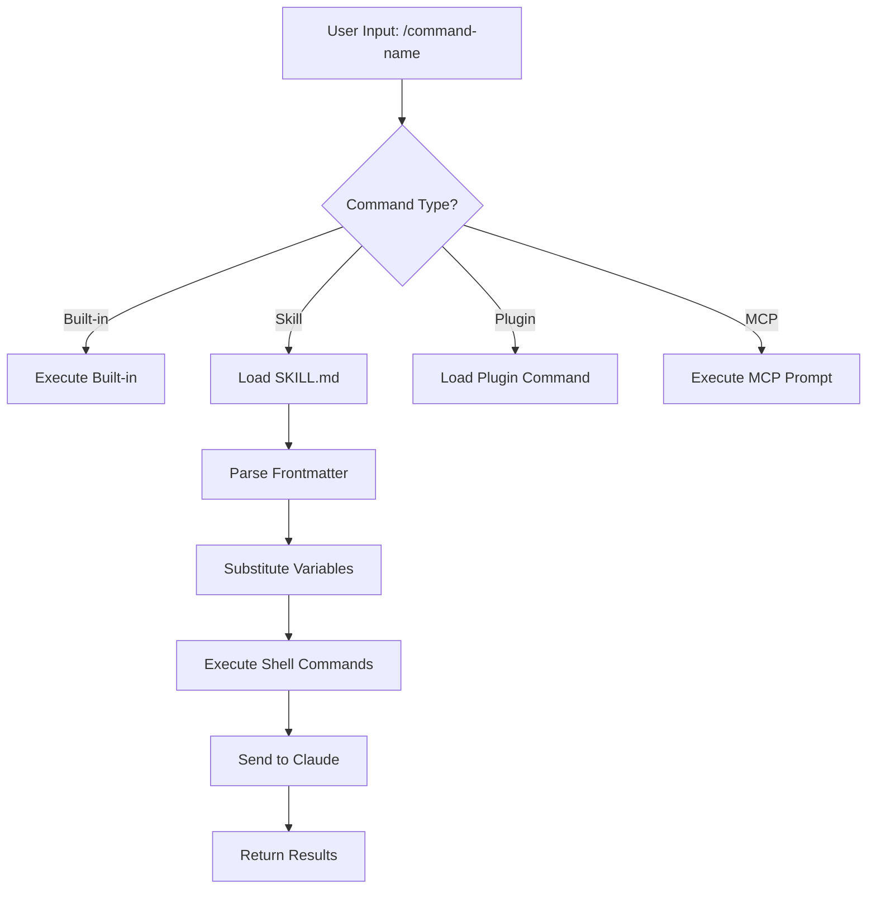
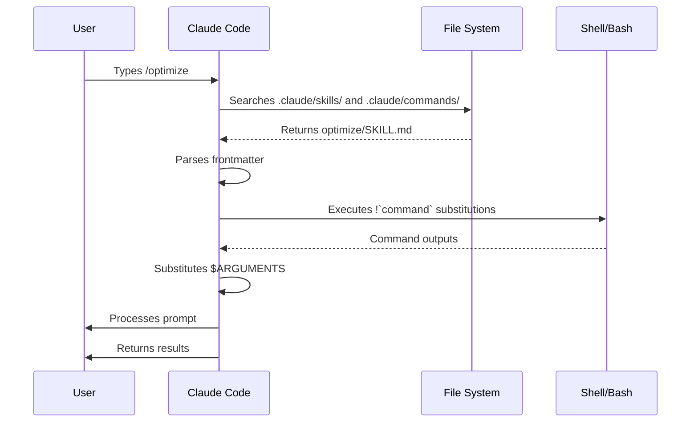

<!-- i18n-source: 01-slash-commands/README.md -->
<!-- i18n-source-sha: TBD -->
<!-- i18n-date: 2026-07-01 -->

<picture>
  <source media="(prefers-color-scheme: dark)" srcset="../../resources/logos/claude-howto-logo-dark.svg">
  
</picture>

# 슬래시 명령어

## 개요

슬래시 명령어는 인터랙티브 세션 중 Claude의 동작을 제어하는 단축키입니다. 여러 유형이 있습니다:

- **내장 커맨드**: Claude Code에서 제공 (`/help`, `/clear`, `/model`)
- **스킬**: `SKILL.md` 파일로 생성된 사용자 정의 커맨드 (`/optimize`, `/pr`)
- **플러그인 커맨드**: 설치된 플러그인의 커맨드 (`/frontend-design:frontend-design`)
- **MCP 프롬프트**: MCP 서버의 커맨드 (`/mcp__github__list_prs`)

> **참고**: 사용자 정의 슬래시 명령어는 스킬에 통합되었습니다. `.claude/commands/` 파일은 여전히 작동하지만, 스킬(`.claude/skills/`)이 이제 권장 방식입니다. 둘 다 `/command-name` 단축키를 만듭니다. 자세한 내용은 [스킬 가이드](../03-skills/)를 참조하세요.

## 내장 커맨드 참조

내장 커맨드는 일반적인 작업을 위한 단축키입니다. **60개 이상의 내장 커맨드**와 **5개의 번들 스킬**이 있습니다. Claude Code에서 `/`를 입력하면 전체 목록을 보거나 `/` 다음에 문자를 입력하여 필터링할 수 있습니다.

| 커맨드 | 목적 |
|---------|---------|
| `/add-dir <path>` | 작업 디렉토리 추가 |
| `/agents` | 에이전트 설정 관리 |
| `/branch [name]` | 대화를 새 세션으로 분기 (별칭: `/fork`). 참고: `/fork`는 v2.1.77에서 `/branch`로 이름 변경됨 |
| `/btw <question>` | Claude가 메인 작업을 수행하는 동안 일시적인 사이드 질문; 메인 대화 컨텍스트를 오염시키지 않음 |
| `/cd <path>` | 프롬프트 캐시를 깨지 않고 세션을 새 작업 디렉토리로 이동 (v2.1.169 추가) |
| `/chrome` | Chrome 브라우저 통합 설정 |
| `/clear` | 대화 지우기 (별칭: `/reset`, `/new`) |
| `/color [color\|default]` | 프롬프트 바 색상 설정. 인자 없는 `/color`는 무작위 세션 색상을 선택합니다(v2.1.128+); 색상 이름이나 hex를 전달하여 명시적으로 설정 가능 |
| `/compact [instructions]` | 선택적 포커스 지침과 함께 대화 압축 |
| `/config` | 설정 열기 (별칭: `/settings`) |
| `/context` | 컨텍스트 사용량을 컬러 그리드로 시각화 |
| `/copy [N]` | 어시스턴트 응답을 클립보드에 복사; `w`는 파일에 씀 |
| `/cost` | `/usage`의 타이핑 단축키 별칭 — 비용 탭 열기 (v2.1.118+) |
| `/desktop` | 데스크탑 앱에서 계속 (별칭: `/app`) |
| `/diff` | 커밋되지 않은 변경사항을 위한 인터랙티브 diff 뷰어 |
| `/doctor` | 설치 상태 진단 — Claude가 응답 중에도 열 수 있음; 상태 아이콘 표시; `f`를 눌러 문제 자동 수정 (v2.1.116에서 개선; v2.1.178에서 평면 트리와 더 선명한 아이콘으로 레이아웃 개선) |
| `/effort [low\|medium\|high\|xhigh\|max\|auto]` | 인터랙티브 화살표 키 슬라이더로 노력 수준 설정. 레벨: `low` → `medium` → `high` → `xhigh` (v2.1.111 신규) → `max`. 기본값은 Opus 4.8에서 `high` (Opus 4.7에서 `xhigh`); `xhigh`는 Opus 4.8 또는 4.7 필요; `max`는 Opus 4.8/4.7/4.6 및 Sonnet 4.6에서 작동. 메뉴에는 `ultracode`도 있음 (모델 노력 수준이 아님 — `xhigh`를 보내고 Claude가 동적 워크플로우를 조율하도록 함; 세션 전용) |
| `/exit` | REPL 종료 (별칭: `/quit`) |
| `/export [filename]` | 현재 대화를 파일이나 클립보드로 내보내기 |
| `/usage-credits` | 속도 제한을 위한 추가 사용량 설정 (v2.1.144에서 `/extra-usage`에서 이름 변경; `/extra-usage`는 여전히 별칭으로 작동) |
| `/fast [on\|off]` | 빠른 모드 전환 |
| `/feedback` | 피드백 제출 (별칭: `/bug`). v2.1.141부터 최근 세션(지난 24시간 또는 7일)을 첨부할 수 있어 여러 세션에 걸친 보고서에 컨텍스트 포함 가능. v2.1.178부터 `/bug`는 설명이 있어야 제출 가능 |
| `/focus` | 포커스 뷰 전환 (v2.1.110 추가; 포커스 토글을 위한 `Ctrl+O` 대체) |
| `/goal <statement>` | 세션 수준 완료 조건 등록; Claude가 목표가 달성될 때까지 계속 작업. `/goal clear`는 제거. 활성 목표는 상태 표시줄에 나타나며, 경과 시간, 턴 수, 토큰 사용량을 보여주는 라이브 오버레이 패널이 표시됨 (v2.1.139 추가) |
| `/help` | 도움말 표시 |
| `/hooks` | 훅 설정 보기 |
| `/ide` | IDE 통합 관리 |
| `/init` | `CLAUDE.md` 초기화. 인터랙티브 플로우를 위해 `CLAUDE_CODE_NEW_INIT=1` 설정 |
| `/insights` | 세션 분석 보고서 생성 |
| `/install-github-app` | GitHub Actions 앱 설정 |
| `/install-slack-app` | Slack 앱 설치 |
| `/keybindings` | 키바인딩 설정 열기 |
| `/less-permission-prompts` | 최근 Bash/MCP 도구 호출을 분석하고 우선순위가 지정된 허용 목록을 `.claude/settings.json`에 추가하여 권한 프롬프트를 줄임 (v2.1.111 추가) |
| `/login` | Anthropic 계정 전환 |
| `/logout` | Anthropic 계정에서 로그아웃 |
| `/mcp` | MCP 서버 및 OAuth 관리 |
| `/memory` | `CLAUDE.md` 편집, 자동 메모리 전환 |
| `/mobile` | 모바일 앱용 QR 코드 (별칭: `/ios`, `/android`) |
| `/model [model]` | 왼쪽/오른쪽 화살표로 노력 수준을 선택하며 모델 선택. v2.1.153부터 선택한 모델이 새 세션의 **기본값으로 저장됨** (IDE와 일치); 선택 후 `s`를 누르면 현재 세션에만 적용. (`modelPicker:setAsDefault` 키바인딩이 `modelPicker:thisSessionOnly`로 이름 변경됨; 기존 `d` 동작이 이제 `s`임) |
| `/passes` | Claude Code 무료 주 공유 |
| `/permissions` | 권한 보기/업데이트 (별칭: `/allowed-tools`) |
| `/plan [description]` | 플랜 모드 진입 |
| `/plugin` | 플러그인 관리 |
| `/proactive` | `/loop`의 별칭 (v2.1.105 추가) |
| `/powerup` | 애니메이션 데모와 함께 인터랙티브 레슨으로 기능 발견 |
| `/privacy-settings` | 개인정보 설정 (Pro/Max 전용) |
| `/release-notes` | 변경 로그 보기 |
| `/recap` | 세션으로 돌아올 때 세션 요약/리캡 표시 (v2.1.108 추가) |
| `/reload-plugins` | 활성 플러그인 다시 로드 |
| `/reload-skills` | 세션을 다시 시작하지 않고 스킬 디렉토리 다시 스캔 (v2.1.152 추가) |
| `/remote-control` | claude.ai에서 원격 제어 (별칭: `/rc`) |
| `/remote-env` | 기본 원격 환경 설정 |
| `/rename [name]` | 세션 이름 변경 |
| `/resume [session]` | 대화 재개 (별칭: `/continue`) |
| `/review <pr>` | GitHub PR 리뷰. v2.1.186부터 `/code-review medium`과 동일한 리뷰 엔진 사용. 로컬 작업 중인 diff를 리뷰하려면 `/code-review` 사용 |
| `/rewind` | 대화 및/또는 코드 되감기 (별칭: `/checkpoint`) |
| `/sandbox` | 샌드박스 모드 전환 |
| `/schedule [description]` | Cloud 예약 작업 생성/관리 |
| `/scroll-speed <+N\|-N>` | TUI 라이브 프리뷰 창의 마우스 휠 스크롤 속도를 라이브 프리뷰로 조정. 머신별로 `~/.claude/preferences.json`에 저장됨 (v2.1.139 추가) |
| `/security-review` | 브랜치의 보안 취약점 분석 |
| `/skills` | 사용 가능한 스킬 목록 |
| `/stats` | `/usage`의 타이핑 단축키 별칭 — 통계 탭 열기 (일일 사용량, 세션, 연속일) (v2.1.118+) |
| `/stickers` | Claude Code 스티커 주문 |
| `/status` | 버전, 모델, 계정 표시 |
| `/statusline` | 상태 표시줄 설정 |
| `/tasks` | 백그라운드 작업 목록/관리 |
| `/team-onboarding` | 프로젝트의 Claude Code 설정에서 팀원 온보딩 가이드 생성 (v2.1.101 신규) |
| `/terminal-setup` | 터미널 키바인딩 설정 |
| `/theme` | 테마 선택기 열기 / 사용자 정의 테마 관리 (v2.1.118). `~/.claude/themes/<name>.json`에 JSON으로 사용자 정의 테마 정의 |
| `/tui` | 깜빡임 없는 전체화면 TUI(텍스트 사용자 인터페이스) 모드 전환 (v2.1.110 추가) |
| `/ultraplan <prompt>` | 울트라플랜 세션에서 계획 초안 작성, 브라우저에서 검토 |
| `/ultrareview` | 종합적인 클라우드 기반 코드 리뷰 with 멀티 에이전트 분석 (v2.1.111 추가) |
| `/undo` | `/rewind`의 별칭 (v2.1.108 추가) |
| `/upgrade` | 더 높은 요금제 페이지 열기 |
| `/usage` | 표준 사용량 대시보드 (v2.1.118) — 요금제 사용량 제한, 속도 제한, 비용, 일일 세션 통계 결합. `/cost`와 `/stats`는 특정 탭을 여는 타이핑 단축키 별칭 |
| `/voice` | 푸시투토크 음성 받아쓰기 전환 |
| `/workflows` | 실행 중 및 완료된 동적 워크플로우 실행 보기 (v2.1.154 추가). [동적 워크플로우](../09-advanced-features/README.md#동적-워크플로우) 참조 |

> **`/cd`가 중요한 이유:** 디렉토리를 변경하면 캐시 웜 상태가 손실되어 다음 턴이 더 느리고 비용이 많이 들었습니다; `/cd`는 전환 중에도 프롬프트 캐시를 유지합니다.

### 번들 스킬

다음 스킬은 Claude Code에 포함되어 슬래시 명령어처럼 호출됩니다:

| 스킬 | 목적 |
|-------|---------|
| `/batch <instruction>` | 워크트리를 사용한 대규모 병렬 변경 조율 |
| `/claude-api` | 프로젝트 언어에 맞는 Claude API 참조 로드 |
| `/debug [description]` | 디버그 로깅 활성화 |
| `/loop [interval] <prompt>` | 간격으로 프롬프트 반복 실행 |
| `/code-review [effort]` | 선택한 노력 수준에서 현재 diff의 정확성 버그 검토 (예: `/code-review high`). 원래 v2.1.146에서 `/simplify`를 흡수했으나 v2.1.154에서 `/simplify`가 별도 커맨드로 복귀 |
| `/simplify` | 정리 전용 리뷰 실행 (재사용/단순화/효율성/고수준) 및 수정 적용; 버그를 찾지 **않음** — 버그 검토는 `/code-review` 사용. 잠시 `/code-review --fix`의 별칭이었다가(v2.1.152), v2.1.154에서 정리 전용으로 변경됨 |

### 폐기된 커맨드

| 커맨드 | 상태 |
|---------|--------|
| `/output-style` | v2.1.73부터 폐기 |
| `/fork` | `/branch`로 이름 변경 (별칭은 여전히 작동, v2.1.77) |
| `/pr-comments` | v2.1.91에서 제거 — PR 댓글을 보려면 Claude에게 직접 요청 |
| `/vim` | v2.1.92에서 제거 — /config → Editor 모드 사용 |

### 최근 변경사항

- `/fork`가 `/branch`로 이름 변경되고 `/fork`는 별칭으로 유지 (v2.1.77)
- `/output-style` 폐기 (v2.1.73)
- `/review <pr>`가 이제 `/code-review medium`과 동일한 리뷰 엔진 사용 (v2.1.186)
- `/effort` 커맨드 추가; `max` 레벨은 Opus 4.6+에서 사용 가능 (원래 Opus 4.6 전용)
- `/voice` 커맨드 추가 (푸시투토크 음성 받아쓰기)
- `/schedule` 커맨드 추가 (예약 작업 생성/관리)
- `/color` 커맨드 추가 (프롬프트 바 사용자 정의)
- /pr-comments가 v2.1.91에서 제거 — PR 댓글을 보려면 Claude에게 직접 요청
- /vim이 v2.1.92에서 제거 — /config → Editor 모드 사용
- /ultraplan 추가 (브라우저 기반 계획 검토 및 실행)
- /powerup 추가 (인터랙티브 기능 레슨)
- /sandbox 추가 (샌드박스 모드 전환)
- `/model` 선택기가 이제 원시 모델 ID 대신 사람이 읽을 수 있는 레이블(예: "Sonnet 4.6") 표시
- `/resume`이 `/continue` 별칭 지원
- MCP 프롬프트를 `/mcp__<server>__<prompt>` 커맨드로 사용 가능 ([MCP 프롬프트 as 커맨드](#mcp-프롬프트-as-커맨드) 참조)
- `/team-onboarding` 추가 (팀원 온보딩 가이드 자동 생성, v2.1.101)
- `/tui` 커맨드 추가 (깜빡임 없는 전체화면 TUI 렌더링, v2.1.110)
- `/focus` 커맨드 추가 (포커스 뷰 토글); `Ctrl+O`는 이제 상세 트랜스크립트만 전환 (v2.1.110)
- `/recap` 커맨드 추가 (세션 컨텍스트 리캡 수동 트리거, v2.1.108)
- `/undo`가 `/rewind`의 별칭으로 추가 (v2.1.108)
- `/proactive`가 `/loop`의 별칭으로 추가 (v2.1.105)
- `/effort`에 인터랙티브 화살표 키 슬라이더와 `high`와 `max` 사이의 새로운 `xhigh` 레벨 추가; Opus 4.7 플랜의 기본 노력 수준이 `xhigh`로 상향 (v2.1.111). Opus 4.8에서는 기본값이 `high` (v2.1.154)
- `/ultrareview` 추가 (종합적인 클라우드 기반 멀티 에이전트 코드 리뷰, v2.1.111)
- `/less-permission-prompts` 추가 (Bash/MCP 도구 호출 분석 및 `.claude/settings.json`의 허용 목록을 통해 권한 프롬프트 감소, v2.1.111)
- Opus 4.7의 Max 구독자에게 `--enable-auto-mode` 플래그 없이 자동 모드 사용 가능 (v2.1.112)
- `/goal` 추가 — Claude가 여러 턴에 걸쳐 작업하는 세션 수준 완료 조건; 라이브 오버레이에 경과 시간, 턴 수, 토큰 사용량 표시 (v2.1.139)
- `/scroll-speed` 추가 — TUI 라이브 프리뷰 창의 마우스 휠 스크롤 속도 조정; 머신별로 저장 (v2.1.139)
- `/reload-skills` 추가 — 세션을 다시 시작하지 않고 스킬 디렉토리 다시 스캔 (v2.1.152)
- `/model`이 이제 선택한 모델을 새 세션의 기본값으로 저장; `s`를 누르면 세션 전용 (키바인딩 `modelPicker:setAsDefault` → `modelPicker:thisSessionOnly`) (v2.1.153)
- `/workflows` 추가 — 실행 중 및 완료된 동적 워크플로우 실행 보기 (v2.1.154)
- `/simplify`가 `/code-review`의 버그 찾기와 별개로 정리 전용 리뷰 커맨드로 복귀 (재사용/단순화/효율성/고수준) (v2.1.154)

### `/goal` — 세션 수준 완료 조건

> **v2.1.139 신규**

`/goal`을 사용하여 현재 세션의 완료 조건을 등록합니다. Claude가 여러 턴에 걸쳐 이를 향해 작업하며, 오버레이 패널에 경과 시간, 턴 수, 사용된 토큰이 표시됩니다. `/goal clear`로 해제합니다. 인터랙티브 모드, `claude -p`, 원격 제어에서 작동합니다.

```
사용자: /goal 결제 서비스를 REST에서 gRPC로 마이그레이션하고 통합 테스트가 통과하도록 합니다.
Claude: 목표가 등록되었습니다. 해제할 때까지 이 목표를 향해 작업하겠습니다.
[목표 패널: ⏱ 0s · 턴 0 · 토큰 0]

사용자: REST 엔드포인트를 나열하는 것부터 시작하세요
Claude: [작업 수행, 패널 업데이트]
```

### `/team-onboarding` — 팀원 온보딩 가이드

> **v2.1.101 신규**

`/team-onboarding`을 사용하여 프로젝트의 로컬 Claude Code 사용에서 팀원 온보딩 가이드를 생성합니다. 이 커맨드는 `CLAUDE.md`, 설치된 스킬, 서브에이전트, 훅, 최근 워크플로우를 검사하여 새 개발자가 빠르게 생산성을 발휘할 수 있도록 돕는 온보딩 문서를 생성합니다.

내장 커맨드이므로 설치할 것이 없습니다.

**사용법:**

```bash
claude /team-onboarding
```

생성된 가이드는 다음을 요약합니다:

- [`CLAUDE.md`](../02-memory/README.md)의 프로젝트 목적 및 주요 규칙
- 사용 가능한 [스킬](../03-skills/README.md)과 자동 호출 시점
- 설정된 [서브에이전트](../04-subagents/README.md)와 그 책임
- 일반적인 이벤트에서 실행되는 [훅](../06-hooks/README.md)
- 새내기가 알아야 할 일반적인 워크플로우

**가용성:** Claude Code v2.1.101 (2026년 4월 11일)부터 제공.

## 사용자 정의 커맨드 (현재 스킬)

사용자 정의 슬래시 명령어는 **스킬에 통합**되었습니다. 두 접근 방식 모두 `/command-name`으로 호출할 수 있는 커맨드를 만듭니다:

| 접근 방식 | 위치 | 상태 |
|----------|----------|--------|
| **스킬 (권장)** | `.claude/skills/<name>/SKILL.md` | 현재 표준 |
| **레거시 커맨드** | `.claude/commands/<name>.md` | 여전히 작동 |

스킬과 커맨드가 같은 이름을 공유하면 **스킬이 우선**합니다. 예를 들어 `.claude/commands/review.md`와 `.claude/skills/review/SKILL.md`가 모두 있으면 스킬 버전이 사용됩니다.

### 마이그레이션 경로

기존 `.claude/commands/` 파일은 변경 없이 계속 작동합니다. 스킬로 마이그레이션하려면:

**이전 (커맨드):**
```
.claude/commands/optimize.md
```

**이후 (스킬):**
```
.claude/skills/optimize/SKILL.md
```

### 스킬을 사용하는 이유

스킬은 레거시 커맨드보다 추가 기능을 제공합니다:

- **디렉토리 구조**: 스크립트, 템플릿, 참조 파일을 번들로 제공
- **자동 호출**: 관련 있을 때 Claude가 스킬을 자동으로 트리거 가능
- **호출 제어**: 사용자, Claude 또는 둘 다 호출할 수 있는지 선택
- **서브에이전트 실행**: `context: fork`로 격리된 컨텍스트에서 스킬 실행
- **점진적 공개**: 필요할 때만 추가 파일 로드

### 스킬로 사용자 정의 커맨드 생성

`SKILL.md` 파일이 있는 디렉토리를 생성합니다:

```bash
mkdir -p .claude/skills/my-command
```

**파일:** `.claude/skills/my-command/SKILL.md`

```yaml
---
name: my-command
description: 이 커맨드의 기능과 사용 시기
---

# My Command

이 커맨드가 호출될 때 Claude가 따라야 할 지침입니다.

1. 첫 번째 단계
2. 두 번째 단계
3. 세 번째 단계
```

### 프론트매터 참조

| 필드 | 목적 | 기본값 |
|-------|---------|---------|
| `name` | 커맨드 이름 (`/name`이 됨) | 디렉토리 이름 |
| `description` | 간단한 설명 (Claude가 사용 시기를 알게 함) | 첫 번째 문단 |
| `argument-hint` | 자동 완성을 위한 예상 인자 | 없음 |
| `allowed-tools` | 권한 없이 사용할 수 있는 도구 | 상속 |
| `model` | 사용할 특정 모델 | 상속 |
| `disable-model-invocation` | `true`면 사용자만 호출 가능 (Claude 불가) | `false` |
| `user-invocable` | `false`면 `/` 메뉴에서 숨김 | `true` |
| `context` | 격리된 서브에이전트에서 실행하려면 `fork`로 설정 | 없음 |
| `agent` | `context: fork` 사용 시 에이전트 유형 | `general-purpose` |
| `hooks` | 스킬 범위의 훅 (PreToolUse, PostToolUse, Stop) | 없음 |

### 인자

커맨드는 인자를 받을 수 있습니다:

**`$ARGUMENTS`로 모든 인자:**

```yaml
---
name: fix-issue
description: GitHub 이슈를 번호로 수정
---

#${ARGUMENTS} 이슈를 코딩 표준에 따라 수정
```

사용법: `/fix-issue 123` → `$ARGUMENTS`가 "123"이 됨

**`$0`, `$1` 등으로 개별 인자:**

```yaml
---
name: review-pr
description: PR을 우선순위로 검토
---

#${0} PR을 ${1} 우선순위로 검토
```

사용법: `/review-pr 456 high` → `$0`="456", `$1`="high"

### 셸 커맨드로 동적 컨텍스트

`` !`command` ``를 사용하여 프롬프트 전에 bash 커맨드 실행:

```yaml
---
name: commit
description: 컨텍스트와 함께 git 커밋 생성
allowed-tools: Bash(git *)
---

## 컨텍스트

- 현재 git 상태: !`git status`
- 현재 git diff: !`git diff HEAD`
- 현재 브랜치: !`git branch --show-current`
- 최근 커밋: !`git log --oneline -5`

## 작업

위 변경사항을 기반으로 단일 git 커밋을 생성합니다.
```

### 파일 참조

`@`를 사용하여 파일 내용 포함:

```markdown
@src/utils/helpers.js의 구현 검토
@src/old-version.js를 @src/new-version.js와 비교
```

## 플러그인 커맨드

플러그인은 사용자 정의 커맨드를 제공할 수 있습니다:

```
/plugin-name:command-name
```

또는 이름 충돌이 없으면 `/command-name`으로 사용 가능합니다.

**예제:**
```bash
/frontend-design:frontend-design
/commit-commands:commit
```

## MCP 프롬프트 as 커맨드

MCP 서버는 프롬프트를 슬래시 명령어로 노출할 수 있습니다:

```
/mcp__<server-name>__<prompt-name> [arguments]
```

**예제:**
```bash
/mcp__github__list_prs
/mcp__github__pr_review 456
/mcp__jira__create_issue "Bug title" high
```

### MCP 권한 구문

권한에서 MCP 서버 접근 제어:

- `mcp__github` - 전체 GitHub MCP 서버 접근
- `mcp__github__*` - 모든 도구에 대한 와일드카드 접근
- `mcp__github__get_issue` - 특정 도구 접근

## 커맨드 아키텍처



## 커맨드 생명주기



## 이 폴더의 사용 가능한 커맨드

이 예제 커맨드는 스킬 또는 레거시 커맨드로 설치할 수 있습니다.

### 1. `/optimize` - 코드 최적화

성능 문제, 메모리 누수, 최적화 기회를 분석합니다.

**사용법:**
```
/optimize
[코드 붙여넣기]
```

### 2. `/pr` - 풀 리퀘스트 준비

린팅, 테스트, 커밋 형식 지정을 포함한 PR 준비 체크리스트를 안내합니다.

**사용법:**
```
/pr
```

**스크린샷:**


### 3. `/generate-api-docs` - API 문서 생성기

소스 코드에서 종합적인 API 문서를 생성합니다.

**사용법:**
```
/generate-api-docs
```

### 4. `/commit` - 컨텍스트가 있는 Git 커밋

저장소의 동적 컨텍스트로 git 커밋을 생성합니다.

**사용법:**
```
/commit [선택적 메시지]
```

### 5. `/push-all` - 스테이징, 커밋 및 푸시

모든 변경사항을 스테이징하고, 커밋을 생성하며, 안전 검사와 함께 원격으로 푸시합니다.

**사용법:**
```
/push-all
```

**안전 검사:**
- 시크릿: `.env*`, `*.key`, `*.pem`, `credentials.json`
- API 키: 실제 키 vs 플레이스홀더 감지
- 대용량 파일: Git LFS 없이 `>10MB`
- 빌드 아티팩트: `node_modules/`, `dist/`, `__pycache__/`

### 6. `/doc-refactor` - 문서 구조 개선

명확성과 접근성을 위해 프로젝트 문서 구조를 개선합니다.

**사용법:**
```
/doc-refactor
```

### 7. `/setup-ci-cd` - CI/CD 파이프라인 설정

품질 보증을 위한 pre-commit 훅과 GitHub Actions을 구현합니다.

**사용법:**
```
/setup-ci-cd
```

### 8. `/unit-test-expand` - 테스트 커버리지 확장

테스트되지 않은 브랜치와 엣지 케이스를 대상으로 테스트 커버리지를 늘립니다.

**사용법:**
```
/unit-test-expand
```

## 설치

### 스킬로 (권장)

스킬 디렉토리에 복사:

```bash
# 스킬 디렉토리 생성
mkdir -p .claude/skills

# 각 커맨드 파일에 대해 스킬 디렉토리 생성
for cmd in optimize pr commit; do
  mkdir -p .claude/skills/$cmd
  cp 01-slash-commands/$cmd.md .claude/skills/$cmd/SKILL.md
done
```

### 레거시 커맨드로

커맨드 디렉토리에 복사:

```bash
# 프로젝트 전체 (팀)
mkdir -p .claude/commands
cp 01-slash-commands/*.md .claude/commands/

# 개인용
mkdir -p ~/.claude/commands
cp 01-slash-commands/*.md ~/.claude/commands/
```

## 나만의 커맨드 만들기

### 스킬 템플릿 (권장)

`.claude/skills/my-command/SKILL.md` 생성:

```yaml
---
name: my-command
description: 이 커맨드의 기능. [트리거 조건]에서 사용.
argument-hint: [선택적-인자]
allowed-tools: Bash(npm *), Read, Grep
---

# 커맨드 제목

## 컨텍스트

- 현재 브랜치: !`git branch --show-current`
- 관련 파일: @package.json

## 지침

1. 첫 번째 단계
2. 인자를 사용한 두 번째 단계: $ARGUMENTS
3. 세 번째 단계

## 출력 형식

- 응답 형식 지정 방법
- 포함할 내용
```

### 사용자 전용 커맨드 (자동 호출 불가)

Claude가 자동으로 트리거하지 말아야 할 부작용이 있는 커맨드:

```yaml
---
name: deploy
description: 프로덕션에 배포
disable-model-invocation: true
allowed-tools: Bash(npm *), Bash(git *)
---

애플리케이션을 프로덕션에 배포:

1. 테스트 실행
2. 애플리케이션 빌드
3. 배포 대상에 푸시
4. 배포 확인
```

## 모범 사례

| 권장 | 비권장 |
|------|---------|
| 명확하고 행동 지향적인 이름 사용 | 일회성 작업을 위한 커맨드 생성 |
| 트리거 조건이 있는 `description` 포함 | 커맨드에 복잡한 로직 구축 |
| 커맨드를 단일 작업에 집중 | 민감한 정보 하드코딩 |
| 부작용에는 `disable-model-invocation` 사용 | 설명 필드 생략 |
| 동적 컨텍스트에는 `!` 접두사 사용 | Claude가 현재 상태를 알고 있다고 가정 |
| 스킬 디렉토리에 관련 파일 구성 | 모든 것을 하나의 파일에 넣기 |

## 문제 해결

### 커맨드를 찾을 수 없음

**해결 방법:**
- 파일이 `.claude/skills/<name>/SKILL.md` 또는 `.claude/commands/<name>.md`에 있는지 확인
- 프론트매터의 `name` 필드가 예상 커맨드 이름과 일치하는지 확인
- Claude Code 세션 다시 시작
- `/help`를 실행하여 사용 가능한 커맨드 확인

### 커맨드가 예상대로 실행되지 않음

**해결 방법:**
- 더 구체적인 지침 추가
- 스킬 파일에 예제 포함
- bash 커맨드 사용 시 `allowed-tools` 확인
- 간단한 입력으로 먼저 테스트

### 스킬 vs 커맨드 충돌

같은 이름으로 둘 다 존재하면 **스킬이 우선**합니다. 하나를 제거하거나 이름을 변경하세요.

## 관련 가이드

- **[스킬](../03-skills/)** - 스킬 전체 참조 (자동 호출 기능)
- **[메모리](../02-memory/)** - CLAUDE.md를 통한 영구 컨텍스트
- **[서브에이전트](../04-subagents/)** - 위임된 AI 에이전트
- **[플러그인](../07-plugins/)** - 번들 커맨드 컬렉션
- **[훅](../06-hooks/)** - 이벤트 기반 자동화

## 추가 자료

- [공식 인터랙티브 모드 문서](https://code.claude.com/docs/en/interactive-mode) - 내장 커맨드 참조
- [공식 스킬 문서](https://code.claude.com/docs/en/skills) - 전체 스킬 참조
- [CLI 참조](https://code.claude.com/docs/en/cli-reference) - 커맨드라인 옵션

---

**최종 업데이트**: 2026년 6월 24일
**Claude Code 버전**: 2.1.187
**출처**:
- https://code.claude.com/docs/en/slash-commands
- https://code.claude.com/docs/en/interactive-mode
- https://code.claude.com/docs/en/changelog
- https://code.claude.com/docs/en/commands
- https://code.claude.com/docs/en/model-config
- https://github.com/anthropics/claude-code/blob/main/CHANGELOG.md
- https://docs.anthropic.com/en/docs/claude-code/slash-commands
- https://github.com/anthropics/claude-code/releases/tag/v2.1.139
- https://github.com/anthropics/claude-code/releases/tag/v2.1.144
- https://github.com/anthropics/claude-code/releases/tag/v2.1.152
- https://github.com/anthropics/claude-code/releases/tag/v2.1.153
- https://github.com/anthropics/claude-code/releases/tag/v2.1.154
**호환 모델**: Claude Sonnet 4.6, Claude Opus 4.8, Claude Haiku 4.5

*[Claude How To](../) 가이드 시리즈의 일부*
