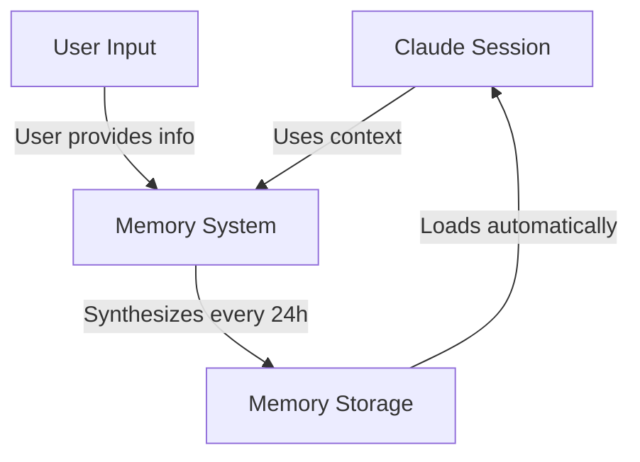
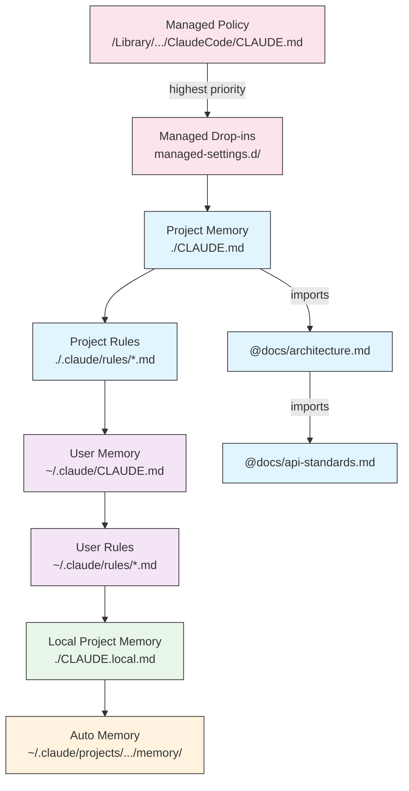
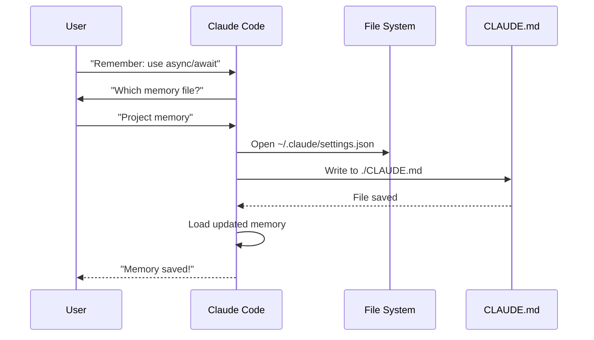
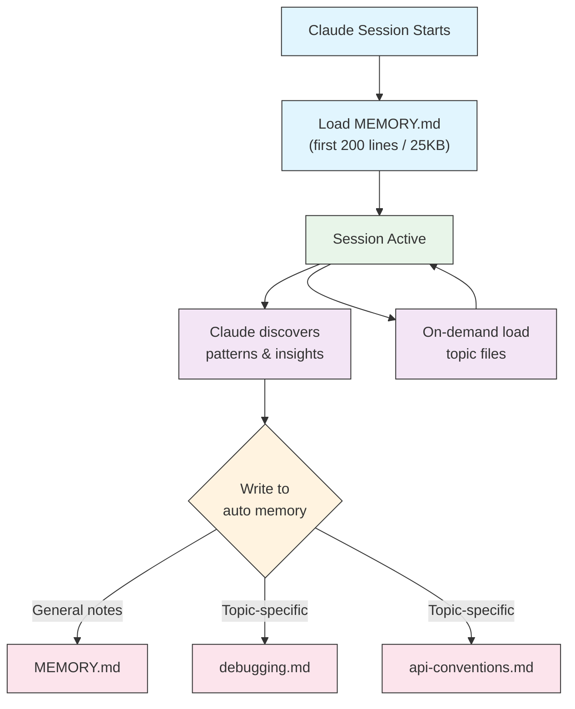

<!-- i18n-source: 02-memory/README.md -->
<!-- i18n-source-sha: TBD -->
<!-- i18n-date: 2026-07-01 -->

<picture>
  <source media="(prefers-color-scheme: dark)" srcset="../../resources/logos/claude-howto-logo-dark.svg">
  
</picture>

# 메모리 가이드

메모리는 Claude가 세션과 대화 전반에 걸쳐 컨텍스트를 유지할 수 있게 합니다. claude.ai의 자동 합성과 Claude Code의 파일시스템 기반 CLAUDE.md 두 가지 형태로 존재합니다.

## 개요

Claude Code의 메모리는 여러 세션과 대화에 걸쳐 지속되는 영구 컨텍스트를 제공합니다. 일시적인 컨텍스트 윈도우와 달리 메모리 파일을 사용하면 다음을 할 수 있습니다:

- 팀 전체에 프로젝트 표준 공유
- 개인 개발 환경 설정 저장
- 디렉토리별 규칙 및 설정 유지
- 외부 문서 가져오기
- 프로젝트의 일부로 메모리 버전 관리

메모리 시스템은 전역 개인 환경 설정에서 특정 하위 디렉토리까지 여러 수준에서 작동하여 Claude가 기억하는 내용과 해당 지식을 적용하는 방법을 세밀하게 제어할 수 있습니다.

## 메모리 커맨드 빠른 참조

| 커맨드 | 목적 | 사용법 | 사용 시기 |
|---------|---------|-------|-------------|
| `/init` | 프로젝트 메모리 초기화 | `/init` | 새 프로젝트 시작, 첫 CLAUDE.md 설정 |
| `/memory` | 편집기에서 메모리 파일 편집 | `/memory` | 대규모 업데이트, 재구성, 내용 검토 |
| `#` 접두사 | ~~빠른 한 줄 메모리 추가~~ **중단됨** | — | 대신 `/memory`를 사용하거나 대화식으로 요청 |
| `@path/to/file` | 외부 콘텐츠 가져오기 | `@README.md` 또는 `@docs/api.md` | CLAUDE.md에서 기존 문서 참조 |

## 빠른 시작: 메모리 초기화

### `/init` 커맨드

`/init` 커맨드는 Claude Code에서 프로젝트 메모리를 설정하는 가장 빠른 방법입니다. 기본 프로젝트 문서로 CLAUDE.md 파일을 초기화합니다.

**사용법:**

```bash
/init
```

**기능:**

- 프로젝트에 새 CLAUDE.md 파일 생성 (일반적으로 `./CLAUDE.md` 또는 `./.claude/CLAUDE.md`)
- 프로젝트 규칙 및 가이드라인 설정
- 세션 간 컨텍스트 지속성을 위한 기반 마련
- 프로젝트 표준 문서화를 위한 템플릿 구조 제공

**향상된 인터랙티브 모드:** `CLAUDE_CODE_NEW_INIT=1`을 설정하여 프로젝트 설정을 단계별로 안내하는 다단계 인터랙티브 플로우 활성화:

```bash
CLAUDE_CODE_NEW_INIT=1 claude
/init
```

**`/init` 사용 시기:**

- Claude Code로 새 프로젝트 시작
- 팀 코딩 표준 및 규칙 설정
- 코드베이스 구조에 대한 문서 생성
- 협업 개발을 위한 메모리 계층 구조 설정

**예제 워크플로우:**

```markdown
# 프로젝트 디렉토리에서
/init

# Claude가 다음과 같은 구조로 CLAUDE.md를 생성합니다:
# 프로젝트 설정
## 프로젝트 개요
- 이름: Your Project
- 기술 스택: [Your technologies]
- 팀 규모: [Number of developers]

## 개발 표준
- 코드 스타일 환경 설정
- 테스트 요구사항
- Git 워크플로우 규칙
```

### 빠른 메모리 업데이트

> **참고**: 인라인 메모리 `#` 단축키는 중단되었습니다. `/memory`를 사용하여 메모리 파일을 직접 편집하거나 Claude에게 대화식으로 기억하도록 요청하세요 (예: "이 프로젝트에서는 항상 TypeScript strict mode를 사용한다고 기억해줘").

메모리에 정보를 추가하는 권장 방법:

**방법 1: `/memory` 커맨드 사용**

```bash
/memory
```

시스템 편집기에서 메모리 파일을 열어 직접 편집합니다.

**방법 2: 대화식으로 요청**

```
기억해줘: 이 프로젝트에서는 항상 TypeScript strict mode를 사용합니다.
메모리에 추가: async/await보다 promise 체인을 선호합니다.
```

Claude가 요청에 따라 적절한 CLAUDE.md 파일을 업데이트합니다.

**히스토리컬 참조** (더 이상 작동하지 않음):

`#` 접두사 단축키는 이전에 인라인 규칙 추가를 허용했습니다:

```markdown
# 이 프로젝트에서는 항상 TypeScript strict mode를 사용합니다  ← 더 이상 작동하지 않음
```

이 패턴에 의존했다면 `/memory` 커맨드 또는 대화식 요청으로 전환하세요.

### `/memory` 커맨드

`/memory` 커맨드는 Claude Code 세션 내에서 CLAUDE.md 메모리 파일을 편집할 수 있는 직접 접근을 제공합니다. 시스템 편집기에서 메모리 파일을 열어 종합적인 편집이 가능합니다.

**사용법:**

```bash
/memory
```

**기능:**

- 시스템의 기본 편집기에서 메모리 파일 열기
- 대규모 추가, 수정, 재구성 허용
- 계층 구조의 모든 메모리 파일에 직접 접근 제공
- 세션 간 영구 컨텍스트 관리 가능

**`/memory` 사용 시기:**

- 기존 메모리 내용 검토
- 프로젝트 표준에 대한 대규모 업데이트
- 메모리 구조 재구성
- 상세 문서 또는 가이드라인 추가
- 프로젝트 발전에 따른 메모리 유지보수 및 업데이트

**비교: `/memory` vs `/init`**

| 측면 | `/memory` | `/init` |
|--------|-----------|---------|
| **목적** | 기존 메모리 파일 편집 | 새 CLAUDE.md 초기화 |
| **사용 시기** | 프로젝트 컨텍스트 업데이트/수정 | 새 프로젝트 시작 |
| **동작** | 변경을 위해 편집기 열기 | 시작 템플릿 생성 |
| **워크플로우** | 지속적인 유지보수 | 일회성 설정 |

**예제 워크플로우:**

```markdown
# 편집을 위해 메모리 열기
/memory

# Claude가 옵션 제시:
# 1. Managed Policy Memory
# 2. Project Memory (./CLAUDE.md)
# 3. User Memory (~/.claude/CLAUDE.md)
# 4. Local Project Memory

# 옵션 2 (Project Memory) 선택
# 기본 편집기가 ./CLAUDE.md 내용과 함께 열림

# 변경하고 저장한 후 편집기 닫기
# Claude가 자동으로 업데이트된 메모리 다시 로드
```

**메모리 가져오기 사용:**

CLAUDE.md 파일은 `@path/to/file` 구문을 지원하여 외부 콘텐츠를 포함합니다:

```markdown
# 프로젝트 문서
프로젝트 개요는 @README.md 참조
사용 가능한 npm 커맨드는 @package.json 참조
시스템 설계는 @docs/architecture.md 참조

# 절대 경로를 사용하여 홈 디렉토리에서 가져오기
@~/.claude/my-project-instructions.md
```

**가져오기 기능:**

- 상대 경로와 절대 경로 모두 지원 (예: `@docs/api.md` 또는 `@~/.claude/my-project-instructions.md`)
- 최대 깊이 5의 재귀적 가져오기 지원
- 외부 위치에서 처음 가져올 때 보안을 위한 승인 대화상자 표시
- 가져오기 지시문은 마크다운 코드 스팬이나 코드 블록 내에서는 평가되지 않음 (예제에서 문서화하는 것은 안전)
- 기존 문서를 참조하여 중복 방지
- 참조된 콘텐츠를 Claude의 컨텍스트에 자동 포함

## 메모리 아키텍처

Claude Code의 메모리는 각 범위가 다른 목적을 제공하는 계층 구조를 따릅니다:



## Claude Code의 메모리 계층 구조

Claude Code는 다중 계층 계층형 메모리 시스템을 사용합니다. Claude Code가 시작될 때 메모리 파일이 자동으로 로드되며, 상위 레벨 파일이 우선합니다.

**전체 메모리 계층 구조 (우선순위 순):**

1. **Managed Policy** - 조직 전체 지침
   - macOS: `/Library/Application Support/ClaudeCode/CLAUDE.md`
   - Linux/WSL: `/etc/claude-code/CLAUDE.md`
   - Windows: `C:\Program Files\ClaudeCode\CLAUDE.md`

2. **Managed Drop-ins** - 알파벳 순으로 병합되는 정책 파일 (v2.1.83+)
   - Managed policy CLAUDE.md와 함께 `managed-settings.d/` 디렉토리
   - 파일은 모듈식 정책 관리를 위해 알파벳 순으로 병합됨

3. **Project Memory** - 팀 공유 컨텍스트 (버전 관리)
   - `./.claude/CLAUDE.md` 또는 `./CLAUDE.md` (저장소 루트)

4. **Project Rules** - 모듈식, 주제별 프로젝트 지침
   - `./.claude/rules/*.md`

5. **User Memory** - 개인 환경 설정 (모든 프로젝트)
   - `~/.claude/CLAUDE.md`

6. **User-Level Rules** - 개인 규칙 (모든 프로젝트)
   - `~/.claude/rules/*.md`

7. **Local Project Memory** - 개인 프로젝트별 환경 설정
   - `./CLAUDE.local.md`

> **참고**: `CLAUDE.local.md`는 [공식 문서](https://code.claude.com/docs/en/memory)에서 완전히 지원되고 문서화되어 있습니다. 버전 관리에 커밋되지 않는 개인 프로젝트별 환경 설정을 제공합니다. `CLAUDE.local.md`를 `.gitignore`에 추가하세요.

8. **Auto Memory** - Claude의 자동 노트 및 학습
   - `~/.claude/projects/<project>/memory/`

**메모리 탐색 동작:**

Claude는 이 순서대로 메모리 파일을 검색하며, 이전 위치가 우선합니다:



## `claudeMdExcludes`로 CLAUDE.md 파일 제외

대규모 모노레포에서 일부 CLAUDE.md 파일이 현재 작업과 관련 없을 수 있습니다. `claudeMdExcludes` 설정을 사용하면 특정 CLAUDE.md 파일을 건너뛰어 컨텍스트에 로드되지 않도록 할 수 있습니다:

```jsonc
// ~/.claude/settings.json 또는 .claude/settings.json
{
  "claudeMdExcludes": [
    "packages/legacy-app/CLAUDE.md",
    "vendors/**/CLAUDE.md"
  ]
}
```

패턴은 프로젝트 루트를 기준으로 한 상대 경로와 일치합니다. 이는 특히 다음과 같은 경우에 유용합니다:

- 많은 하위 프로젝트가 있는 모노레포에서 일부만 관련된 경우
- 벤더 또는 타사 CLAUDE.md 파일이 포함된 저장소
- 오래되었거나 관련 없는 지침을 제외하여 Claude의 컨텍스트 윈도우 노이즈 감소

## 설정 파일 계층 구조

Claude Code 설정(`autoMemoryDirectory`, `claudeMdExcludes` 및 기타 설정 포함)은 5단계 계층 구조에서 해결되며, 상위 레벨이 우선합니다:

| 레벨 | 위치 | 범위 |
|-------|----------|-------|
| 1 (최고) | Managed policy (시스템 레벨) | 조직 전체 적용 |
| 2 | `managed-settings.d/` (v2.1.83+) | 모듈식 정책 드롭인, 알파벳 순 병합 |
| 3 | `.claude/settings.local.json` | 로컬 재정의 (git에서 무시) |
| 4 | `.claude/settings.json` | 프로젝트 레벨 (git에 커밋) |
| 5 (최저) | `~/.claude/settings.json` | 사용자 환경 설정 |

**플랫폼별 설정 (v2.1.51+):**

설정은 다음을 통해서도 구성할 수 있습니다:
- **macOS**: Property list (plist) 파일
- **Windows**: Windows 레지스트리

이러한 플랫폼 네이티브 메커니즘은 JSON 설정 파일과 함께 읽히며 동일한 우선순위 규칙을 따릅니다.

> **참고 (v2.1.119)**: `/config` 변경사항이 이제 `~/.claude/settings.json`에 유지됩니다. `/config`를 통해 작성된 값은 위에서 설명한 일반 정책/로컬/프로젝트 우선순위 체인에 참여하며, 더 이상 세션 전용이 아닙니다. 인터랙티브 편집에는 `/config`를 사용하고, 스크립트 또는 관리 설정에는 `settings.json` 파일을 직접 편집하세요.

### 보존 및 정리 설정

| 설정 | 타입 | 기본값 | 설명 |
|---------|------|---------|-------------|
| `cleanupPeriodDays` | 정수 (일) | 30 | 디스크 아티팩트 보존 기간. **v2.1.117부터** 체크포인트(`~/.claude/checkpoints/`), 작업(`~/.claude/tasks/`), 셸 스냅샷(`~/.claude/shell-snapshots/`), 백업(`~/.claude/backups/`) 네 가지 모두에 적용됩니다. 기간보다 오래된 파일은 시작 시 정리됩니다. |

```jsonc
// ~/.claude/settings.json
{
  "cleanupPeriodDays": 14
}
```

### 기여도, 음성 및 PR URL 설정

| 설정 | 타입 | 설명 |
|---------|------|-------------|
| `attribution.commit` | boolean | Claude가 생성한 커밋에 `Co-Authored-By: Claude` 트레일러를 추가합니다. 폐기된 `includeCoAuthoredBy` 플래그를 대체합니다. |
| `attribution.pr` | boolean | 풀 리퀘스트 설명에 Claude 기여도를 추가합니다. PR에 대한 폐기된 `includeCoAuthoredBy` 플래그를 대체합니다. |
| `attribution.sessionUrl` | boolean | 웹 및 원격 제어 세션에서 생성된 커밋 및 PR에서 claude.ai 세션 링크를 생략합니다 (v2.1.183+). |
| `voice.enabled` | boolean | 푸시투토크 음성 받아쓰기(`/voice`)를 활성화합니다. 폐기된 `voiceEnabled` 플래그를 대체합니다. |
| `prUrlTemplate` | string | **v2.1.119 신규.** 푸터 PR 배지의 사용자 정의 URL 템플릿; GitLab, Bitbucket 또는 내부 코드 검토 플랫폼에 유용합니다. `{{owner}}`, `{{repo}}`, `{{number}}` 플레이스홀더를 지원합니다. |

```jsonc
// ~/.claude/settings.json
{
  "attribution": {
    "commit": false,
    "pr": true
  },
  "voice": {
    "enabled": true
  },
  "prUrlTemplate": "https://gitlab.internal/{{owner}}/{{repo}}/-/merge_requests/{{number}}"
}
```

#### 폐기된 설정 이름

다음 레거시 설정 키는 여전히 작동하지만 폐기되었습니다. 위의 대체 설정을 선호하세요.

| 폐기된 키 | 대체 | 참고 |
|----------------|-------------|-------|
| `includeCoAuthoredBy` | `attribution.commit` / `attribution.pr` | 이전 단일 플래그가 별도의 커밋 및 PR 스위치로 분할되었습니다. 이전 설치 사용자는 레거시 키를 계속 사용할 수 있습니다; 새 프로젝트는 중첩 형식을 사용해야 합니다. |
| `voiceEnabled` | `voice.enabled` | 향후 음성 관련 옵션과 함께 `voice` 네임스페이스 아래에 그룹화됩니다. |

## 모듈식 규칙 시스템

`.claude/rules/` 디렉토리 구조를 사용하여 체계적이고 경로별 규칙을 만듭니다. 규칙은 프로젝트 레벨과 사용자 레벨 모두에서 정의할 수 있습니다:

```
your-project/
├── .claude/
│   ├── CLAUDE.md
│   └── rules/
│       ├── code-style.md
│       ├── testing.md
│       ├── security.md
│       └── api/                  # 하위 디렉토리 지원
│           ├── conventions.md
│           └── validation.md

~/.claude/
├── CLAUDE.md
└── rules/                        # 사용자 레벨 규칙 (모든 프로젝트)
    ├── personal-style.md
    └── preferred-patterns.md
```

규칙은 `rules/` 디렉토리 내에서 하위 디렉토리를 포함하여 재귀적으로 발견됩니다. `~/.claude/rules/`의 사용자 레벨 규칙은 프로젝트 레벨 규칙보다 먼저 로드되어, 프로젝트가 재정의할 수 있는 개인 기본값을 허용합니다.

### YAML 프론트매터가 있는 경로별 규칙

특정 파일 경로에만 적용되는 규칙 정의:

```markdown
---
paths: src/api/**/*.ts
---

# API 개발 규칙

- 모든 API 엔드포인트는 입력 검증을 포함해야 함
- 스키마 검증에 Zod 사용
- 모든 매개변수 및 응답 타입 문서화
- 모든 작업에 오류 처리 포함
```

**Glob 패턴 예제:**

- `**/*.ts` - 모든 TypeScript 파일
- `src/**/*` - src/ 아래의 모든 파일
- `src/**/*.{ts,tsx}` - 여러 확장자
- `{src,lib}/**/*.ts, tests/**/*.test.ts` - 여러 패턴

### 하위 디렉토리 및 심볼릭 링크

`.claude/rules/`의 규칙은 두 가지 조직 기능을 지원합니다:

- **하위 디렉토리**: 규칙이 재귀적으로 발견되므로 주제별 폴더로 구성할 수 있습니다 (예: `rules/api/`, `rules/testing/`, `rules/security/`)
- **심볼릭 링크**: 여러 프로젝트에서 규칙을 공유하기 위해 심볼릭 링크가 지원됩니다. 예를 들어, 중앙 위치의 공유 규칙 파일을 각 프로젝트의 `.claude/rules/` 디렉토리로 심볼릭 링크할 수 있습니다

## 메모리 위치 표

| 위치 | 범위 | 우선순위 | 공유 | 접근 | 최적 대상 |
|----------|-------|----------|--------|--------|----------|
| `/Library/Application Support/ClaudeCode/CLAUDE.md` (macOS) | Managed Policy | 1 (최고) | 조직 | 시스템 | 회사 전체 정책 |
| `/etc/claude-code/CLAUDE.md` (Linux/WSL) | Managed Policy | 1 (최고) | 조직 | 시스템 | 조직 표준 |
| `C:\Program Files\ClaudeCode\CLAUDE.md` (Windows) | Managed Policy | 1 (최고) | 조직 | 시스템 | 기업 가이드라인 |
| `managed-settings.d/*.md` (정책과 함께) | Managed Drop-ins | 1.5 | 조직 | 시스템 | 모듈식 정책 파일 (v2.1.83+) |
| `./CLAUDE.md` 또는 `./.claude/CLAUDE.md` | Project Memory | 2 | 팀 | Git | 팀 표준, 공유 아키텍처 |
| `./.claude/rules/*.md` | Project Rules | 3 | 팀 | Git | 경로별, 모듈식 규칙 |
| `~/.claude/CLAUDE.md` | User Memory | 4 | 개인 | 파일시스템 | 개인 환경 설정 (모든 프로젝트) |
| `~/.claude/rules/*.md` | User Rules | 5 | 개인 | 파일시스템 | 개인 규칙 (모든 프로젝트) |
| `./CLAUDE.local.md` | Project Local | 6 | 개인 | Git (무시됨) | 개인 프로젝트별 환경 설정 |
| `~/.claude/projects/<project>/memory/` | Auto Memory | 7 (최저) | 개인 | 파일시스템 | Claude의 자동 노트 및 학습 |

## 메모리 업데이트 생명주기

메모리 업데이트가 Claude Code 세션을 통해 흐르는 방식:



## 자동 메모리

자동 메모리는 Claude가 프로젝트 작업 중에 학습, 패턴, 인사이트를 자동으로 기록하는 영구 디렉토리입니다. 사용자가 직접 작성하고 유지 관리하는 CLAUDE.md 파일과 달리, 자동 메모리는 세션 중에 Claude 자체가 작성합니다.

### 자동 메모리 작동 방식

- **위치**: `~/.claude/projects/<project>/memory/`
- **진입점**: `MEMORY.md`가 자동 메모리 디렉토리의 메인 파일 역할
- **주제 파일**: 특정 주제를 위한 선택적 추가 파일 (예: `debugging.md`, `api-conventions.md`)
- **로드 동작**: `MEMORY.md`의 처음 200줄(또는 먼저 도달하는 25KB)이 세션 시작 시 컨텍스트에 로드됨. 주제 파일은 시작 시가 아닌 필요시 로드됨
- **읽기/쓰기**: Claude는 세션 중에 패턴과 프로젝트별 지식을 발견하면서 메모리 파일을 읽고 씀

### 자동 메모리 아키텍처



### 자동 메모리 디렉토리 구조

```
~/.claude/projects/<project>/memory/
├── MEMORY.md              # 진입점 (처음 200줄 / 25KB가 시작 시 로드됨)
├── debugging.md           # 주제 파일 (필요시 로드)
├── api-conventions.md     # 주제 파일 (필요시 로드)
└── testing-patterns.md    # 주제 파일 (필요시 로드)
```

### 버전 요구사항

자동 메모리는 **Claude Code v2.1.59 이상**이 필요합니다. 이전 버전을 사용 중이라면 먼저 업그레이드하세요:

```bash
npm install -g @anthropic-ai/claude-code@latest
```

### 사용자 정의 자동 메모리 디렉토리

기본적으로 자동 메모리는 `~/.claude/projects/<project>/memory/`에 저장됩니다. `autoMemoryDirectory` 설정을 사용하여 이 위치를 변경할 수 있습니다 (**v2.1.74부터**):

```jsonc
// ~/.claude/settings.json 또는 .claude/settings.local.json (사용자/로컬 설정만)
{
  "autoMemoryDirectory": "/path/to/custom/memory/directory"
}
```

> **참고**: `autoMemoryDirectory`는 사용자 레벨(`~/.claude/settings.json`) 또는 로컬 설정(`.claude/settings.local.json`)에서만 설정할 수 있으며, 프로젝트 또는 관리 정책 설정에서는 설정할 수 없습니다.

이는 다음과 같은 경우에 유용합니다:

- 공유 또는 동기화된 위치에 자동 메모리 저장
- 기본 Claude 설정 디렉토리와 자동 메모리 분리
- 기본 계층 구조 외부의 프로젝트별 경로 사용

### 워크트리 및 저장소 공유

동일한 git 저장소 내의 모든 워크트리와 하위 디렉토리는 단일 자동 메모리 디렉토리를 공유합니다. 즉, 워크트리 간 전환 또는 동일한 저장소의 다른 하위 디렉토리에서 작업해도 동일한 메모리 파일을 읽고 씁니다.

### 서브에이전트 메모리

서브에이전트(Task 도구 또는 병렬 실행을 통해 생성됨)는 자체 메모리 컨텍스트를 가질 수 있습니다. 서브에이전트 정의에서 `memory` 프론트매터 필드를 사용하여 로드할 메모리 범위를 지정하세요:

```yaml
memory: user      # 사용자 레벨 메모리만 로드
memory: project   # 프로젝트 레벨 메모리만 로드
memory: local     # 로컬 메모리만 로드
```

이를 통해 서브에이전트가 전체 메모리 계층 구조를 상속받지 않고 집중된 컨텍스트로 작동할 수 있습니다.

> **참고**: 서브에이전트는 자체 자동 메모리를 유지할 수도 있습니다. 자세한 내용은 [공식 서브에이전트 메모리 문서](https://code.claude.com/docs/en/sub-agents#enable-persistent-memory)를 참조하세요.

### 자동 메모리 제어

자동 메모리는 `CLAUDE_CODE_DISABLE_AUTO_MEMORY` 환경 변수로 제어할 수 있습니다:

| 값 | 동작 |
|-------|----------|
| `0` | 자동 메모리 **강제 켜기** |
| `1` | 자동 메모리 **강제 끄기** |
| *(설정 안 함)* | 기본 동작 (자동 메모리 활성화됨) |

```bash
# 세션에 대해 자동 메모리 비활성화
CLAUDE_CODE_DISABLE_AUTO_MEMORY=1 claude

# 명시적으로 자동 메모리 강제 켜기
CLAUDE_CODE_DISABLE_AUTO_MEMORY=0 claude
```

## `--add-dir`로 추가 디렉토리

`--add-dir` 플래그를 사용하면 Claude Code가 현재 작업 디렉토리 외부의 추가 디렉토리에서 CLAUDE.md 파일을 로드할 수 있습니다. 이는 다른 디렉토리의 컨텍스트가 관련된 모노레포 또는 다중 프로젝트 설정에 유용합니다.

이 기능을 활성화하려면 환경 변수를 설정하세요:

```bash
CLAUDE_CODE_ADDITIONAL_DIRECTORIES_CLAUDE_MD=1
```

그런 다음 플래그와 함께 Claude Code를 실행하세요:

```bash
claude --add-dir /path/to/other/project
```

Claude는 현재 작업 디렉토리의 메모리 파일과 함께 지정된 추가 디렉토리에서 CLAUDE.md를 로드합니다.

## 실제 예제

### 예제 1: 프로젝트 메모리 구조

**파일:** `./CLAUDE.md`

```markdown
# 프로젝트 설정

## 프로젝트 개요
- **이름**: E-commerce Platform
- **기술 스택**: Node.js, PostgreSQL, React 18, Docker
- **팀 규모**: 5명의 개발자
- **마감일**: 2025년 Q4

## 아키텍처
@docs/architecture.md
@docs/api-standards.md
@docs/database-schema.md

## 개발 표준

### 코드 스타일
- 포맷팅에 Prettier 사용
- Airbnb 설정으로 ESLint 사용
- 최대 줄 길이: 100자
- 2칸 들여쓰기 사용

### 명명 규칙
- **파일**: kebab-case (user-controller.js)
- **클래스**: PascalCase (UserService)
- **함수/변수**: camelCase (getUserById)
- **상수**: UPPER_SNAKE_CASE (API_BASE_URL)
- **데이터베이스 테이블**: snake_case (user_accounts)

### Git 워크플로우
- 브랜치 이름: `feature/description` 또는 `fix/description`
- 커밋 메시지: Conventional commits 준수
- 병합 전 PR 필수
- 모든 CI/CD 검사 통과 필요
- 최소 1명의 승인 필요

### 테스트 요구사항
- 최소 80% 코드 커버리지
- 모든 중요 경로에 테스트 필요
- 단위 테스트에 Jest 사용
- E2E 테스트에 Cypress 사용
- 테스트 파일 이름: `*.test.ts` 또는 `*.spec.ts`

### API 표준
- RESTful 엔드포인트만
- JSON 요청/응답
- HTTP 상태 코드 올바르게 사용
- API 엔드포인트 버전 관리: `/api/v1/`
- 모든 엔드포인트를 예제와 함께 문서화

### 데이터베이스
- 스키마 변경에 마이그레이션 사용
- 자격 증명을 하드코딩하지 않음
- 커넥션 풀링 사용
- 개발 환경에서 쿼리 로깅 활성화
- 정기적인 백업 필수

### 배포
- Docker 기반 배포
- Kubernetes 오케스트레이션
- Blue-green 배포 전략
- 실패 시 자동 롤백
- 배포 전 데이터베이스 마이그레이션 실행

## 일반 커맨드

| 커맨드 | 목적 |
|---------|---------|
| `npm run dev` | 개발 서버 시작 |
| `npm test` | 테스트 스위트 실행 |
| `npm run lint` | 코드 스타일 확인 |
| `npm run build` | 프로덕션 빌드 |
| `npm run migrate` | 데이터베이스 마이그레이션 실행 |

## 팀 연락처
- 기술 리드: Sarah Chen (@sarah.chen)
- 프로덕트 매니저: Mike Johnson (@mike.j)
- DevOps: Alex Kim (@alex.k)

## 알려진 이슈 및 해결 방법
- 피크 시간에 PostgreSQL 커넥션 풀이 20으로 제한됨
- 해결 방법: 쿼리 큐잉 구현
- Safari 14의 async generator 호환성 문제
- 해결 방법: Babel 트랜스파일러 사용

## 관련 프로젝트
- 분석 대시보드: `/projects/analytics`
- 모바일 앱: `/projects/mobile`
- 관리자 패널: `/projects/admin`
```

### 예제 2: 디렉토리별 메모리

**파일:** `./src/api/CLAUDE.md`

````markdown
# API 모듈 표준

이 파일은 /src/api/의 모든 것에 대해 루트 CLAUDE.md를 재정의합니다.

## API별 표준

### 요청 검증
- 스키마 검증에 Zod 사용
- 항상 입력 검증
- 검증 오류와 함께 400 반환
- 필드 레벨 오류 세부정보 포함

### 인증
- 모든 엔드포인트는 JWT 토큰 필요
- Authorization 헤더의 토큰
- 토큰은 24시간 후 만료
- 리프레시 토큰 메커니즘 구현

### 응답 형식

모든 응답은 다음 구조를 따라야 합니다:

```json
{
  "success": true,
  "data": { /* 실제 데이터 */ },
  "timestamp": "2025-11-06T10:30:00Z",
  "version": "1.0"
}
```

오류 응답:
```json
{
  "success": false,
  "error": {
    "code": "VALIDATION_ERROR",
    "message": "사용자 메시지",
    "details": { /* 필드 오류 */ }
  },
  "timestamp": "2025-11-06T10:30:00Z"
}
```

### 페이지네이션
- 커서 기반 페이지네이션 사용 (오프셋 아님)
- `hasMore` 불리언 포함
- 최대 페이지 크기를 100으로 제한
- 기본 페이지 크기: 20

### 속도 제한
- 인증된 사용자: 시간당 1000 요청
- 공개 엔드포인트: 시간당 100 요청
- 초과 시 429 반환
- retry-after 헤더 포함

### 캐싱
- 세션 캐싱에 Redis 사용
- 캐시 지속 시간: 기본 5분
- 쓰기 작업 시 무효화
- 리소스 유형으로 캐시 키 태깅
````

### 예제 3: 개인 메모리

**파일:** `~/.claude/CLAUDE.md`

```markdown
# 내 개발 환경 설정

## About Me
- **경험 수준**: 8년 풀스택 개발
- **선호 언어**: TypeScript, Python
- **커뮤니케이션 스타일**: 직설적, 예제 포함
- **학습 스타일**: 코드와 함께하는 시각적 다이어그램

## 코드 환경 설정

### 오류 처리
명시적인 try-catch 블록과 의미 있는 오류 메시지를 선호합니다.
일반적인 오류는 피하세요. 디버깅을 위해 항상 오류를 로깅하세요.

### 주석
WHAT이 아닌 WHY에 주석을 사용하세요. 코드는 스스로 문서화되어야 합니다.
주석은 비즈니스 로직이나 명확하지 않은 결정을 설명해야 합니다.

### 테스팅
TDD(테스트 주도 개발)를 선호합니다.
먼저 테스트를 작성하고, 그 다음 구현하세요.
구현 세부사항이 아닌 동작에 집중하세요.

### 아키텍처
모듈식의 느슨하게 결합된 설계를 선호합니다.
테스트 용이성을 위해 의존성 주입을 사용하세요.
관심사 분리 (컨트롤러, 서비스, 리포지토리).

## 디버깅 환경 설정
- console.log에 `[DEBUG]` 접두사 사용
- 컨텍스트 포함: 함수 이름, 관련 변수
- 가능할 때 스택 트레이스 사용
- 로그에 항상 타임스탬프 포함

## 커뮤니케이션
- 다이어그램으로 복잡한 개념 설명
- 이론 설명 전에 구체적인 예제 제시
- 이전/이후 코드 스니펫 포함
- 마지막에 핵심 요점 요약

## 프로젝트 구성
프로젝트를 다음과 같이 구성합니다:

   project/
   ├── src/
   │   ├── api/
   │   ├── services/
   │   ├── models/
   │   └── utils/
   ├── tests/
   ├── docs/
   └── docker/

## 도구
- **IDE**: vim 키바인딩이 있는 VS Code
- **터미널**: Oh-My-Zsh가 있는 Zsh
- **포맷터**: Prettier (100자 줄 길이)
- **린터**: Airbnb 설정의 ESLint
- **테스트 프레임워크**: React Testing Library가 있는 Jest
```

_내 테스트_
Claude에게 새 규칙을 저장하도록 요청


어디에도 `Claude.md` 파일이 없어서 Claude가 규칙을 저장하지 않았습니다. 그런 다음 Claude에게 위치를 확인하도록 요청했습니다.


### 예제 4: 세션 중 메모리 업데이트

활성 Claude Code 세션 중에 메모리에 새 규칙을 추가할 수 있습니다. 두 가지 방법이 있습니다:

#### 방법 1: 직접 요청

```markdown
사용자: 모든 새 컴포넌트에 대해 React hooks를 class 컴포넌트보다
     선호한다는 것을 기억해줘.

Claude: 메모리에 추가하겠습니다. 어느 메모리 파일에 저장할까요?
        1. 프로젝트 메모리 (./CLAUDE.md)
        2. 개인 메모리 (~/.claude/CLAUDE.md)

사용자: 프로젝트 메모리

Claude: ✅ 메모리 저장됨!

./CLAUDE.md에 추가됨:
---

### 컴포넌트 개발
- React Hooks와 함께 함수형 컴포넌트 사용
- class 컴포넌트보다 hooks 선호
- 재사용 가능한 로직을 위한 사용자 정의 hooks
- 이벤트 핸들러에 useCallback 사용
- 비용이 많이 드는 계산에 useMemo 사용
```

#### 방법 2: "# new rule into memory" 패턴 사용

명시적 패턴 "# new rule into memory"를 사용하여 메모리 업데이트를 트리거할 수도 있습니다:

```markdown
사용자: # new rule into memory
      처리 전에 항상 Zod 스키마로 사용자 입력을 검증하세요.

Claude: 이 규칙을 메모리에 저장하겠습니다. 어떤 메모리 파일을 사용할까요?
        1. 프로젝트 메모리 (./CLAUDE.md)
        2. 개인 메모리 (~/.claude/CLAUDE.md)

사용자: 프로젝트 메모리

Claude: ✅ 메모리 저장됨!

./CLAUDE.md에 추가됨:
---

### 입력 검증
- 처리 전에 항상 Zod 스키마로 사용자 입력 검증
- 각 API 핸들러 파일 상단에 스키마 정의
- 검증 오류와 함께 400 상태 반환
```

#### 메모리 추가 팁

- 규칙을 구체적이고 실행 가능하게 작성
- 섹션 제목 아래에 관련 규칙을 함께 그룹화
- 내용을 복제하지 말고 기존 섹션 업데이트
- 적절한 메모리 범위 선택 (프로젝트 vs 개인)

## 메모리 기능 비교

| 기능 | Claude Web/Desktop | Claude Code (CLAUDE.md) |
|---------|-------------------|------------------------|
| 자동 합성 | ✅ 24시간마다 | ✅ 자동 메모리 |
| 프로젝트 간 | ✅ 공유됨 | ❌ 프로젝트별 |
| 팀 접근 | ✅ 공유 프로젝트 | ✅ Git 추적 |
| 검색 가능 | ✅ 내장 | ✅ `/memory`를 통해 |
| 편집 가능 | ✅ 채팅 내 | ✅ 직접 파일 편집 |
| 가져오기/내보내기 | ✅ 예 | ✅ 복사/붙여넣기 |
| 지속성 | ✅ 24시간+ | ✅ 무기한 |

### Claude Web/Desktop의 메모리

#### 메모리 합성 타임라인


**메모리 요약 예제:**

```markdown
## Claude의 사용자 메모리

### 전문 배경
- 8년 경력의 시니어 풀스택 개발자
- TypeScript/Node.js 백엔드 및 React 프론트엔드 중심
- 활발한 오픈 소스 기여자
- AI 및 머신러닝에 관심

### 프로젝트 컨텍스트
- 현재 E-commerce 플랫폼 구축 중
- 기술 스택: Node.js, PostgreSQL, React 18, Docker
- 5명의 개발자로 구성된 팀과 함께 작업
- CI/CD 및 blue-green 배포 사용

### 커뮤니케이션 선호도
- 직접적이고 간결한 설명 선호
- 시각적 다이어그램과 예제 선호
- 코드 스니펫 선호
- 주석에 비즈니스 로직 설명

### 현재 목표
- API 성능 개선
- 테스트 커버리지를 90%로 증가
- 캐싱 전략 구현
- 아키텍처 문서화
```

## 모범 사례

### 권장 사항 - 포함할 내용

- **구체적이고 상세하게**: 모호한 지침보다 명확하고 상세한 지침 사용
  - ✅ 좋음: "모든 JavaScript 파일에 2칸 들여쓰기 사용"
  - ❌ 피하기: "모범 사례를 따르세요"

- **체계적으로 유지**: 명확한 마크다운 섹션과 제목으로 메모리 파일 구성

- **적절한 계층 수준 사용**:
  - **Managed policy**: 회사 전체 정책, 보안 표준, 규정 준수 요구사항
  - **Project memory**: 팀 표준, 아키텍처, 코딩 규칙 (git에 커밋)
  - **User memory**: 개인 환경 설정, 커뮤니케이션 스타일, 도구 선택
  - **Directory memory**: 모듈별 규칙 및 재정의

- **가져오기 활용**: `@path/to/file` 구문을 사용하여 기존 문서 참조
  - 최대 5단계의 재귀적 중첩 지원
  - 메모리 파일 간 중복 방지
  - 예제: `프로젝트 개요는 @README.md 참조`

- **빈번한 커맨드 문서화**: 시간을 절약하기 위해 자주 사용하는 커맨드 포함

- **프로젝트 메모리 버전 관리**: 팀 이점을 위해 프로젝트 레벨 CLAUDE.md 파일을 git에 커밋

- **정기적으로 검토**: 프로젝트가 발전하고 요구사항이 변경됨에 따라 메모리 정기 업데이트

- **구체적인 예제 제공**: 코드 스니펫과 특정 시나리오 포함

### 금지 사항 - 피해야 할 내용

- **시크릿 저장 금지**: API 키, 비밀번호, 토큰 또는 자격 증명을 절대 포함하지 않음

- **민감 데이터 포함 금지**: 개인식별정보(PII), 개인 정보 또는 독점 비밀 포함 금지

- **내용 중복 금지**: 기존 문서를 참조하려면 가져오기(`@path`) 사용

- **모호하게 작성 금지**: "모범 사례를 따르세요" 또는 "좋은 코드를 작성하세요"와 같은 일반적인 문장 피하기

- **너무 길게 작성 금지**: 개별 메모리 파일을 500줄 미만으로 유지하고 집중

- **과도한 구성 금지**: 계층 구조를 전략적으로 사용; 과도한 하위 디렉토리 재정의 생성 금지

- **업데이트 간과 금지**: 오래된 메모리는 혼란과 구식 관행을 유발할 수 있음

- **중첩 제한 초과 금지**: 메모리 가져오기는 최대 5단계 중첩 지원

### 메모리 관리 팁

**올바른 메모리 수준 선택:**

| 사용 사례 | 메모리 수준 | 근거 |
|----------|-------------|-----------|
| 회사 보안 정책 | Managed Policy | 조직 전체 모든 프로젝트에 적용 |
| 팀 코드 스타일 가이드 | Project | git을 통해 팀과 공유 |
| 선호하는 편집기 단축키 | User | 개인 환경 설정, 공유되지 않음 |
| API 모듈 표준 | Directory | 해당 모듈에만 특정 |

**빠른 업데이트 워크플로우:**

1. 단일 규칙: `/memory`를 사용하여 편집기 열기, 또는 대화식으로 요청
2. 여러 변경사항: `/memory`를 사용하여 편집기 열기
3. 초기 설정: `/init`를 사용하여 템플릿 생성

**가져오기 모범 사례:**

```markdown
# 좋음: 기존 문서 참조
@README.md
@docs/architecture.md
@package.json

# 피하기: 다른 곳에 있는 내용 복사
# README 내용을 CLAUDE.md에 복사하는 대신 가져오기만 하세요
```

## 설치 지침

### 프로젝트 메모리 설정

#### 방법 1: `/init` 커맨드 사용 (권장)

프로젝트 메모리 설정의 가장 빠른 방법:

1. **프로젝트 디렉토리로 이동:**
   ```bash
   cd /path/to/your/project
   ```

2. **Claude Code에서 init 커맨드 실행:**
   ```bash
   /init
   ```

3. **Claude가 CLAUDE.md를 생성하고 템플릿 구조로 채움**

4. **생성된 파일을 프로젝트 요구사항에 맞게 사용자 정의**

5. **git에 커밋:**
   ```bash
   git add CLAUDE.md
   git commit -m "Initialize project memory with /init"
   ```

#### 방법 2: 수동 생성

수동 설정을 선호하는 경우:

1. **프로젝트 루트에 CLAUDE.md 생성:**
   ```bash
   cd /path/to/your/project
   touch CLAUDE.md
   ```

2. **프로젝트 표준 추가:**
   ```bash
   cat > CLAUDE.md << 'EOF'
   # 프로젝트 설정

   ## 프로젝트 개요
   - **이름**: Your Project Name
   - **기술 스택**: List your technologies
   - **팀 규모**: Number of developers

   ## 개발 표준
   - Your coding standards
   - Naming conventions
   - Testing requirements
   EOF
   ```

3. **git에 커밋:**
   ```bash
   git add CLAUDE.md
   git commit -m "Add project memory configuration"
   ```

#### 방법 3: `#`로 빠른 업데이트

CLAUDE.md가 있으면 대화 중에 규칙을 빠르게 추가:

```markdown
# 모든 릴리스에 시맨틱 버저닝 사용

# 커밋 전에 항상 테스트 실행

# 상속보다 컴포지션 선호
```

Claude가 업데이트할 메모리 파일을 선택하라는 메시지를 표시합니다.

### 개인 메모리 설정

1. **~/.claude 디렉토리 생성:**
   ```bash
   mkdir -p ~/.claude
   ```

2. **개인 CLAUDE.md 생성:**
   ```bash
   touch ~/.claude/CLAUDE.md
   ```

3. **환경 설정 추가:**
   ```bash
   cat > ~/.claude/CLAUDE.md << 'EOF'
   # 내 개발 환경 설정

   ## About Me
   - 경험 수준: [Your level]
   - 선호 언어: [Your languages]
   - 커뮤니케이션 스타일: [Your style]

   ## 코드 환경 설정
   - [Your preferences]
   EOF
   ```

### 디렉토리별 메모리 설정

1. **특정 디렉토리에 메모리 생성:**
   ```bash
   mkdir -p /path/to/directory/.claude
   touch /path/to/directory/CLAUDE.md
   ```

2. **디렉토리별 규칙 추가:**
   ```bash
   cat > /path/to/directory/CLAUDE.md << 'EOF'
   # [Directory Name] 표준

   이 파일은 이 디렉토리의 루트 CLAUDE.md를 재정의합니다.

   ## [Specific Standards]
   EOF
   ```

3. **버전 관리에 커밋:**
   ```bash
   git add /path/to/directory/CLAUDE.md
   git commit -m "Add [directory] memory configuration"
   ```

### 설정 확인

1. **메모리 위치 확인:**
   ```bash
   # 프로젝트 루트 메모리
   ls -la ./CLAUDE.md

   # 개인 메모리
   ls -la ~/.claude/CLAUDE.md
   ```

2. **Claude Code가 자동으로 로드**하여 세션 시작 시 이러한 파일을 사용

3. **Claude Code로 테스트** by 프로젝트에서 새 세션 시작

## 공식 문서

최신 정보는 공식 Claude Code 문서를 참조하세요:

- **[메모리 문서](https://code.claude.com/docs/en/memory)** - 전체 메모리 시스템 참조
- **[슬래시 명령어 참조](https://code.claude.com/docs/en/interactive-mode)** - `/init` 및 `/memory`를 포함한 모든 내장 커맨드
- **[CLI 참조](https://code.claude.com/docs/en/cli-reference)** - 커맨드라인 인터페이스 문서

### 공식 문서의 주요 기술 세부사항

**메모리 로딩:**

- 모든 메모리 파일은 Claude Code가 시작될 때 자동으로 로드됨
- Claude는 현재 작업 디렉토리에서 위로 이동하여 CLAUDE.md 파일을 발견
- 하위 트리 파일은 해당 디렉토리에 접근할 때 컨텍스트에 맞게 발견 및 로드됨

**가져오기 구문:**

- `@path/to/file`을 사용하여 외부 콘텐츠 포함 (예: `@~/.claude/my-project-instructions.md`)
- 상대 경로와 절대 경로 모두 지원
- 최대 깊이 5의 재귀적 가져오기 지원
- 처음 외부 가져오기 시 승인 대화상자 표시
- 마크다운 코드 스팬 또는 코드 블록 내에서는 평가되지 않음
- 참조된 콘텐츠를 Claude의 컨텍스트에 자동 포함

**메모리 계층 우선순위:**

1. Managed Policy (최고 우선순위)
2. Managed Drop-ins (`managed-settings.d/`, v2.1.83+)
3. Project Memory
4. Project Rules (`.claude/rules/`)
5. User Memory
6. User-Level Rules (`~/.claude/rules/`)
7. Local Project Memory
8. Auto Memory (최저 우선순위)

## 관련 개념 링크

### 통합 포인트
- [MCP 프로토콜](../05-mcp/) - 메모리와 함께 실시간 데이터 접근
- [슬래시 명령어](../01-slash-commands/) - 세션별 단축키
- [스킬](../03-skills/) - 메모리 컨텍스트를 사용한 자동화된 워크플로우

### 관련 Claude 기능
- [Claude 웹 메모리](https://claude.ai) - 자동 합성
- [공식 메모리 문서](https://code.claude.com/docs/en/memory) - Anthropic 문서

---

**최종 업데이트**: 2026년 6월 24일
**Claude Code 버전**: 2.1.187
**출처**:
- https://code.claude.com/docs/en/memory
- https://code.claude.com/docs/en/settings
- https://github.com/anthropics/claude-code/blob/main/CHANGELOG.md
- https://docs.anthropic.com/en/docs/claude-code/settings
- https://code.claude.com/docs/en/cli-reference
- https://github.com/anthropics/claude-code/releases/tag/v2.1.117
- https://github.com/anthropics/claude-code/releases/tag/v2.1.144
- https://github.com/anthropics/claude-code/releases/tag/v2.1.145
**호환 모델**: Claude Sonnet 4.6, Claude Opus 4.8, Claude Haiku 4.5
