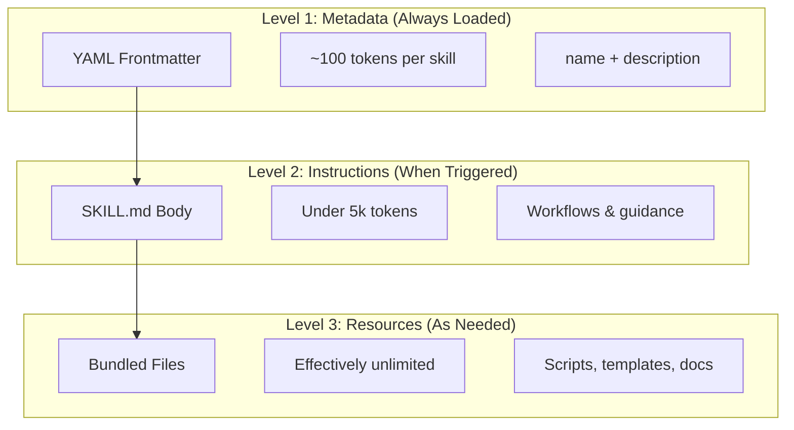
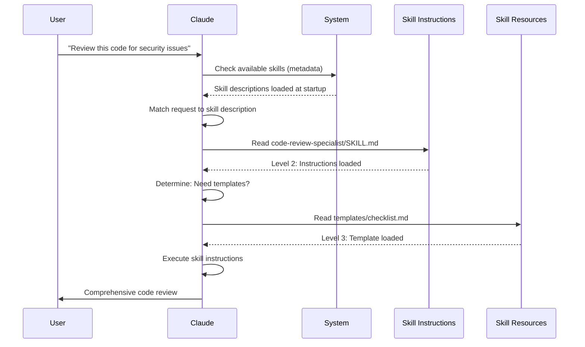

<!-- i18n-source: 03-skills/README.md -->
<!-- i18n-source-sha: TBD -->
<!-- i18n-date: 2026-07-01 -->

<picture>
  <source media="(prefers-color-scheme: dark)" srcset="../../resources/logos/claude-howto-logo-dark.svg">
  
</picture>

# 에이전트 스킬 가이드

에이전트 스킬은 Claude의 기능을 확장하는 재사용 가능한 파일시스템 기반 기능입니다. 도메인별 전문 지식, 워크플로우, 모범 사례를 패키징하여 관련 있을 때 Claude가 자동으로 사용하는 발견 가능한 컴포넌트로 만듭니다.

## 개요

**에이전트 스킬**은 범용 에이전트를 전문가로 변환하는 모듈식 기능입니다. 프롬프트(일회성 작업을 위한 대화 수준 지침)와 달리 스킬은 필요시 로드되며 여러 대화에 걸쳐 동일한 지침을 반복적으로 제공할 필요가 없습니다.

### 주요 이점

- **Claude 전문화**: 도메인별 작업에 맞게 기능 조정
- **반복 작업 감소**: 한 번 생성하면 여러 대화에서 자동으로 사용
- **기능 구성**: 스킬을 결합하여 복잡한 워크플로우 구축
- **워크플로우 확장**: 여러 프로젝트와 팀에서 스킬 재사용
- **품질 유지**: 모범 사례를 워크플로우에 직접 내장

스킬은 여러 AI 도구에서 작동하는 [Agent Skills](https://agentskills.io) 오픈 표준을 따릅니다. Claude Code는 호출 제어, 서브에이전트 실행, 동적 컨텍스트 주입 등의 추가 기능으로 표준을 확장합니다.

> **참고**: 사용자 정의 슬래시 명령어는 스킬에 통합되었습니다. `.claude/commands/` 파일은 여전히 작동하며 동일한 프론트매터 필드를 지원합니다. 새 개발에는 스킬이 권장됩니다. 동일한 경로에 둘 다 존재하는 경우 (예: `.claude/commands/review.md`와 `.claude/skills/review/SKILL.md`), 스킬이 우선합니다.

## 스킬 작동 방식: 점진적 공개

스킬은 **점진적 공개** 아키텍처를 활용합니다—Claude는 필요에 따라 정보를 단계적으로 로드하여 처음부터 컨텍스트를 소비하지 않습니다. 이를 통해 효율적인 컨텍스트 관리와 무제한 확장성이 가능합니다.

### 세 가지 로딩 수준



| 레벨 | 로드 시점 | 토큰 비용 | 콘텐츠 |
|-------|------------|------------|---------|
| **레벨 1: 메타데이터** | 항상 (시작 시) | 스킬당 ~100 토큰 | YAML 프론트매터의 `name` 및 `description` |
| **레벨 2: 지침** | 스킬이 트리거될 때 | 5k 토큰 미만 | 지침 및 안내가 포함된 SKILL.md 본문 |
| **레벨 3+: 리소스** | 필요시 | 사실상 무제한 | 콘텐츠를 컨텍스트에 로드하지 않고 bash를 통해 실행되는 번들 파일 |

즉, 많은 스킬을 컨텍스트 패널티 없이 설치할 수 있습니다—Claude는 실제로 트리거될 때까지 각 스킬이 존재하고 사용 시기만 알 수 있습니다.

## 스킬 로딩 프로세스



## 스킬 유형 및 위치

| 유형 | 위치 | 범위 | 공유 | 최적 대상 |
|------|----------|-------|--------|----------|
| **Enterprise** | 관리 설정 | 모든 조직 사용자 | 예 | 조직 전체 표준 |
| **Personal** | `~/.claude/skills/<skill-name>/SKILL.md` | 개인 | 아니오 | 개인 워크플로우 |
| **Project** | `.claude/skills/<skill-name>/SKILL.md` | 팀 | 예 (git 통해) | 팀 표준 |
| **Plugin** | `<plugin>/skills/<skill-name>/SKILL.md` | 활성화된 곳 | 상황에 따라 다름 | 플러그인과 함께 번들 |

스킬이 여러 수준에서 같은 이름을 공유할 경우, 우선순위가 높은 위치가 승리합니다: **enterprise > personal > project**. 플러그인 스킬은 `plugin-name:skill-name` 네임스페이스를 사용하므로 충돌할 수 없습니다.

> **서브에이전트 스킬 탐색 (v2.1.133+)**: 서브에이전트는 이제 메인 세션과 동일한 방식으로 Skill 도구를 통해 프로젝트, 사용자 및 플러그인 스킬을 발견합니다. 이전 버전은 서브에이전트를 자체 내장 세트로 제한하여 스킬+서브에이전트 워크플로우가 조용히 저하되었습니다; v2.1.133부터 동일한 스킬 카탈로그가 둘 다에 표시됩니다.

### 자동 탐색

**중첩 디렉토리**: 하위 디렉토리에서 파일을 작업할 때 Claude Code는 중첩된 `.claude/skills/` 디렉토리에서 스킬을 자동으로 발견합니다. 예를 들어 `packages/frontend/`에서 파일을 편집하는 경우 Claude Code는 `packages/frontend/.claude/skills/`에서도 스킬을 찾습니다. 이는 패키지가 자체 스킬을 가질 수 있는 모노레포 설정을 지원합니다. v2.1.178부터 중첩된 `.claude/skills/` 디렉토리 간에 스킬 이름이 충돌하면 **현재 작업 디렉토리에 가장 가까운 디렉토리**가 승리합니다 — 패키지 레벨 스킬이 동일한 이름의 저장소 루트 스킬을 재정의합니다.

**`--add-dir` 디렉토리**: `--add-dir`를 통해 추가된 디렉토리의 스킬은 실시간 변경 감지와 함께 자동으로 로드됩니다. 해당 디렉토리의 스킬 파일 편집은 Claude Code를 다시 시작하지 않고 즉시 적용됩니다.

**스킬 다시 로드**: `/reload-skills` 커맨드(v2.1.152 추가)는 세션을 다시 시작하지 않고 모든 스킬 디렉토리를 다시 스캔합니다 — 실시간 감지가 포착하지 못한 스킬을 추가하거나 편집한 후에 유용합니다. `SessionStart` 훅은 `reloadSkills: true`를 반환하여 동일한 다시 스캔을 트리거할 수 있습니다 ([훅](../06-hooks/README.md) 참조).

**설명 예산**: 스킬 설명(레벨 1 메타데이터)은 **컨텍스트 윈도우의 1%** 로 제한됩니다 (대체: **8,000자**). 많은 스킬이 설치된 경우 설명이 짧아질 수 있습니다. 모든 스킬 이름은 항상 포함되지만 설명은 맞춰서 잘립니다. 핵심 사용 사례를 설명의 앞부분에 배치하세요. `SLASH_COMMAND_TOOL_CHAR_BUDGET` 환경 변수로 예산을 재정의할 수 있습니다.

## 사용자 정의 스킬 생성

### 기본 디렉토리 구조

```
my-skill/
├── SKILL.md           # 주요 지침 (필수)
├── template.md        # Claude가 채울 템플릿
├── examples/
│   └── sample.md      # 예상 형식을 보여주는 예제 출력
└── scripts/
    └── validate.sh    # Claude가 실행할 수 있는 스크립트
```

### SKILL.md 형식

```yaml
---
name: your-skill-name
description: 이 스킬이 하는 일과 사용 시기에 대한 간략한 설명
---

# 스킬 이름

## 지침
Claude를 위한 명확하고 단계별 지침을 제공합니다.

## 예제
이 스킬 사용의 구체적인 예제를 보여줍니다.
```

### 필수 필드

- **name**: 소문자, 숫자, 하이픈만 사용 (최대 64자). "anthropic" 또는 "claude"를 포함할 수 없음.
- **description**: 스킬이 하는 일과 사용 시기 (최대 1024자). Claude가 스킬을 활성화할 시기를 알기 위해 중요.

### 선택적 프론트매터 필드

```yaml
---
name: my-skill
description: 이 스킬이 하는 일과 사용 시기
argument-hint: "[filename] [format]"        # 자동 완성을 위한 힌트
disable-model-invocation: true              # 사용자만 호출 가능
user-invocable: false                       # 슬래시 메뉴에서 숨김
allowed-tools: Read, Grep, Glob             # 도구 접근 제한
disallowed-tools: Write, Edit               # 활성화 중 특정 도구 제거 (v2.1.152)
model: opus                                 # 사용할 특정 모델
effort: high                                # 노력 수준 재정의 (low, medium, high, xhigh, max)
context: fork                               # 격리된 서브에이전트에서 실행
agent: Explore                              # 에이전트 유형 (context: fork와 함께)
shell: bash                                 # 커맨드용 셸: bash (기본값) 또는 powershell
hooks:                                      # 스킬 범위 훅
  PreToolUse:
    - matcher: "Bash"
      hooks:
        - type: command
          command: "./scripts/validate.sh"
paths: "src/api/**/*.ts"               # 스킬 활성화를 제한하는 Glob 패턴
---
```

| 필드 | 설명 |
|-------|-------------|
| `name` | 소문자, 숫자, 하이픈만 사용 (최대 64자). "anthropic" 또는 "claude"를 포함할 수 없음. |
| `description` | 스킬이 하는 일과 사용 시기 (최대 1024자). 자동 호출 매칭에 중요. |
| `argument-hint` | `/` 자동 완성 메뉴에 표시되는 힌트 (예: `"[filename] [format]"`). |
| `disable-model-invocation` | `true` = 사용자만 `/name`으로 호출 가능. Claude는 자동 호출하지 않음. |
| `user-invocable` | `false` = `/` 메뉴에서 숨김. Claude만 자동으로 호출 가능. |
| `allowed-tools` | 스킬이 권한 프롬프트 없이 사용할 수 있는 도구의 쉼표로 구분된 목록. |
| `disallowed-tools` | 스킬이 활성화된 동안 제거할 도구의 쉼표로 구분된 목록 (`allowed-tools`를 보완). v2.1.152 추가. |
| `model` | 스킬이 활성화된 동안의 모델 재정의 (예: `opus`, `sonnet`). |
| `effort` | 스킬이 활성화된 동안의 노력 수준 재정의: `low`, `medium`, `high`, `xhigh` 또는 `max`. 사용 가능한 수준은 모델에 따라 다름 — 기본 노력 수준은 Opus 4.8에서 `high` (Opus 4.7에서 `xhigh`). |
| `context` | `fork`로 설정하면 분기된 서브에이전트 컨텍스트에서 자체 컨텍스트 윈도우로 스킬 실행. |
| `agent` | `context: fork` 시 서브에이전트 유형 (예: `Explore`, `Plan`, `general-purpose`). |
| `shell` | `` !`command` `` 치환 및 스크립트에 사용되는 셸: `bash` (기본값) 또는 `powershell`. |
| `hooks` | 이 스킬의 생명주기로 범위가 지정된 훅 (전역 훅과 동일한 형식). |
| `paths` | 스킬이 자동 활성화되는 시기를 제한하는 Glob 패턴. 쉼표로 구분된 문자열 또는 YAML 목록. 경로별 규칙과 동일한 형식. |

## 스킬 콘텐츠 유형

스킬은 각각 다른 목적에 적합한 두 가지 유형의 콘텐츠를 포함할 수 있습니다:

### 참조 콘텐츠

Claude가 현재 작업에 적용하는 지식(규칙, 패턴, 스타일 가이드, 도메인 지식)을 추가합니다. 대화 컨텍스트와 함께 인라인으로 실행됩니다.

```yaml
---
name: api-conventions
description: 이 코드베이스의 API 설계 패턴
---

API 엔드포인트 작성 시:
- RESTful 명명 규칙 사용
- 일관된 오류 형식 반환
- 요청 검증 포함
```

### 작업 콘텐츠

특정 작업을 위한 단계별 지침. 종종 `/skill-name`으로 직접 호출됩니다.

```yaml
---
name: deploy
description: 프로덕션에 애플리케이션 배포
context: fork
disable-model-invocation: true
---

애플리케이션 배포:
1. 테스트 스위트 실행
2. 애플리케이션 빌드
3. 배포 대상에 푸시
```

## 스킬 호출 제어

기본적으로 사용자와 Claude 모두 모든 스킬을 호출할 수 있습니다. 두 개의 프론트매터 필드가 세 가지 호출 모드를 제어합니다:

| 프론트매터 | 사용자 호출 가능 | Claude 호출 가능 |
|---|---|---|
| (기본값) | 예 | 예 |
| `disable-model-invocation: true` | 예 | 아니오 |
| `user-invocable: false` | 아니오 | 예 |

**`disable-model-invocation: true` 사용** for 부작용이 있는 워크플로우: `/commit`, `/deploy`, `/send-slack-message`. 코드가 준비되었다고 Claude가 배포를 결정하는 것을 원하지 않습니다.

**`user-invocable: false` 사용** for 커맨드로 실행할 수 없는 배경 지식. `legacy-system-context` 스킬은 이전 시스템의 작동 방식을 설명합니다—Claude에게는 유용하지만 사용자에게는 의미 있는 작업이 아닙니다.

## 문자열 치환

스킬은 스킬 콘텐츠가 Claude에 도달하기 전에 해결되는 동적 값을 지원합니다:

| 변수 | 설명 |
|----------|-------------|
| `$ARGUMENTS` | 스킬 호출 시 전달된 모든 인자 |
| `$ARGUMENTS[N]` 또는 `$N` | 인덱스로 특정 인자 접근 (0부터 시작) |
| `${CLAUDE_SESSION_ID}` | 현재 세션 ID |
| `${CLAUDE_SKILL_DIR}` | 스킬의 SKILL.md 파일이 포함된 디렉토리 |
| `${CLAUDE_EFFORT}` | 현재 노력 수준 (`low`, `medium`, `high`, `xhigh` 또는 `max`). 스킬 동작 분기에 유용: 예: `[ "${CLAUDE_EFFORT}" = "max" ] && deep_analysis` (v2.1.120+) |
| `` !`command` `` | 동적 컨텍스트 주입 — 셸 커맨드를 실행하고 출력을 인라인으로 삽입 |

**예제:**

```yaml
---
name: fix-issue
description: GitHub 이슈 수정
---

코딩 표준에 따라 GitHub 이슈 $ARGUMENTS를 수정합니다.
1. 이슈 설명 읽기
2. 수정 구현
3. 테스트 작성
4. 커밋 생성
```

`/fix-issue 123` 실행 시 `$ARGUMENTS`가 `123`으로 대체됩니다.

## 동적 컨텍스트 주입

`` !`command` `` 구문은 스킬 콘텐츠가 Claude에 전송되기 전에 셸 커맨드를 실행합니다:

```yaml
---
name: pr-summary
description: 풀 리퀘스트의 변경사항 요약
context: fork
agent: Explore
---

## 풀 리퀘스트 컨텍스트
- PR diff: !`gh pr diff`
- PR 댓글: !`gh pr view --comments`
- 변경된 파일: !`gh pr diff --name-only`

## 작업
이 풀 리퀘스트를 요약하세요...
```

커맨드는 즉시 실행됩니다; Claude는 최종 출력만 볼 수 있습니다. 기본적으로 커맨드는 `bash`에서 실행됩니다. 프론트매터에서 `shell: powershell`을 설정하여 PowerShell을 대신 사용하세요.

## 서브에이전트에서 스킬 실행

`context: fork`를 추가하여 격리된 서브에이전트 컨텍스트에서 스킬을 실행합니다. 스킬 콘텐츠는 자체 컨텍스트 윈도우를 가진 전용 서브에이전트의 작업이 되어 메인 대화를 깔끔하게 유지합니다.

> **v2.1.145 수정**: `context: fork`를 사용하는 스킬이 드물게 무한 재호출 루프를 트리거할 수 있었습니다. 포킹 스킬을 작성하거나 의존하는 경우 v2.1.145+로 업그레이드하세요.

`agent` 필드는 사용할 에이전트 유형을 지정합니다:

| 에이전트 유형 | 최적 대상 |
|---|---|
| `Explore` | 읽기 전용 리서치, 코드베이스 분석 |
| `Plan` | 구현 계획 생성 |
| `general-purpose` | 모든 도구가 필요한 광범위한 작업 |
| 사용자 정의 에이전트 | 설정에 정의된 특수 에이전트 |

**예제 프론트매터:**

```yaml
---
context: fork
agent: Explore
---
```

**전체 스킬 예제:**

```yaml
---
name: deep-research
description: 주제를 철저히 조사
context: fork
agent: Explore
---

$ARGUMENTS를 철저히 조사:
1. Glob 및 Grep을 사용하여 관련 파일 찾기
2. 코드 읽기 및 분석
3. 특정 파일 참조와 함께 결과 요약
```

## 실제 예제

### 예제 1: 코드 리뷰 스킬

**디렉토리 구조:**

```
~/.claude/skills/code-review-specialist/
├── SKILL.md
├── templates/
│   ├── review-checklist.md
│   └── finding-template.md
└── scripts/
    ├── analyze-metrics.py
    └── compare-complexity.py
```

**파일:** `~/.claude/skills/code-review-specialist/SKILL.md`

```yaml
---
name: code-review-specialist
description: 보안, 성능, 품질 분석을 포함한 종합적인 코드 리뷰. 사용자가 코드 리뷰, 코드 품질 분석, 풀 리퀘스트 평가를 요청하거나 코드 리뷰, 보안 분석, 성능 최적화를 언급할 때 사용합니다.
---

# 코드 리뷰 스킬

이 스킬은 다음에 초점을 맞춘 종합적인 코드 리뷰 기능을 제공합니다:

1. **보안 분석**
   - 인증/권한 부여 문제
   - 데이터 노출 위험
   - 인젝션 취약점
   - 암호화 약점

2. **성능 리뷰**
   - 알고리즘 효율성 (Big O 분석)
   - 메모리 최적화
   - 데이터베이스 쿼리 최적화
   - 캐싱 기회

3. **코드 품질**
   - SOLID 원칙
   - 디자인 패턴
   - 명명 규칙
   - 테스트 커버리지

4. **유지보수성**
   - 코드 가독성
   - 함수 크기 (50줄 미만이어야 함)
   - 순환 복잡도
   - 타입 안전성

## 리뷰 템플릿

리뷰되는 각 코드에 대해 다음을 제공합니다:

### 요약
- 전반적인 품질 평가 (1-5)
- 주요 발견 사항 수
- 권장 우선 순위 영역

### 중요 이슈 (있는 경우)
- **이슈**: 명확한 설명
- **위치**: 파일 및 줄 번호
- **영향**: 이것이 중요한 이유
- **심각도**: Critical/High/Medium
- **수정**: 코드 예제

자세한 체크리스트는 [templates/review-checklist.md](templates/review-checklist.md)를 참조하세요.
```

### 예제 2: 코드베이스 시각화 도구 스킬

인터랙티브 HTML 시각화를 생성하는 스킬:

**디렉토리 구조:**

```
~/.claude/skills/codebase-visualizer/
├── SKILL.md
└── scripts/
    └── visualize.py
```

**파일:** `~/.claude/skills/codebase-visualizer/SKILL.md`

````yaml
---
name: codebase-visualizer
description: 코드베이스의 인터랙티브 접이식 트리 시각화를 생성합니다. 새 저장소 탐색, 프로젝트 구조 이해, 대용량 파일 식별 시 사용합니다.
allowed-tools: Bash(python *)
---

# 코드베이스 시각화 도구

프로젝트의 파일 구조를 보여주는 인터랙티브 HTML 트리 뷰를 생성합니다.

## 사용법

프로젝트 루트에서 시각화 스크립트를 실행하세요:

```bash
python ~/.claude/skills/codebase-visualizer/scripts/visualize.py .
```

이렇게 하면 `codebase-map.html`이 생성되고 기본 브라우저에서 열립니다.

## 시각화 기능

- **접이식 디렉토리**: 폴더를 클릭하여 펼치기/접기
- **파일 크기**: 각 파일 옆에 표시
- **색상**: 파일 유형별로 다른 색상
- **디렉토리 합계**: 각 폴더의 총 크기 표시
````

번들된 Python 스크립트는 무거운 작업을 수행하고 Claude는 오케스트레이션을 처리합니다.

### 예제 3: 배포 스킬 (사용자 호출 전용)

```yaml
---
name: deploy
description: 프로덕션에 애플리케이션 배포
disable-model-invocation: true
allowed-tools: Bash(npm *), Bash(git *)
---

$ARGUMENTS를 프로덕션에 배포:

1. 테스트 스위트 실행: `npm test`
2. 애플리케이션 빌드: `npm run build`
3. 배포 대상에 푸시
4. 배포 성공 확인
5. 배포 상태 보고
```

### 예제 4: 브랜드 보이스 스킬 (배경 지식)

```yaml
---
name: brand-voice
description: 모든 커뮤니케이션이 브랜드 보이스와 톤 가이드라인과 일치하도록 합니다. 마케팅 카피, 고객 커뮤니케이션, 공개 콘텐츠를 만들 때 사용합니다.
user-invocable: false
---

## 말투
- **친근하지만 프로페셔널** - 편안하지만 캐주얼하지 않음
- **명확하고 간결** - 전문 용어 피하기
- **자신감** - 우리가 무엇을 하는지 알고 있음
- **공감** - 사용자 니즈 이해

## 작성 가이드라인
- 독자를 지칭할 때 "당신" 사용
- 능동태 사용
- 문장을 20단어 미만으로 유지
- 가치 제안으로 시작

템플릿은 [templates/](templates/)를 참조하세요.
```

### 예제 5: CLAUDE.md 생성기 스킬

```yaml
---
name: claude-md
description: 최적의 AI 에이전트 온보딩을 위한 모범 사례에 따라 CLAUDE.md 파일을 생성하거나 업데이트합니다. 사용자가 CLAUDE.md, 프로젝트 문서, AI 온보딩을 언급할 때 사용합니다.
---

## 핵심 원칙

**LLM은 상태 비저장**: CLAUDE.md는 모든 대화에 자동으로 포함되는 유일한 파일입니다.

### 황금 규칙

1. **적을수록 좋다**: 300줄 미만으로 유지 (가급적 100줄 미만)
2. **보편적 적용 가능성**: 모든 세션에 관련된 정보만 포함
3. **Claude를 린터로 사용하지 마라**: 대신 결정론적 도구 사용
4. **절대 자동 생성하지 마라**: 신중한 고려와 함께 수동으로 작성

## 필수 섹션

- **프로젝트 이름**: 간단한 한 줄 설명
- **기술 스택**: 주요 언어, 프레임워크, 데이터베이스
- **개발 커맨드**: 설치, 테스트, 빌드 커맨드
- **중요 규칙**: 명확하지 않고 영향력이 큰 규칙만
- **알려진 이슈 / 주의사항**: 개발자를 당황하게 하는 것들
```

### 예제 6: 스크립트가 포함된 리팩토링 스킬

**디렉토리 구조:**

```
refactor/
├── SKILL.md
├── references/
│   ├── code-smells.md
│   └── refactoring-catalog.md
├── templates/
│   └── refactoring-plan.md
└── scripts/
    ├── analyze-complexity.py
    └── detect-smells.py
```

**파일:** `refactor/SKILL.md`

```yaml
---
name: code-refactor
description: Martin Fowler의 방법론에 기반한 체계적인 코드 리팩토링. 사용자가 코드 리팩토링, 코드 구조 개선, 기술 부채 감소, 코드 스멜 제거를 요청할 때 사용합니다.
---

# 코드 리팩토링 스킬

테스트에 기반한 안전하고 점진적인 변경을 강조하는 단계적 접근 방식.

## 워크플로우

1단계: 리서치 및 분석 → 2단계: 테스트 커버리지 평가 →
3단계: 코드 스멜 식별 → 4단계: 리팩토링 계획 생성 →
5단계: 점진적 구현 → 6단계: 검토 및 반복

## 핵심 원칙

1. **동작 보존**: 외부 동작은 변경되지 않아야 함
2. **작은 단계**: 작고 테스트 가능한 변경
3. **테스트 주도**: 테스트는 안전망
4. **지속적**: 리팩토링은 일회성 이벤트가 아닌 지속적인 과정

코드 스멜 카탈로그는 [references/code-smells.md](references/code-smells.md)를 참조하세요.
리팩토링 기법은 [references/refactoring-catalog.md](references/refactoring-catalog.md)를 참조하세요.
```

## 지원 파일

스킬은 `SKILL.md` 외에도 디렉토리에 여러 파일을 포함할 수 있습니다. 이러한 지원 파일(템플릿, 예제, 스크립트, 참조 문서)을 사용하면 메인 스킬 파일을 집중적으로 유지하면서 Claude가 필요시 로드할 수 있는 추가 리소스를 제공할 수 있습니다.

```
my-skill/
├── SKILL.md              # 주요 지침 (필수, 500줄 미만 유지)
├── templates/            # Claude가 채울 템플릿
│   └── output-format.md
├── examples/             # 예상 형식을 보여주는 예제 출력
│   └── sample-output.md
├── references/           # 도메인 지식 및 명세
│   └── api-spec.md
└── scripts/              # Claude가 실행할 수 있는 스크립트
    └── validate.sh
```

지원 파일 가이드라인:

- `SKILL.md`를 **500줄 미만**으로 유지하세요. 상세 참조 자료, 대규모 예제, 명세는 별도 파일로 이동하세요.
- `SKILL.md`에서 **상대 경로**를 사용하여 추가 파일을 참조하세요 (예: `[API reference](references/api-spec.md)`).
- 지원 파일은 레벨 3(필요시)에서 로드되므로 Claude가 실제로 읽을 때까지 컨텍스트를 소비하지 않습니다.

## 스킬 관리

### 사용 가능한 스킬 보기

Claude에게 직접 물어보세요:
```
사용 가능한 스킬이 무엇인가요?
```

또는 파일시스템 확인:
```bash
# 개인 스킬 목록
ls ~/.claude/skills/

# 프로젝트 스킬 목록
ls .claude/skills/
```

> **팁 (v2.1.121+):** `/skills` 인터랙티브 메뉴를 필터링하려면 입력하세요 — 많은 스킬이 설치된 경우 유용합니다.

### 스킬 테스트

테스트하는 두 가지 방법:

**Claude가 자동으로 호출하도록** 설명과 일치하는 질문을 하세요:
```
이 코드를 보안 문제에 대해 검토해 주시겠어요?
```

**또는 직접 호출** with 스킬 이름:
```
/code-review-specialist src/auth/login.ts
```

> **참고**: 이 로컬 스킬은 `code-review-specialist`로 설치되어 내장 `/code-review` 커맨드(Claude Code v2.1.146에 포함된 이름 변경된 `/simplify`)와 **충돌하지 않습니다**. 대신 `~/.claude/skills/code-review/`에 복사하면 내장을 가리게 됩니다 — 충돌을 피하려면 `-specialist` 접미사를 유지하세요.

### 스킬 업데이트

`SKILL.md` 파일을 직접 편집하세요. 변경사항은 다음 Claude Code 시작 시 적용됩니다.

```bash
# 개인 스킬
code ~/.claude/skills/my-skill/SKILL.md

# 프로젝트 스킬
code .claude/skills/my-skill/SKILL.md
```

### Claude의 스킬 접근 제한

Claude가 호출할 수 있는 스킬을 제어하는 세 가지 방법:

**모든 스킬 비활성화** in `/permissions`:
```
# 거부 규칙에 추가:
Skill
```

**특정 스킬 허용 또는 거부**:
```
# 특정 스킬만 허용
Skill(commit)
Skill(review-pr *)

# 특정 스킬 거부
Skill(deploy *)
```

**개별 스킬 숨기기** by 프론트매터에 `disable-model-invocation: true` 추가.

### 스킬 재정의 동작 제어 (`skillOverrides`)

프로젝트 스킬과 사용자 스킬이 같은 이름을 공유하면 기본적으로 프로젝트가 승리합니다. `skillOverrides` 설정(v2.1.129+)을 사용하여 이를 조정할 수 있습니다. `~/.claude/settings.json` 또는 프로젝트 `.claude/settings.json`에 추가하세요:

```json
{
  "skillOverrides": "name-only"
}
```

허용되는 값:

| 값 | 동작 |
|-------|----------|
| `"on"` (기본값) | 저장소 스킬이 동일한 이름의 사용자 스킬을 재정의할 수 있음. |
| `"off"` | 재정의를 완전히 비활성화 — 사용자 스킬이 항상 승리. |
| `"name-only"` | 스킬 이름으로만 재정의 일치 (설명/소스 무시). |
| `"user-invocable-only"` | 사용자 호출 가능 스킬만 재정의 가능 — 모델 호출 스킬은 항상 원래 위치에서 제공. |

팀 정책이 "사용자 정의 스킬이 항상 우선해야 함" (`"off"`) 또는 "좁은 이름 기반 재정의만 허용" (`"name-only"`)인 경우 유용합니다.

## 모범 사례

### 1. 설명을 구체적으로 작성

- **나쁨 (모호)**: "문서 작업에 도움"
- **좋음 (구체적)**: "PDF 파일에서 텍스트와 테이블 추출, 양식 작성, 문서 병합. PDF 파일 작업 시 또는 사용자가 PDF, 양식, 문서 추출을 언급할 때 사용."

### 2. 스킬을 집중적으로 유지

- 하나의 스킬 = 하나의 기능
- ✅ "PDF 양식 작성"
- ❌ "문서 처리" (너무 광범위)

### 3. 트리거 용어 포함

사용자 요청과 일치하는 키워드를 설명에 추가:
```yaml
description: Excel 스프레드시트 분석, 피벗 테이블 생성, 차트 작성. Excel 파일, 스프레드시트 또는 .xlsx 파일 작업 시 사용.
```

### 4. SKILL.md를 500줄 미만으로 유지

상세 참조 자료는 Claude가 필요시 로드하는 별도 파일로 이동하세요.

### 5. 지원 파일 참조

```markdown
## 추가 리소스

- 전체 API 세부정보는 [reference.md](reference.md) 참조
- 사용 예제는 [examples.md](examples.md) 참조
```

### 권장 사항

- 명확하고 설명적인 이름 사용
- 종합적인 지침 포함
- 구체적인 예제 추가
- 관련 스크립트와 템플릿 패키징
- 실제 시나리오로 테스트
- 의존성 문서화

### 금지 사항

- 일회성 작업을 위한 스킬 생성 금지
- 기존 기능 중복 금지
- 스킬을 너무 광범위하게 만들지 않기
- 설명 필드 생략 금지
- 감사 없이 신뢰할 수 없는 소스의 스킬 설치 금지

## 문제 해결

### 빠른 참조

| 문제 | 해결 방법 |
|-------|----------|
| Claude가 스킬을 사용하지 않음 | 트리거 용어로 설명을 더 구체적으로 작성 |
| 스킬 파일을 찾을 수 없음 | 경로 확인: `~/.claude/skills/name/SKILL.md` |
| YAML 오류 | `---` 마커, 들여쓰기, 탭 없음 확인 |
| 스킬 충돌 | 설명에 고유한 트리거 용어 사용 |
| 스크립트가 실행되지 않음 | 권한 확인: `chmod +x scripts/*.py` |
| Claude가 모든 스킬을 보지 못함 | 스킬이 너무 많음; `/context`에서 경고 확인 |

### 스킬이 트리거되지 않음

Claude가 예상할 때 스킬을 사용하지 않는 경우:

1. 설명에 사용자가 자연스럽게 말할 키워드가 포함되어 있는지 확인
2. "사용 가능한 스킬이 무엇인가요?"라고 물었을 때 스킬이 나타나는지 확인
3. 설명과 일치하도록 요청을 다시 표현
4. `/skill-name`으로 직접 호출하여 테스트

### 스킬이 너무 자주 트리거됨

Claude가 원하지 않을 때 스킬을 사용하는 경우:

1. 설명을 더 구체적으로 작성
2. 수동 전용 호출을 위해 `disable-model-invocation: true` 추가

### Claude가 모든 스킬을 보지 못함

스킬 설명은 **컨텍스트 윈도우의 1%** 로 로드됩니다 (대체: **8,000자**). 각 항목은 예산에 관계없이 250자로 제한됩니다. `/context`를 실행하여 제외된 스킬에 대한 경고를 확인하세요. `SLASH_COMMAND_TOOL_CHAR_BUDGET` 환경 변수로 예산을 재정의할 수 있습니다.

## 보안 고려사항

**신뢰할 수 있는 소스의 스킬만 사용하세요.** 스킬은 지침과 코드를 통해 Claude에 기능을 제공합니다 — 악성 스킬은 Claude가 도구를 호출하거나 유해한 방식으로 코드를 실행하도록 지시할 수 있습니다.

**주요 보안 고려사항:**

- **철저히 감사**: 스킬 디렉토리의 모든 파일 검토
- **외부 소스는 위험**: 외부 URL에서 가져오는 스킬은 손상될 수 있음
- **도구 오용**: 악성 스킬이 유해한 방식으로 도구를 호출할 수 있음
- **소프트웨어 설치처럼 취급**: 신뢰할 수 있는 소스의 스킬만 사용

### 스킬에서 셸 치환 비활성화

스킬은 `` !`command` `` 구문을 지원하여 셸 커맨드의 출력을 Claude가 보기 전에 프롬프트에 주입합니다. 보안에 민감한 환경(공유 엔터프라이즈 배포, 잠긴 CI 실행기)에서는 `disableSkillShellExecution` 설정을 통해 이 치환을 완전히 비활성화할 수 있습니다 (**v2.1.91** 추가):

```jsonc
// ~/.claude/settings.json 또는 관리 정책
{
  "disableSkillShellExecution": true
}
```

`disableSkillShellExecution`이 `true`이면 스킬의 `` !`command` `` 마커가 실행되지 않고 리터럴 텍스트로 남습니다 — 스킬 자체를 비활성화하지 않고 스킬 레벨 셸 인젝션 공격 표면을 제거합니다. 심층 방어를 위해 `allowedTools` 허용 목록과 결합하는 것을 고려하세요.

### 번들 스킬 숨기기 (`disableBundledSkills`)

`disableBundledSkills` 설정(**v2.1.169** 추가)은 Claude Code와 함께 제공되는 번들 스킬, 워크플로우 및 커맨드를 모델에서 숨깁니다. 내장 스킬이 특정 프로젝트에서 노이즈일 때 또는 모델의 스킬 표면을 줄이기 위해 사용하세요:

```jsonc
// ~/.claude/settings.json 또는 프로젝트 .claude/settings.json
{
  "disableBundledSkills": true
}
```

해당 환경 변수 형식:

```bash
export CLAUDE_CODE_DISABLE_BUNDLED_SKILLS=1
```

## 스킬 vs 다른 기능

| 기능 | 호출 방식 | 최적 대상 |
|---------|------------|----------|
| **스킬** | 자동 또는 `/name` | 재사용 가능한 전문 지식, 워크플로우 |
| **슬래시 명령어** | 사용자 시작 `/name` | 빠른 단축키 (스킬에 통합됨) |
| **서브에이전트** | 자동 위임 | 격리된 작업 실행 |
| **메모리 (CLAUDE.md)** | 항상 로드됨 | 영구 프로젝트 컨텍스트 |
| **MCP** | 실시간 | 외부 데이터/서비스 접근 |
| **훅** | 이벤트 기반 | 자동화된 부작용 |

## 번들 스킬

Claude Code는 설치 없이 항상 사용 가능한 9개의 내장 스킬과 함께 제공됩니다:

| 스킬 | 설명 |
|-------|-------------|
| `/batch <instruction>` | git 워크트리를 사용하여 코드베이스 전반에 걸친 대규모 병렬 변경 조율 |
| `/claude-api` | Claude API/SDK 참조 로드; `anthropic`/`@anthropic-ai/sdk` 임포트에서 자동 활성화 |
| `/debug [description]` | 디버그 로그를 읽어 현재 세션 문제 해결 |
| `/fewer-permission-prompts` | 트랜스크립트를 스캔하고 일반적인 읽기 전용 도구에 대한 우선순위 허용 목록 제안 |
| `/loop [interval] <prompt>` | 간격으로 프롬프트 반복 실행 (예: `/loop 5m check the deploy`) |
| `/run` *(v2.1.145+)* | 이 프로젝트의 앱을 실행하여 변경사항이 작동하는지 확인 — 프로젝트 스킬을 찾고, 그렇지 않으면 프로젝트 유형별 내장 패턴으로 대체 |
| `/run-skill-generator` *(v2.1.145+)* | 프로젝트별 스킬을 생성하여 `/run`/`/verify`가 특정 프로젝트를 처리하는 방법을 교육 |
| `/code-review [effort]` | 선택한 노력 수준에서 현재 diff의 정확성 버그 검토 (예: `/code-review high`); `--comment`를 전달하여 결과를 인라인 PR 댓글로 게시. v2.1.146에서 `/simplify`에서 이름 변경됨 |
| `/verify` *(v2.1.145+)* | 앱을 빌드, 실행 및 관찰하여 수정이 작동하는지 확인 (테스트 통과뿐만 아니라) |

이러한 스킬은 기본적으로 사용 가능하며 설치하거나 설정할 필요가 없습니다. 사용자 정의 스킬과 동일한 SKILL.md 형식을 따릅니다.

## 스킬 공유

### 프로젝트 스킬 (팀 공유)

1. `.claude/skills/`에 스킬 생성
2. git에 커밋
3. 팀원이 변경사항을 가져오면 스킬을 즉시 사용 가능

### 개인 스킬

```bash
# 개인 디렉토리로 복사
cp -r my-skill ~/.claude/skills/

# 스크립트를 실행 가능하게
chmod +x ~/.claude/skills/my-skill/scripts/*.py
```

### 플러그인 배포

더 넓은 배포를 위해 스킬을 플러그인의 `skills/` 디렉토리에 패키징하세요.

## 더 나아가기: 스킬 컬렉션 및 스킬 매니저

스킬을 본격적으로 구축하기 시작하면 두 가지가 필수적입니다: 검증된 스킬 라이브러리와 이를 관리하는 도구.

**[luongnv89/skills](https://github.com/luongnv89/skills)** — 거의 모든 프로젝트에서 매일 사용하는 스킬 모음입니다. 하이라이트는 `logo-designer`(프로젝트 로고를 즉석에서 생성)와 `ollama-optimizer`(하드웨어에 맞게 로컬 LLM 성능 조정)입니다. 바로 사용할 수 있는 스킬을 원한다면 좋은 출발점입니다.

**[luongnv89/asm](https://github.com/luongnv89/asm)** — 에이전트 스킬 매니저. 스킬 개발, 중복 감지, 테스트를 처리합니다. `asm link` 커맨드를 사용하면 파일을 복사하지 않고 모든 프로젝트에서 스킬을 테스트할 수 있습니다 — 스킬이 몇 개 이상 있으면 필수적입니다.

## 추가 자료

- [공식 스킬 문서](https://code.claude.com/docs/en/skills)
- [에이전트 스킬 아키텍처 블로그](https://claude.com/blog/equipping-agents-for-the-real-world-with-agent-skills)
- [스킬 저장소](https://github.com/luongnv89/skills) - 바로 사용할 수 있는 스킬 모음
- [슬래시 명령어 가이드](../01-slash-commands/) - 사용자 시작 단축키
- [서브에이전트 가이드](../04-subagents/) - 위임된 AI 에이전트
- [메모리 가이드](../02-memory/) - 영구 컨텍스트
- [MCP (Model Context Protocol)](../05-mcp/) - 실시간 외부 데이터
- [훅 가이드](../06-hooks/) - 이벤트 기반 자동화

---

**최종 업데이트**: 2026년 6월 17일
**Claude Code 버전**: 2.1.179
**출처**:
- https://code.claude.com/docs/en/skills
- https://code.claude.com/docs/en/settings
- https://code.claude.com/docs/en/changelog
- https://code.claude.com/docs/en/commands
- https://github.com/anthropics/claude-code/releases/tag/v2.1.152
- https://github.com/anthropics/claude-code/releases/tag/v2.1.154
**호환 모델**: Claude Sonnet 4.6, Claude Opus 4.8, Claude Haiku 4.5
