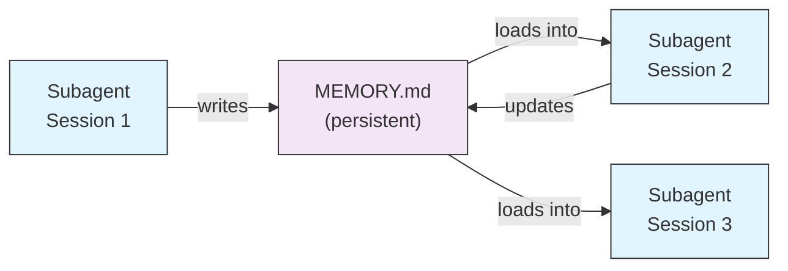
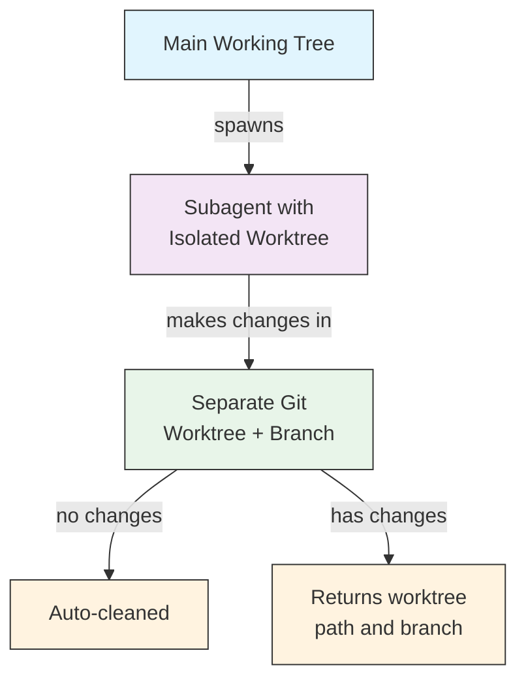
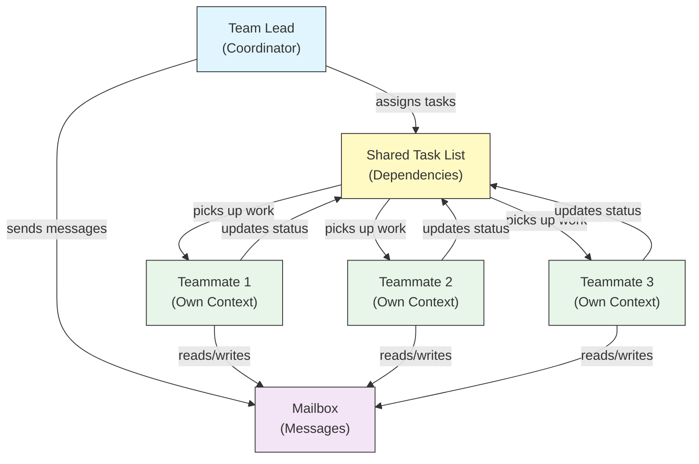
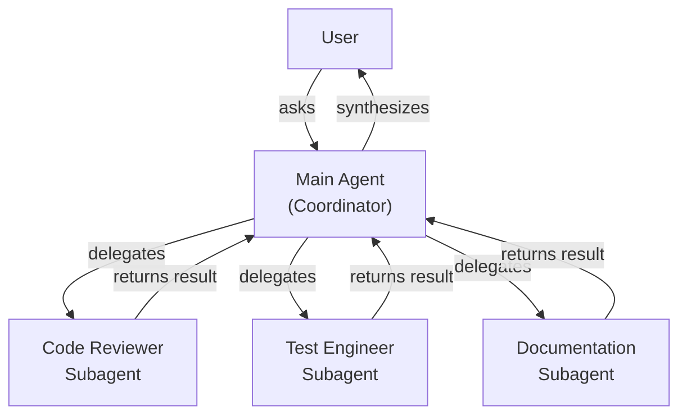
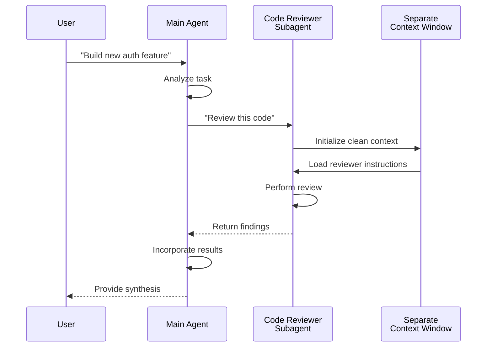
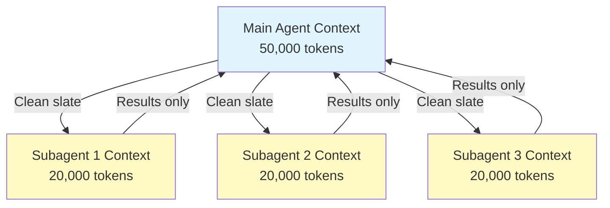
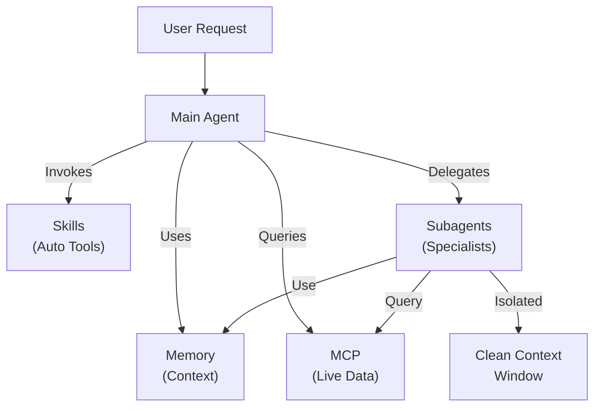

<!-- i18n-source: 04-subagents/README.md -->
<!-- i18n-source-sha: TBD -->
<!-- i18n-date: 2026-07-01 -->

<picture>
  <source media="(prefers-color-scheme: dark)" srcset="../../resources/logos/claude-howto-logo-dark.svg">
  
</picture>

# 서브에이전트 - 완전 참조 가이드

서브에이전트는 Claude Code가 작업을 위임할 수 있는 특수화된 AI 어시스턴트입니다. 각 서브에이전트는 특정 목적을 가지고, 메인 대화와 분리된 자체 컨텍스트 창을 사용하며, 특정 도구와 사용자 정의 시스템 프롬프트로 구성할 수 있습니다.

## 목차

1. [개요](#개요)
2. [주요 이점](#주요-이점)
3. [파일 위치](#파일-위치)
4. [설정](#설정)
5. [내장 서브에이전트](#내장-서브에이전트)
6. [서브에이전트 관리](#서브에이전트-관리)
7. [서브에이전트 사용](#서브에이전트-사용)
8. [재개 가능한 에이전트](#재개-가능한-에이전트)
9. [서브에이전트 체이닝](#서브에이전트-체이닝)
10. [서브에이전트 영구 메모리](#서브에이전트-영구-메모리)
11. [백그라운드 서브에이전트](#백그라운드-서브에이전트)
12. [워크트리 격리](#워크트리-격리)
13. [생성 가능한 서브에이전트 제한](#생성-가능한-서브에이전트-제한)
14. [`claude agents` CLI 명령어](#claude-agents-cli-명령어)
15. [에이전트 팀 (실험적)](#에이전트-팀-실험적)
16. [플러그인 서브에이전트 보안](#플러그인-서브에이전트-보안)
17. [아키텍처](#아키텍처)
18. [컨텍스트 관리](#컨텍스트-관리)
19. [서브에이전트 사용 시점](#서브에이전트-사용-시기)
20. [모범 사례](#모범-사례)
21. [이 폴더의 예제 서브에이전트](#이-폴더의-예제-서브에이전트)
22. [설치 방법](#설치-방법)
23. [관련 개념](#관련-개념)

---

## 개요

서브에이전트는 Claude Code에서 위임된 작업 실행을 가능하게 합니다:

- **격리된 AI 어시스턴트**를 별도의 컨텍스트 창으로 생성
- 특화된 전문 지식을 위한 **사용자 정의 시스템 프롬프트** 제공
- 기능을 제한하는 **도구 접근 제어** 적용
- 복잡한 작업으로 인한 **컨텍스트 오염** 방지
- 여러 특화 작업의 **병렬 실행** 가능

각 서브에이전트는 깨끗한 상태로 독립적으로 작동하며, 해당 작업에 필요한 특정 컨텍스트만 받은 후 결과를 메인 에이전트에 반환하여 종합합니다.

**빠른 시작**: `/agents` 명령어를 사용하여 서브에이전트를 대화형으로 생성, 확인, 편집 및 관리하세요.

---

## 주요 이점

| 이점 | 설명 |
|---------|-------------|
| **컨텍스트 보존** | 별도 컨텍스트에서 작동하여 메인 대화 오염 방지 |
| **특화된 전문성** | 특정 도메인에 맞춰져 높은 성공률 |
| **재사용성** | 여러 프로젝트에서 사용하고 팀과 공유 가능 |
| **유연한 권한** | 서브에이전트 유형별로 다른 도구 접근 수준 |
| **확장성** | 여러 에이전트가 동시에 다른 측면 작업 가능 |

---

## 파일 위치

서브에이전트 파일은 다양한 범위의 여러 위치에 저장할 수 있습니다:

| 우선순위 | 유형 | 위치 | 범위 |
|----------|------|----------|-------|
| 1 (가장 높음) | **CLI 정의** | `--agents` 플래그 사용 (JSON) | 세션 전용 |
| 2 | **프로젝트 서브에이전트** | `.claude/agents/` | 현재 프로젝트 |
| 3 | **사용자 서브에이전트** | `~/.claude/agents/` | 모든 프로젝트 |
| 4 (가장 낮음) | **플러그인 에이전트** | 플러그인 `agents/` 디렉토리 | 플러그인을 통해 |

중복된 이름이 있는 경우, 더 높은 우선순위 소스가 우선합니다.

> **중첩된 `.claude/` 우선순위 (v2.1.178)**: 동일한 에이전트 이름이 여러 중첩된 `.claude/agents/` 디렉토리에 정의된 경우(예: 패키지 레벨의 `.claude/` 폴더가 있는 모노레포), **현재 작업 디렉토리와 가장 가까운** 정의가 우선합니다. 동일한 최근접 우선 규칙이 중첩된 워크플로우 및 출력 스타일 정의에도 적용됩니다.

---

## 설정

### 파일 형식

서브에이전트는 YAML frontmatter 뒤에 시스템 프롬프트를 markdown으로 작성하여 정의합니다:

```yaml
---
name: your-sub-agent-name
description: Description of when this subagent should be invoked
tools: tool1, tool2, tool3  # Optional - inherits all tools if omitted
disallowedTools: tool4  # Optional - explicitly disallowed tools
model: sonnet  # Optional - sonnet, opus, haiku, or inherit
permissionMode: default  # Optional - permission mode
maxTurns: 20  # Optional - limit agentic turns
skills: skill1, skill2  # Optional - skills to preload into context
mcpServers: server1  # Optional - MCP servers to make available
memory: user  # Optional - persistent memory scope (user, project, local)
background: false  # Optional - run as background task
effort: high  # Optional - reasoning effort (low, medium, high, max)
isolation: worktree  # Optional - git worktree isolation
initialPrompt: "Start by analyzing the codebase"  # Optional - auto-submitted first turn
hooks:  # Optional - component-scoped hooks
  PreToolUse:
    - matcher: "Bash"
      hooks:
        - type: command
          command: "./scripts/security-check.sh"
---

Your subagent's system prompt goes here. This can be multiple paragraphs
and should clearly define the subagent's role, capabilities, and approach
to solving problems.
```

### 설정 필드

| 필드 | 필수 | 설명 |
|-------|----------|-------------|
| `name` | 예 | 고유 식별자 (소문자와 하이픈 사용) |
| `description` | 예 | 목적에 대한 자연어 설명. 자동 호출을 유도하려면 "use PROACTIVELY" 포함 |
| `tools` | 아니요 | 특정 도구의 쉼표로 구분된 목록. 생략 시 모든 도구 상속. `Agent(agent_name)` 문법으로 생성 가능한 서브에이전트 제한 가능 |
| `disallowedTools` | 아니요 | 서브에이전트가 사용하지 말아야 할 도구 목록 |
| `model` | 아니요 | 사용할 모델: `sonnet`, `opus`, `haiku`, 전체 모델 ID 또는 `inherit`. 기본값은 설정된 서브에이전트 모델 |
| `permissionMode` | 아니요 | `default`, `acceptEdits`, `dontAsk`, `bypassPermissions`, `plan` |
| `maxTurns` | 아니요 | 서브에이전트가 수행할 수 있는 최대 에이전트 턴 수 |
| `skills` | 아니요 | 사전 로드할 스킬 목록. 시작 시 전체 스킬 내용을 서브에이전트 컨텍스트에 주입. **v2.1.133+:** 서브에이전트도 Skill 도구를 통해 프로젝트, 사용자, 플러그인 스킬을 탐색 가능 — 메인 세션과 동일한 카탈로그, 더 이상 자신의 임베디드 세트로 제한되지 않음 |
| `mcpServers` | 아니요 | 서브에이전트가 사용할 수 있는 MCP 서버 |
| `hooks` | 아니요 | 컴포넌트 범위의 훅 (PreToolUse, PostToolUse, Stop) |
| `memory` | 아니요 | 영구 메모리 디렉토리 범위: `user`, `project`, 또는 `local` |
| `background` | 아니요 | `true`로 설정하면 이 서브에이전트를 항상 백그라운드 작업으로 실행 |
| `effort` | 아니요 | 추론 노력 수준: `low`, `medium`, `high`, 또는 `max` |
| `isolation` | 아니요 | `worktree`로 설정하면 서브에이전트에 자체 git 워크트리 부여 |
| `initialPrompt` | 아니요 | 서브에이전트가 메인 에이전트로 실행될 때 자동 제출되는 첫 번째 턴 |

### 메인 스레드 에이전트 Frontmatter 적용 (v2.1.117+/v2.1.119+)

에이전트가 메인 스레드 에이전트로 호출될 때(`claude --agent <name>` 또는 `--print` 모드), 다음 frontmatter 필드가 적용됩니다:

| 필드 | 버전 | 비고 |
|-------|---------|-------|
| `mcpServers` | v2.1.117+ | `claude --agent <name>`으로 메인 스레드 에이전트로 호출 시 로드됨 |
| `permissionMode` | v2.1.119+ | `--agent <name>`을 통한 내장 에이전트에 적용 |
| `tools` / `disallowedTools` | v2.1.119+ | `--print` 모드(비대화형/스크립트 사용)에서 적용 |

**`mcpServers`와 `permissionMode`가 있는 에이전트 예시:**

```yaml
---
name: secure-researcher
description: Research agent with scoped MCP access and restricted permissions
permissionMode: acceptEdits
mcpServers:
  notion:
    type: http
    url: https://mcp.notion.com/mcp
  github:
    type: http
    url: https://api.github.com/mcp
tools: Read, Grep, Glob
---

You are a research agent. You may query Notion and GitHub through the
configured MCP servers, and read local files, but you cannot write or
execute commands outside of accepted edits.
```

실행:

```bash
claude --agent secure-researcher
```

### 도구 설정 옵션

**옵션 1: 모든 도구 상속 (필드 생략)**
```yaml
---
name: full-access-agent
description: Agent with all available tools
---
```

**옵션 2: 개별 도구 지정**
```yaml
---
name: limited-agent
description: Agent with specific tools only
tools: Read, Grep, Glob, Bash
---
```

> **Glob/Grep 참고 (v2.1.113+):** 네이티브 macOS/Linux 빌드에서는 Glob과 Grep이 별도 도구가 아닌 Bash 도구를 통한 `bfs`/`ugrep`으로 제공됩니다. Windows 및 npm-JS 빌드는 여전히 독립 도구로 노출합니다. 작성자는 `allowedTools`에서 Glob/Grep을 계속 참조할 수 있으며, 백엔드 대체는 투명하게 이루어집니다.

**옵션 3: 조건부 도구 접근**
```yaml
---
name: conditional-agent
description: Agent with filtered tool access
tools: Read, Bash(npm:*), Bash(test:*)
---
```

### CLI 기반 설정

`--agents` 플래그와 JSON 형식을 사용하여 단일 세션용 서브에이전트 정의:

```bash
claude --agents '{
  "code-reviewer": {
    "description": "Expert code reviewer. Use proactively after code changes.",
    "prompt": "You are a senior code reviewer. Focus on code quality, security, and best practices.",
    "tools": ["Read", "Grep", "Glob", "Bash"],
    "model": "sonnet"
  }
}'
```

**`--agents` 플래그용 JSON 형식:**

```json
{
  "agent-name": {
    "description": "Required: when to invoke this agent",
    "prompt": "Required: system prompt for the agent",
    "tools": ["Optional", "array", "of", "tools"],
    "model": "optional: sonnet|opus|haiku"
  }
}
```

**에이전트 정의 우선순위:**

에이전트 정의는 다음 우선순위로 로드됩니다(첫 번째 일치가 우선):
1. **CLI 정의** - `--agents` 플래그 (세션 전용, JSON)
2. **프로젝트 수준** - `.claude/agents/` (현재 프로젝트)
3. **사용자 수준** - `~/.claude/agents/` (모든 프로젝트)
4. **플러그인 수준** - 플러그인 `agents/` 디렉토리

이를 통해 단일 세션에서 CLI 정의가 다른 모든 소스를 재정의할 수 있습니다.

---

## 내장 서브에이전트

Claude Code에는 항상 사용 가능한 여러 내장 서브에이전트가 포함되어 있습니다:

| 에이전트 | 모델 | 목적 |
|-------|-------|---------|
| **general-purpose** | 상속 | 복잡한 다단계 작업 |
| **Plan** | 상속 | 계획 모드의 연구 |
| **Explore** | Haiku | 읽기 전용 코드베이스 탐색 (빠름/중간/매우 철저) |
| **Bash** | 상속 | 별도 컨텍스트에서 터미널 명령어 실행 |
| **statusline-setup** | Sonnet | 상태 줄 구성 |
| **Claude Code Guide** | Haiku | Claude Code 기능 질문에 답변 |

### 일반 목적 서브에이전트

| 속성 | 값 |
|----------|-------|
| **모델** | 부모로부터 상속 |
| **도구** | 모든 도구 |
| **목적** | 복잡한 연구 작업, 다단계 작업, 코드 수정 |

**사용 시점**: 복잡한 추론이 필요한 탐색과 수정이 모두 필요한 작업.

### Plan 서브에이전트

| 속성 | 값 |
|----------|-------|
| **모델** | 부모로부터 상속 |
| **도구** | Read, Glob, Grep, Bash |
| **목적** | 계획 모드에서 코드베이스 연구를 위해 자동 사용 |

**사용 시점**: Claude가 계획을 제시하기 전에 코드베이스를 이해해야 할 때.

### Explore 서브에이전트

| 속성 | 값 |
|----------|-------|
| **모델** | Haiku (빠름, 저지연) |
| **모드** | 엄격히 읽기 전용 |
| **도구** | Glob, Grep, Read, Bash (읽기 전용 명령어만) |
| **목적** | 빠른 코드베이스 검색 및 분석 |

**사용 시점**: 변경 없이 코드를 검색/이해할 때.

**철저함 수준** - 탐색 깊이 지정:
- **"quick"** - 최소한의 탐색으로 빠른 검색, 특정 패턴 찾기에 적합
- **"medium"** - 중간 정도의 탐색, 속도와 철저함의 균형, 기본 접근 방식
- **"very thorough"** - 여러 위치와 네이밍 규칙에 걸친 포괄적 분석, 시간이 더 걸릴 수 있음

### Bash 서브에이전트

| 속성 | 값 |
|----------|-------|
| **모델** | 부모로부터 상속 |
| **도구** | Bash |
| **목적** | 별도 컨텍스트 창에서 터미널 명령어 실행 |

**사용 시점**: 격리된 컨텍스트가 유익한 셸 명령어 실행 시.

### 상태 줄 설정 서브에이전트

| 속성 | 값 |
|----------|-------|
| **모델** | Sonnet |
| **도구** | Read, Write, Bash |
| **목적** | Claude Code 상태 줄 표시 구성 |

**사용 시점**: 상태 줄 설정 또는 사용자 정의 시.

### Claude Code 가이드 서브에이전트

| 속성 | 값 |
|----------|-------|
| **모델** | Haiku (빠름, 저지연) |
| **도구** | 읽기 전용 |
| **목적** | Claude Code 기능 및 사용법에 대한 질문에 답변 |

**사용 시점**: 사용자가 Claude Code 작동 방식이나 특정 기능 사용법에 대해 질문할 때.

---

## 서브에이전트 관리

### `/agents` 명령어 사용 (권장)

```bash
/agents
```

대화형 메뉴를 제공합니다:
- 모든 사용 가능한 서브에이전트 확인 (내장, 사용자, 프로젝트)
- 안내 설정으로 새 서브에이전트 생성
- 기존 맞춤 서브에이전트 및 도구 접근 편집
- 맞춤 서브에이전트 삭제
- 중복이 있을 때 활성 서브에이전트 확인

### 직접 파일 관리

```bash
# 프로젝트 서브에이전트 생성
mkdir -p .claude/agents
cat > .claude/agents/test-runner.md << 'EOF'
---
name: test-runner
description: Use proactively to run tests and fix failures
---

You are a test automation expert. When you see code changes, proactively
run the appropriate tests. If tests fail, analyze the failures and fix
them while preserving the original test intent.
EOF

# 사용자 서브에이전트 생성 (모든 프로젝트에서 사용 가능)
mkdir -p ~/.claude/agents
```

---

## 서브에이전트 사용

### 자동 위임

Claude는 다음에 따라 작업을 자동으로 위임합니다:
- 요청 내 작업 설명
- 서브에이전트 설정의 `description` 필드
- 현재 컨텍스트 및 사용 가능한 도구

자동 사용을 유도하려면 `description` 필드에 "use PROACTIVELY" 또는 "MUST BE USED"를 포함하세요:

```yaml
---
name: code-reviewer
description: Expert code review specialist. Use PROACTIVELY after writing or modifying code.
---
```

### 명시적 호출

특정 서브에이전트를 명시적으로 요청할 수 있습니다:

```
> Use the test-runner subagent to fix failing tests
> Have the code-reviewer subagent look at my recent changes
> Ask the debugger subagent to investigate this error
```

> **대소문자 및 구분자 미구분 `subagent_type` 매칭 (v2.1.140)**: `subagent_type`(`Agent` 도구 호출 또는 `--agent` 플래그에서)은 대소문자를 구분하지 않고 구분자 스타일을 무시합니다 — `code-reviewer`, `Code Reviewer`, `code_reviewer` 모두 동일한 에이전트로 확인됩니다. 이는 사소한 대문자 차이로 인해 자동으로 기본 에이전트로 대체되던 오랜 문제를 해결합니다.

### @-멘션 호출

`@` 접두사를 사용하여 특정 서브에이전트가 호출되도록 보장합니다(자동 위임 휴리스틱 우회):

```
> @"code-reviewer (agent)" review the auth module
```

### 세션 전체 에이전트

특정 에이전트를 메인 에이전트로 사용하여 전체 세션을 실행:

```bash
# CLI 플래그를 통해
claude --agent code-reviewer

# settings.json을 통해
{
  "agent": "code-reviewer"
}
```

### 사용 가능한 에이전트 목록 보기

`claude agents` 명령어를 사용하여 모든 소스의 모든 설정된 에이전트를 나열:

```bash
claude agents
```

---

## 재개 가능한 에이전트

서브에이전트는 전체 컨텍스트가 보존된 상태로 이전 대화를 계속할 수 있습니다:

```bash
# 초기 호출
> Use the code-analyzer agent to start reviewing the authentication module
# agentId: "abc123" 반환

# 나중에 에이전트 재개
> Resume agent abc123 and now analyze the authorization logic as well
```

**사용 사례**:
- 여러 세션에 걸친 장기 실행 연구
- 컨텍스트를 잃지 않는 반복적 개선
- 컨텍스트를 유지하는 다단계 워크플로우

---

## 서브에이전트 체이닝

여러 서브에이전트를 순차적으로 실행:

```bash
> First use the code-analyzer subagent to find performance issues,
  then use the optimizer subagent to fix them
```

이를 통해 한 서브에이전트의 출력이 다른 서브에이전트로 전달되는 복잡한 워크플로우가 가능합니다.

---

## 서브에이전트 영구 메모리

`memory` 필드는 서브에이전트에게 대화 간에 유지되는 영구 디렉토리를 제공합니다. 이를 통해 서브에이전트가 시간이 지남에 따라 지식을 축적하고, 메모, 발견 사항, 컨텍스트를 세션 간에 저장할 수 있습니다.

### 메모리 범위

| 범위 | 디렉토리 | 사용 사례 |
|-------|-----------|----------|
| `user` | `~/.claude/agent-memory/<name>/` | 모든 프로젝트에 걸친 개인 메모 및 선호사항 |
| `project` | `.claude/agent-memory/<name>/` | 팀과 공유되는 프로젝트별 지식 |
| `local` | `.claude/agent-memory-local/<name>/` | 버전 관리에 커밋되지 않는 로컬 프로젝트 지식 |

### 작동 방식

- 메모리 디렉토리의 `MEMORY.md` 처음 200줄이 서브에이전트의 시스템 프롬프트에 자동 로드됨
- `Read`, `Write`, `Edit` 도구가 서브에이전트가 메모리 파일을 관리할 수 있도록 자동 활성화됨
- 서브에이전트는 필요에 따라 메모리 디렉토리에 추가 파일을 생성할 수 있음

### 예제 설정

```yaml
---
name: researcher
memory: user
---

You are a research assistant. Use your memory directory to store findings,
track progress across sessions, and build up knowledge over time.

Check your MEMORY.md file at the start of each session to recall previous context.
```



---

## 백그라운드 서브에이전트

서브에이전트는 백그라운드에서 실행되어 다른 작업을 위해 메인 대화를 자유롭게 할 수 있습니다.

### 설정

frontmatter에서 `background: true`를 설정하여 항상 백그라운드 작업으로 실행:

```yaml
---
name: long-runner
background: true
description: Performs long-running analysis tasks in the background
---
```

### 키보드 단축키

| 단축키 | 동작 |
|----------|--------|
| `Ctrl+B` | 현재 실행 중인 서브에이전트 작업을 백그라운드로 |
| `Ctrl+F` | 모든 백그라운드 에이전트 종료 (두 번 눌러 확인) |

### 백그라운드 작업 비활성화

환경 변수를 설정하여 백그라운드 작업 지원을 완전히 비활성화:

```bash
export CLAUDE_CODE_DISABLE_BACKGROUND_TASKS=1
```

---

## 워크트리 격리

`isolation: worktree` 설정은 서브에이전트에게 자체 git 워크트리를 제공하여 메인 작업 트리에 영향을 주지 않고 독립적으로 변경할 수 있게 합니다.

### 설정

```yaml
---
name: feature-builder
isolation: worktree
description: Implements features in an isolated git worktree
tools: Read, Write, Edit, Bash, Grep, Glob
---
```

### 작동 방식



- 서브에이전트는 별도 브랜치의 자체 git 워크트리에서 작동
- 서브에이전트가 변경하지 않으면 워크트리가 자동 정리됨
- 변경 사항이 있으면 워크트리 경로와 브랜치 이름이 메인 에이전트에 반환되어 검토 또는 병합

---

## 포크된 서브에이전트

포크된 서브에이전트(`context: fork`)는 깨끗한 상태로 시작하는 대신 포크 시점의 부모 에이전트 전체 대화 컨텍스트를 상속합니다. 이는 지금까지의 작업을 잃지 않고 대체 경로를 탐색하는 데 유용합니다.

> **사용 가능**: v2.1.117에서 GA. 외부 빌드(퍼스트파티 배포가 아닌 경우)에서는 `CLAUDE_CODE_FORK_SUBAGENT=1`을 설정하여 포크를 활성화하세요.

### 설정

```yaml
---
name: alternative-explorer
description: Explore an alternative implementation path while preserving parent context
context: fork
tools: Read, Edit, Bash, Grep, Glob
---

You are a forked subagent. You inherit the parent's full conversation and
may explore an alternative approach. Return your findings and the parent
will decide whether to adopt them.
```

### 외부 빌드에서 활성화

```bash
export CLAUDE_CODE_FORK_SUBAGENT=1
claude
```

### 포크 vs 깨끗한 컨텍스트 사용 시기

| 시나리오 | `context: fork` | 깨끗한 컨텍스트 (기본값) |
|----------|-----------------|-------------------------|
| 대체 구현 탐색 | 예 | 아니요 (컨텍스트 손실) |
| 기존 컨텍스트로 긴 연구 | 예 | 아니요 |
| 독립적인 특화 작업 | 아니요 | 예 |
| 컨텍스트 오염 방지 | 아니요 | 예 |

---

## 생성 가능한 서브에이전트 제한

`tools` 필드에서 `Agent(agent_type)` 문법을 사용하여 특정 서브에이전트가 생성할 수 있는 하위 서브에이전트를 제어할 수 있습니다. 이는 위임을 위한 특정 서브에이전트를 허용 목록에 추가하는 방법을 제공합니다.

> **참고**: v2.1.63에서 `Task` 도구는 `Agent`로 이름이 변경되었습니다. 기존 `Task(...)` 참조는 여전히 별칭으로 작동합니다.

### 예시

```yaml
---
name: coordinator
description: Coordinates work between specialized agents
tools: Agent(worker, researcher), Read, Bash
---

You are a coordinator agent. You can delegate work to the "worker" and
"researcher" subagents only. Use Read and Bash for your own exploration.
```

이 예시에서 `coordinator` 서브에이전트는 `worker`와 `researcher` 서브에이전트만 생성할 수 있습니다. 다른 곳에 정의되어 있어도 다른 서브에이전트는 생성할 수 없습니다.

---

## `claude agents` CLI 명령어

`claude agents` 명령어는 모든 설정된 에이전트를 소스별로 그룹화하여 표시합니다(내장, 사용자 수준, 프로젝트 수준):

```bash
claude agents
```

이 명령어는:
- 모든 소스의 모든 사용 가능한 에이전트 표시
- 소스 위치별로 에이전트 그룹화
- 더 높은 우선순위 수준의 에이전트가 더 낮은 수준의 에이전트를 가릴 때 **재정의** 표시 (예: 사용자 수준 에이전트와 동일한 이름의 프로젝트 수준 에이전트)

---

## 에이전트 팀 (실험적)

에이전트 팀은 여러 Claude Code 인스턴스를 조정하여 복잡한 작업을 함께 수행합니다. 서브에이전트(결과를 반환하는 위임된 하위 작업)와 달리, 팀원은 자체 컨텍스트 창으로 독립적으로 작업하며 공유 메일박스 시스템을 통해 서로 직접 메시지를 보낼 수 있습니다.

> **공식 문서**: [code.claude.com/docs/en/agent-teams](https://code.claude.com/docs/en/agent-teams)

> **참고**: 에이전트 팀은 실험적이며 기본적으로 비활성화되어 있습니다. Claude Code v2.1.32+가 필요합니다. 사용 전에 활성화하세요.

### 서브에이전트 vs 에이전트 팀

| 측면 | 서브에이전트 | 에이전트 팀 |
|--------|-----------|-------------|
| **위임 모델** | 부모가 하위 작업 위임, 결과 대기 | 팀 리드가 작업 조정, 팀원이 독립적으로 실행 |
| **컨텍스트** | 하위 작업당 새 컨텍스트, 결과는 요약되어 반환 | 각 팀원이 자체 영구 컨텍스트 창 유지 |
| **조정** | 부모가 관리하는 순차적 또는 병렬 | 자동 의존성 관리가 있는 공유 작업 목록 |
| **통신** | 결과만 부모에게 반환 (에이전트 간 메시징 없음) | 팀원이 메일박스를 통해 서로 직접 메시지 전송 가능 |
| **세션 재개** | 지원됨 | 인프로세스 팀원에서는 지원되지 않음 |
| **최적 대상** | 집중적이고 잘 정의된 하위 작업 | 에이전트 간 통신 및 병렬 실행이 필요한 복잡한 작업 |

### 에이전트 팀 활성화

환경 변수를 설정하거나 `settings.json`에 추가:

```bash
export CLAUDE_CODE_EXPERIMENTAL_AGENT_TEAMS=1
```

또는 `settings.json`에서:

```json
{
  "env": {
    "CLAUDE_CODE_EXPERIMENTAL_AGENT_TEAMS": "1"
  }
}
```

### 팀 시작

활성화되면 프롬프트에서 Claude에게 팀원과 함께 작업하도록 요청:

```
User: Build the authentication module. Use a team — one teammate for the API endpoints,
      one for the database schema, and one for the test suite.
```

Claude가 팀을 만들고, 작업을 할당하고, 자동으로 조정합니다.

### 표시 모드

팀원 활동 표시 방식 제어:

| 모드 | 플래그 | 설명 |
|------|------|-------------|
| **Auto** | `--teammate-mode auto` | 터미널에 가장 적합한 표시 모드 자동 선택 |
| **In-process** (기본값) | `--teammate-mode in-process` | 현재 터미널에 팀원 출력을 인라인으로 표시 |
| **Split-panes** | `--teammate-mode tmux` | 각 팀원을 별도 tmux 또는 iTerm2 창에 표시 |
| **iTerm2** | `--teammate-mode iterm2` | (v2.1.186+) 전용 iTerm2 창에 팀원 생성. `it2` CLI 필요; auto 모드는 찾을 수 없을 때 경고 |

```bash
claude --teammate-mode tmux
```

표시 모드는 `settings.json`에서도 설정 가능:

```json
{
  "teammateMode": "tmux"
}
```

> **참고**: 분할 창 모드는 tmux 또는 iTerm2가 필요합니다. VS Code 터미널, Windows 터미널, Ghostty에서는 사용할 수 없습니다.

### 탐색

분할 창 모드에서 `Shift+Down`을 사용하여 팀원 간 이동.

### 팀 설정

팀 설정은 `~/.claude/teams/{team-name}/config.json`에 저장됩니다.

### 아키텍처



**주요 구성 요소**:

- **팀 리드**: 팀을 만들고, 작업을 할당하고, 조정하는 메인 Claude Code 세션
- **공유 작업 목록**: 자동 의존성 추적이 있는 동기화된 작업 목록
- **메일박스**: 팀원이 상태를 통신하고 조정하기 위한 에이전트 간 메시징 시스템
- **팀원**: 각각 자체 컨텍스트 창이 있는 독립적인 Claude Code 인스턴스

### 작업 할당 및 메시징

팀 리드는 작업을 나누어 팀원에게 할당합니다. 공유 작업 목록은 다음을 처리합니다:

- **자동 의존성 관리** — 작업은 의존성이 완료될 때까지 대기
- **상태 추적** — 팀원이 작업하면서 작업 상태 업데이트
- **에이전트 간 메시징** — 팀원이 조정을 위해 메일박스를 통해 메시지 전송 (예: "데이터베이스 스키마 준비됨, 쿼리 작성을 시작할 수 있습니다")

### 계획 승인 워크플로우

복잡한 작업의 경우, 팀 리드는 팀원이 작업을 시작하기 전에 실행 계획을 만듭니다. 사용자가 계획을 검토하고 승인하여, 코드 변경이 이루어지기 전에 팀의 접근 방식이 기대치와 일치하는지 확인합니다.

### 팀을 위한 훅 이벤트

에이전트 팀은 두 가지 추가 [훅 이벤트](../06-hooks/)를 도입합니다:

| 이벤트 | 발생 시점 | 사용 사례 |
|-------|-----------|----------|
| `TeammateIdle` | 팀원이 현재 작업을 완료하고 대기 중인 작업이 없음 | 알림 트리거, 후속 작업 할당 |
| `TaskCompleted` | 공유 작업 목록의 작업이 완료로 표시됨 | 검증 실행, 대시보드 업데이트, 의존 작업 체이닝 |

### 모범 사례

- **팀 규모**: 최적의 조정을 위해 팀은 3-5명으로 유지
- **작업 크기**: 각각 5-15분 정도 소요되는 작업으로 분할 — 병렬화하기 충분히 작고, 의미 있을 만큼 충분히 큼
- **파일 충돌 방지**: 다른 팀원에게 다른 파일이나 디렉토리를 할당하여 병합 충돌 방지
- **간단하게 시작**: 첫 번째 팀은 in-process 모드 사용; 익숙해지면 분할 창으로 전환
- **명확한 작업 설명**: 팀원이 독립적으로 작업할 수 있도록 구체적이고 실행 가능한 작업 설명 제공

### 제한 사항

- **실험적**: 기능 동작은 향후 릴리스에서 변경될 수 있음
- **세션 재개 불가**: 인프로세스 팀원은 세션 종료 후 재개 불가
- **세션당 하나의 팀**: 중첩 팀 또는 단일 세션에서 여러 팀 생성 불가
- **고정 리더십**: 팀 리드 역할을 팀원에게 양도 불가
- **분할 창 제한**: tmux/iTerm2 필요; VS Code 터미널, Windows 터미널, Ghostty에서는 사용 불가
- **교차 세션 팀 없음**: 팀원은 현재 세션 내에서만 존재

> **경고**: 에이전트 팀은 실험적입니다. 중요하지 않은 작업으로 먼저 테스트하고 예상치 못한 동작이 있는지 팀원 조정을 모니터링하세요.

---

## 플러그인 서브에이전트 보안

플러그인 제공 서브에이전트는 보안을 위해 제한된 frontmatter 기능을 가집니다. 다음 필드는 플러그인 서브에이전트 정의에서 **허용되지 않습니다**:

- `hooks` - 라이프사이클 훅을 정의할 수 없음
- `mcpServers` - MCP 서버를 구성할 수 없음
- `permissionMode` - 권한 설정을 재정의할 수 없음

이는 플러그인이 권한을 상승시키거나 서브에이전트 훅을 통해 임의 명령어를 실행하는 것을 방지합니다.

---

## 아키텍처

### 고수준 아키텍처



### 서브에이전트 라이프사이클



---

## 컨텍스트 관리



### 주요 사항

- 각 서브에이전트는 메인 대화 기록 없이 **새로운 컨텍스트 창**을 받음
- **관련 컨텍스트만** 서브에이전트의 특정 작업에 전달됨
- 결과는 메인 에이전트로 **요약되어** 반환됨
- 이는 긴 프로젝트에서 **컨텍스트 토큰 소진**을 방지

### 성능 고려 사항

- **컨텍스트 효율성** - 에이전트가 메인 컨텍스트를 보존하여 더 긴 세션 가능
- **지연 시간** - 서브에이전트가 깨끗한 상태로 시작하여 초기 컨텍스트 수집에 지연이 추가될 수 있음

### 주요 동작

- **중첩 생성 (최대 5단계)** - v2.1.172부터 서브에이전트는 최대 5단계 깊이까지 자체 서브에이전트를 생성할 수 있음. 이전 버전에서는 중첩이 허용되지 않음. `Agent(agent_type)` 제한 문법을 사용하여 특정 서브에이전트가 생성할 수 있는 하위 에이전트를 제어 (자세한 내용은 [생성 가능한 서브에이전트 제한](#생성-가능한-서브에이전트-제한) 참조)
- **백그라운드 권한** - 백그라운드 서브에이전트는 사전 승인되지 않은 모든 권한을 자동 거부
- **백그라운딩** - `Ctrl+B`를 눌러 현재 실행 중인 작업을 백그라운드로 전환
- **트랜스크립트** - 서브에이전트 트랜스크립트는 `~/.claude/projects/{project}/{sessionId}/subagents/agent-{agentId}.jsonl`에 저장
- **자동 압축** - 서브에이전트 컨텍스트는 약 95% 용량에서 자동 압축됨 (`CLAUDE_AUTOCOMPACT_PCT_OVERRIDE` 환경 변수로 재정의 가능)

---

## 서브에이전트 사용 시기

| 시나리오 | 서브에이전트 사용 | 이유 |
|----------|--------------|-----|
| 많은 단계가 있는 복잡한 기능 | 예 | 관심사 분리, 컨텍스트 오염 방지 |
| 빠른 코드 리뷰 | 아니요 | 불필요한 오버헤드 |
| 병렬 작업 실행 | 예 | 각 서브에이전트가 자체 컨텍스트를 가짐 |
| 특화된 전문 지식 필요 | 예 | 사용자 정의 시스템 프롬프트 |
| 장기 실행 분석 | 예 | 메인 컨텍스트 소진 방지 |
| 단일 작업 | 아니요 | 불필요한 지연 시간 추가 |

---

## 모범 사례

### 설계 원칙

**Do:**
- Claude가 생성한 에이전트로 시작 - Claude로 초기 서브에이전트를 생성한 다음 반복하여 사용자 정의
- 집중된 서브에이전트 설계 - 하나가 모든 것을 하기보다는 단일하고 명확한 책임
- 상세한 프롬프트 작성 - 구체적인 지침, 예제, 제약 조건 포함
- 도구 접근 제한 - 서브에이전트의 목적에 필요한 도구만 부여
- 버전 관리 - 팀 협업을 위해 프로젝트 서브에이전트를 버전 관리에 포함

**Don't:**
- 동일한 역할을 가진 중복 서브에이전트 생성
- 서브에이전트에 불필요한 도구 접근 권한 부여
- 간단한 단일 단계 작업에 서브에이전트 사용
- 하나의 서브에이전트 프롬프트에 여러 관심사 혼합
- 필요한 컨텍스트 전달 잊기

### 시스템 프롬프트 모범 사례

1. **역할에 대해 구체적으로**
   ```
   You are an expert code reviewer specializing in [specific areas]
   ```

2. **우선순위를 명확히 정의**
   ```
   Review priorities (in order):
   1. Security Issues
   2. Performance Problems
   3. Code Quality
   ```

3. **출력 형식 지정**
   ```
   For each issue provide: Severity, Category, Location, Description, Fix, Impact
   ```

4. **액션 단계 포함**
   ```
   When invoked:
   1. Run git diff to see recent changes
   2. Focus on modified files
   3. Begin review immediately
   ```

### 도구 접근 전략

1. **제한적으로 시작**: 필수 도구만으로 시작
2. **필요할 때만 확장**: 요구사항이 생기면 도구 추가
3. **가능하면 읽기 전용**: 분석 에이전트에는 Read/Grep 사용
4. **샌드박스 실행**: Bash 명령어를 특정 패턴으로 제한

---

## 이 폴더의 예제 서브에이전트

이 폴더에는 바로 사용할 수 있는 예제 서브에이전트가 포함되어 있습니다:

### 1. 코드 리뷰어 (`code-reviewer.md`)

**목적**: 포괄적인 코드 품질 및 유지보수성 분석

**도구**: Read, Grep, Glob, Bash

**전문 분야**:
- 보안 취약점 탐지
- 성능 최적화 식별
- 코드 유지보수성 평가
- 테스트 커버리지 분석

**사용 시점**: 품질과 보안에 중점을 둔 자동화된 코드 리뷰가 필요할 때

---

### 2. 테스트 엔지니어 (`test-engineer.md`)

**목적**: 테스트 전략, 커버리지 분석, 자동화된 테스팅

**도구**: Read, Write, Bash, Grep

**전문 분야**:
- 단위 테스트 생성
- 통합 테스트 설계
- 엣지 케이스 식별
- 커버리지 분석 (80% 이상 목표)

**사용 시점**: 포괄적인 테스트 스위트 생성 또는 커버리지 분석이 필요할 때

---

### 3. 문서화 작성자 (`documentation-writer.md`)

**목적**: 기술 문서, API 문서, 사용자 가이드

**도구**: Read, Write, Grep

**전문 분야**:
- API 엔드포인트 문서화
- 사용자 가이드 생성
- 아키텍처 문서화
- 코드 주석 개선

**사용 시점**: 프로젝트 문서를 생성하거나 업데이트해야 할 때

---

### 4. 보안 리뷰어 (`secure-reviewer.md`)

**목적**: 최소 권한으로 보안 중심 코드 리뷰

**도구**: Read, Grep

**전문 분야**:
- 보안 취약점 탐지
- 인증/권한 부여 이슈
- 데이터 노출 위험
- 인젝션 공격 식별

**사용 시점**: 수정 능력 없이 보안 감사가 필요할 때

---

### 5. 구현 에이전트 (`implementation-agent.md`)

**목적**: 기능 개발을 위한 완전한 구현 능력

**도구**: Read, Write, Edit, Bash, Grep, Glob

**전문 분야**:
- 기능 구현
- 코드 생성
- 빌드 및 테스트 실행
- 코드베이스 수정

**사용 시점**: 서브에이전트가 기능을 엔드투엔드로 구현해야 할 때

---

### 6. 디버거 (`debugger.md`)

**목적**: 오류, 테스트 실패, 예상치 못한 동작을 위한 디버깅 전문가

**도구**: Read, Edit, Bash, Grep, Glob

**전문 분야**:
- 근본 원인 분석
- 오류 조사
- 테스트 실패 해결
- 최소 수정 구현

**사용 시점**: 버그, 오류, 예상치 못한 동작이 발생했을 때

---

### 7. 데이터 사이언티스트 (`data-scientist.md`)

**목적**: SQL 쿼리 및 데이터 인사이트를 위한 데이터 분석 전문가

**도구**: Bash, Read, Write

**전문 분야**:
- SQL 쿼리 최적화
- BigQuery 작업
- 데이터 분석 및 시각화
- 통계적 인사이트

**사용 시점**: 데이터 분석, SQL 쿼리, BigQuery 작업이 필요할 때

---

## 설치 방법

### 방법 1: /agents 명령어 사용 (권장)

```bash
/agents
```

그런 다음:
1. 'Create New Agent' 선택
2. 프로젝트 수준 또는 사용자 수준 선택
3. 서브에이전트를 자세히 설명
4. 접근 권한을 부여할 도구 선택 (또는 비워두면 모든 도구 상속)
5. 저장 후 사용

### 방법 2: 프로젝트에 복사

에이전트 파일을 프로젝트의 `.claude/agents/` 디렉토리에 복사:

```bash
# 프로젝트로 이동
cd /path/to/your/project

# agents 디렉토리가 없으면 생성
mkdir -p .claude/agents

# 이 폴더에서 모든 에이전트 파일 복사
cp /path/to/04-subagents/*.md .claude/agents/

# README 제거 (.claude/agents에는 필요 없음)
rm .claude/agents/README.md
```

### 방법 3: 사용자 디렉토리에 복사

모든 프로젝트에서 사용 가능한 에이전트:

```bash
# 사용자 에이전트 디렉토리 생성
mkdir -p ~/.claude/agents

# 에이전트 복사
cp /path/to/04-subagents/code-reviewer.md ~/.claude/agents/
cp /path/to/04-subagents/debugger.md ~/.claude/agents/
# ... 필요한 대로 다른 것들도 복사
```

### 확인

설치 후 에이전트가 인식되는지 확인:

```bash
/agents
```

설치된 에이전트가 내장 에이전트와 함께 표시되어야 합니다.

---

## 파일 구조

```
project/
├── .claude/
│   └── agents/
│       ├── code-reviewer.md
│       ├── test-engineer.md
│       ├── documentation-writer.md
│       ├── secure-reviewer.md
│       ├── implementation-agent.md
│       ├── debugger.md
│       └── data-scientist.md
└── ...
```

---

## 관련 개념

### 관련 기능

- **[슬래시 명령어](../01-slash-commands/)** - 빠른 사용자 호출 단축키
- **[메모리](../02-memory/)** - 영구적인 세션 간 컨텍스트
- **[스킬](../03-skills/)** - 재사용 가능한 자율 기능
- **[MCP 프로토콜](../05-mcp/)** - 실시간 외부 데이터 접근
- **[훅](../06-hooks/)** - 이벤트 기반 셸 명령어 자동화
- **[플러그인](../07-plugins/)** - 번들 확장 패키지

### 다른 기능과의 비교

| 기능 | 사용자 호출 | 자동 호출 | 영구적 | 외부 접근 | 격리된 컨텍스트 |
|---------|--------------|--------------|-----------|------------------|------------------|
| **슬래시 명령어** | 예 | 아니요 | 아니요 | 아니요 | 아니요 |
| **서브에이전트** | 예 | 예 | 아니요 | 아니요 | 예 |
| **메모리** | 자동 | 자동 | 예 | 아니요 | 아니요 |
| **MCP** | 자동 | 예 | 아니요 | 예 | 아니요 |
| **스킬** | 예 | 예 | 아니요 | 아니요 | 아니요 |

### 통합 패턴



---

## 관측 가능성

> **v2.1.139에서 추가됨.**

서브에이전트에서 발생하는 API 요청은 두 개의 추가 HTTP 헤더를 전달하므로 추적 및 로그를 발송 세션과 연관시킬 수 있습니다:

| 헤더 | 설명 |
|--------|-------------|
| `x-claude-code-agent-id` | 요청을 하는 서브에이전트의 UUID |
| `x-claude-code-parent-agent-id` | 이 서브에이전트를 발송한 에이전트(메인 에이전트 또는 체인의 상위 레벨 서브에이전트)의 UUID |

동일한 식별자는 `claude_code.llm_request` OpenTelemetry 스팬에서 `claude.code.agent.id` 및 `claude.code.agent.parent_id` 속성으로 노출됩니다. 다음과 같이 사용하세요:

- API 지출을 부모 세션이 아닌 특정 서브에이전트 유형에 귀속
- 사후에 에이전트 호출 체인 재구성 (parent_id가 트리를 형성)
- 문제 서브에이전트에 대한 경고 (예: 하나의 `agent.id`가 세션 지출의 50% 초과)

엔드투엔드 익스포터 설정은 [고급 기능 → 원격 측정](../09-advanced-features/README.md)의 OpenTelemetry 섹션을 참조하세요.

## 추가 자료

- [공식 서브에이전트 문서](https://code.claude.com/docs/en/sub-agents)
- [CLI 참조](https://code.claude.com/docs/en/cli-reference) - `--agents` 플래그 및 기타 CLI 옵션
- [플러그인 가이드](../07-plugins/) - 다른 기능과 에이전트 번들링
- [스킬 가이드](../03-skills/) - 자동 호출 기능
- [메모리 가이드](../02-memory/) - 영구 컨텍스트
- [훅 가이드](../06-hooks/) - 이벤트 기반 자동화

---

**마지막 업데이트**: 2026년 6월 24일
**Claude Code 버전**: 2.1.187
**출처**:
- https://code.claude.com/docs/en/sub-agents
- https://github.com/anthropics/claude-code/blob/main/CHANGELOG.md
- https://code.claude.com/docs/en/agent-teams
- https://code.claude.com/docs/en/changelog#2-1-172
- https://code.claude.com/docs/en/changelog
- https://github.com/anthropics/claude-code/releases/tag/v2.1.117
- https://github.com/anthropics/claude-code/releases/tag/v2.1.131
- https://github.com/anthropics/claude-code/releases/tag/v2.1.138
- https://github.com/anthropics/claude-code/releases/tag/v2.1.139
- https://github.com/anthropics/claude-code/releases/tag/v2.1.140
**호환 모델**: Claude Sonnet 4.6, Claude Opus 4.8, Claude Haiku 4.5
