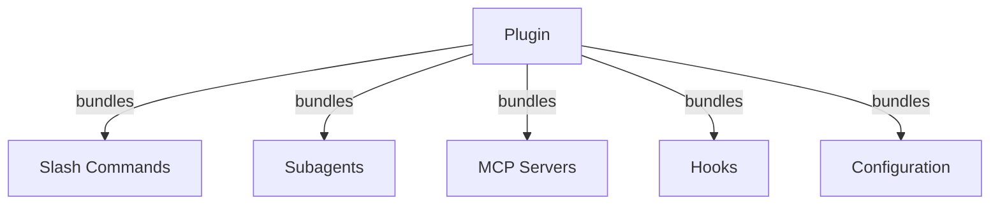
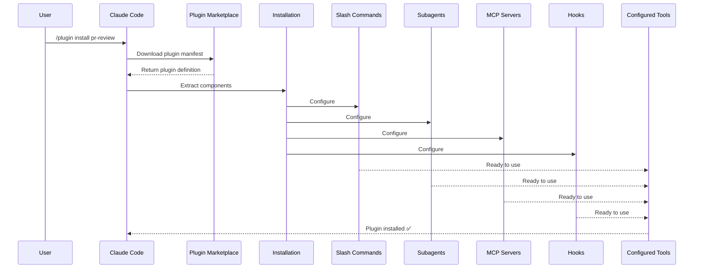
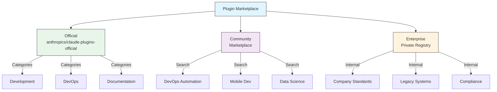
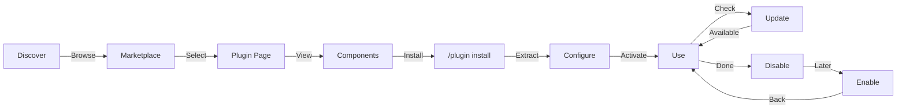
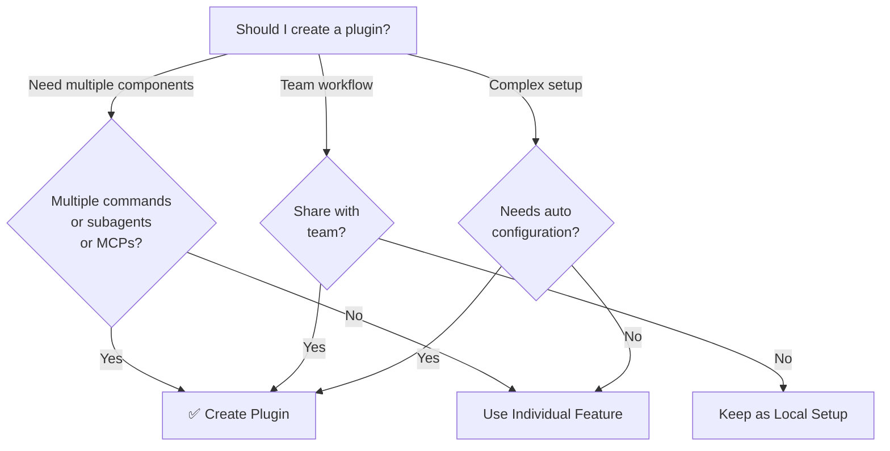

<!-- i18n-source: 07-plugins/README.md -->
<!-- i18n-source-sha: TBD -->
<!-- i18n-date: 2026-07-01 -->

<picture>
  <source media="(prefers-color-scheme: dark)" srcset="../../resources/logos/claude-howto-logo-dark.svg">
  
</picture>

# Claude Code 플러그인

이 폴더에는 여러 Claude Code 기능을 하나의 응집력 있는 설치 가능한 패키지로 번들링한 완전한 플러그인 예제가 포함되어 있습니다.

## 개요

Claude Code 플러그인은 슬래시 명령어, 서브에이전트, MCP 서버 및 훅의 번들 컬렉션으로, 단일 명령어로 설치됩니다. 이는 가장 높은 수준의 확장 메커니즘으로, 여러 기능을 응집력 있고 공유 가능한 패키지로 결합합니다.

## 플러그인 아키텍처



## 플러그인 로딩 프로세스



> **마켓플레이스 필요 없음 (v2.1.157+)**: `.claude/skills` 디렉토리에 배치된 플러그인은 마켓플레이스 없이 자동 로드됩니다. `claude plugin init <name>`으로 새 플러그인을 스캐폴딩하세요.

## 플러그인 유형 및 배포

| 유형 | 범위 | 공유 | 권한 | 예시 |
|------|-------|--------|-----------|----------|
| 공식 | 전역 | 모든 사용자 | Anthropic | PR Review, Security Guidance |
| 커뮤니티 | 공개 | 모든 사용자 | 커뮤니티 | DevOps, Data Science |
| 조직 | 내부 | 팀원 | 회사 | 내부 표준, 도구 |
| 개인 | 개인 | 단일 사용자 | 개발자 | 사용자 정의 워크플로우 |

## 플러그인 정의 구조

플러그인 매니페스트는 `.claude-plugin/plugin.json`에서 JSON 형식을 사용합니다:

```json
{
  "name": "my-first-plugin",
  "description": "A greeting plugin",
  "version": "1.0.0",
  "author": {
    "name": "Your Name"
  },
  "homepage": "https://example.com",
  "repository": "https://github.com/user/repo",
  "license": "MIT"
}
```

## 플러그인 구조 예시

```
my-plugin/
├── .claude-plugin/
│   └── plugin.json       # Manifest (name, description, version, author)
├── commands/             # Skills as Markdown files
│   ├── task-1.md
│   ├── task-2.md
│   └── workflows/
├── agents/               # Custom agent definitions
│   ├── specialist-1.md
│   ├── specialist-2.md
│   └── configs/
├── skills/               # Agent Skills with SKILL.md files
│   ├── skill-1.md
│   └── skill-2.md
├── hooks/                # Event handlers in hooks.json
│   └── hooks.json
├── .mcp.json             # MCP server configurations
├── .lsp.json             # LSP server configurations for code intelligence
├── bin/                  # Executables added to Bash tool's PATH while plugin is enabled
├── settings.json         # Default settings applied when plugin is enabled (currently only `agent` key supported)
├── themes/               # Optional: ship custom Claude Code themes (v2.1.118+)
├── templates/
│   └── issue-template.md
├── scripts/
│   ├── helper-1.sh
│   └── helper-2.py
├── docs/
│   ├── README.md
│   └── USAGE.md
└── tests/
    └── plugin.test.js
```

### LSP 서버 설정

플러그인은 실시간 코드 인텔리전스를 위한 LSP(Language Server Protocol) 지원을 포함할 수 있습니다. LSP 서버는 작업 중 진단, 코드 탐색 및 심볼 정보를 제공합니다.

**설정 위치**:
- 플러그인 루트 디렉토리의 `.lsp.json` 파일
- `plugin.json`의 인라인 `lsp` 키

#### 필드 참조

| 필드 | 필수 | 설명 |
|-------|----------|-------------|
| `command` | 예 | LSP 서버 바이너리 (PATH에 있어야 함) |
| `extensionToLanguage` | 예 | 파일 확장자를 언어 ID에 매핑 |
| `args` | 아니요 | 서버용 명령줄 인자 |
| `transport` | 아니요 | 통신 방법: `stdio` (기본값) 또는 `socket` |
| `env` | 아니요 | 서버 프로세스용 환경 변수 |
| `initializationOptions` | 아니요 | LSP 초기화 중 전송되는 옵션 |
| `settings` | 아니요 | 서버에 전달되는 작업 공간 설정 |
| `workspaceFolder` | 아니요 | 작업 공간 폴더 경로 재정의 |
| `startupTimeout` | 아니요 | 서버 시작 대기 최대 시간 (ms) |
| `shutdownTimeout` | 아니요 | 정상 종료 최대 시간 (ms) |
| `restartOnCrash` | 아니요 | 서버 충돌 시 자동 재시작 |
| `maxRestarts` | 아니요 | 포기 전 최대 재시도 횟수 |

#### 예제 설정

**Go (gopls)**:

```json
{
  "go": {
    "command": "gopls",
    "args": ["serve"],
    "extensionToLanguage": {
      ".go": "go"
    }
  }
}
```

**Python (pyright)**:

```json
{
  "python": {
    "command": "pyright-langserver",
    "args": ["--stdio"],
    "extensionToLanguage": {
      ".py": "python",
      ".pyi": "python"
    }
  }
}
```

**TypeScript**:

```json
{
  "typescript": {
    "command": "typescript-language-server",
    "args": ["--stdio"],
    "extensionToLanguage": {
      ".ts": "typescript",
      ".tsx": "typescriptreact",
      ".js": "javascript",
      ".jsx": "javascriptreact"
    }
  }
}
```

#### 사용 가능한 LSP 플러그인

공식 마켓플레이스에는 사전 구성된 LSP 플러그인이 포함되어 있습니다:

| 플러그인 | 언어 | 서버 바이너리 | 설치 명령어 |
|--------|----------|---------------|----------------|
| `pyright-lsp` | Python | `pyright-langserver` | `pip install pyright` |
| `typescript-lsp` | TypeScript/JavaScript | `typescript-language-server` | `npm install -g typescript-language-server typescript` |
| `rust-lsp` | Rust | `rust-analyzer` | `rustup component add rust-analyzer`로 설치 |

#### LSP 기능

설정되면 LSP 서버는 다음을 제공합니다:

- **즉시 진단** — 편집 후 즉시 오류 및 경고 표시
- **코드 탐색** — 정의로 이동, 참조 찾기, 구현
- **호버 정보** — 호버 시 타입 시그니처 및 문서
- **심볼 목록** — 현재 파일 또는 작업 공간의 심볼 찾아보기

### `bin/` 디렉토리를 `PATH`에 추가

플러그인이 활성화되면 해당 `bin/` 디렉토리가 세션의 `PATH` 앞에 추가됩니다. 거기에 제공된 모든 실행 파일은 정규화된 경로 없이 Bash 도구에서 이름으로 직접 호출할 수 있습니다.

```bash
# 플러그인 레이아웃에서:
my-plugin/
├── plugin.json
└── bin/
    └── my-tool          # executable file (chmod +x)

# 플러그인이 활성화된 Claude Code 세션 내에서:
$ my-tool --help
```

동일한 플러그인 내의 훅, 스킬 또는 명령어가 셸 아웃할 CLI 헬퍼에 사용하세요. 플러그인 저장소에서 파일을 실행 가능하게 표시하세요(`chmod +x`) — git이 비트를 보존합니다.

## 플러그인 옵션 (v2.1.83+)

플러그인은 매니페스트에서 `userConfig`를 통해 사용자 설정 가능한 옵션을 선언할 수 있습니다. `sensitive: true`로 표시된 값은 일반 텍스트 설정 파일 대신 시스템 키체인에 저장됩니다:

```json
{
  "name": "my-plugin",
  "version": "1.0.0",
  "userConfig": {
    "apiKey": {
      "description": "API key for the service",
      "sensitive": true
    },
    "region": {
      "description": "Deployment region",
      "default": "us-east-1"
    }
  }
}
```

## 영구 플러그인 데이터 (`${CLAUDE_PLUGIN_DATA}`) (v2.1.78+)

플러그인은 `${CLAUDE_PLUGIN_DATA}` 환경 변수를 통해 영구 상태 디렉토리에 접근할 수 있습니다. 이 디렉토리는 플러그인별로 고유하며 세션 간에 유지되므로 캐시, 데이터베이스 및 기타 영구 상태에 적합합니다:

```json
{
  "hooks": {
    "PostToolUse": [
      {
        "command": "node ${CLAUDE_PLUGIN_DATA}/track-usage.js"
      }
    ]
  }
}
```

디렉토리는 플러그인이 설치될 때 자동으로 생성됩니다. 여기에 저장된 파일은 플러그인이 제거될 때까지 유지됩니다.

### 백그라운드 모니터 (v2.1.105)

플러그인은 세션이 시작되거나 플러그인의 스킬이 호출될 때 자동으로 활성화되는 백그라운드 모니터를 등록할 수 있습니다. 플러그인 매니페스트에 최상위 `monitors` 키를 추가하세요:

```json
{
  "name": "my-plugin",
  "version": "1.0.0",
  "monitors": [
    {
      "command": "tail -f /var/log/app.log",
      "trigger": "session_start"
    }
  ]
}
```

`trigger` 필드는 다음을 허용합니다:
- `"session_start"` — 세션이 시작될 때 자동으로 모니터 활성화
- `"skill_invoke"` — 플러그인의 스킬이 호출될 때 모니터 활성화

모니터는 내부적으로 동일한 Monitor 도구를 사용하며, Claude가 반응할 수 있는 이벤트로 stdout 라인을 스트리밍합니다.

## 설정을 통한 인라인 플러그인 (`source: 'settings'`) (v2.1.80+)

플러그인은 `source: 'settings'` 필드를 사용하여 설정 파일에 마켓플레이스 항목으로 인라인 정의할 수 있습니다. 이를 통해 별도의 저장소나 마켓플레이스 없이 플러그인 정의를 직접 포함할 수 있습니다:

```json
{
  "pluginMarketplaces": [
    {
      "name": "inline-tools",
      "source": "settings",
      "plugins": [
        {
          "name": "quick-lint",
          "source": "./local-plugins/quick-lint"
        }
      ]
    }
  ]
}
```

## 플러그인 설정

플러그인은 기본 설정을 제공하기 위해 `settings.json` 파일을 제공할 수 있습니다. 현재는 `agent` 키를 지원하여 플러그인의 메인 스레드 에이전트를 설정합니다:

```json
{
  "agent": "agents/specialist-1.md"
}
```

플러그인에 `settings.json`이 포함되면 설치 시 기본값이 적용됩니다. 사용자는 자신의 프로젝트 또는 사용자 설정에서 이러한 설정을 재정의할 수 있습니다.

## 독립형 vs 플러그인 접근 방식

| 접근 방식 | 명령어 이름 | 설정 | 최적 대상 |
|----------|---------------|---|---|
| **독립형** | `/hello` | CLAUDE.md에서 수동 설정 | 개인, 프로젝트별 |
| **플러그인** | `/plugin-name:hello` | plugin.json을 통해 자동화 | 공유, 배포, 팀 사용 |

**독립형 슬래시 명령어**는 빠른 개인 워크플로우에 사용하세요. 여러 기능을 번들링하고, 팀과 공유하거나, 배포용으로 게시하려면 **플러그인**을 사용하세요.

> **공백 호출 (v2.1.136+)**: 플러그인 슬래시 명령어는 공백으로도 작동합니다 — `/myplugin review`는 표준 형식인 `/myplugin:review`로 확인됩니다. 두 형식 모두 괜찮습니다; 콜론 형식이 표준이며 스크립트에서 권장됩니다.

> **`skills/` 발견 (v2.1.136+)**: `plugin.json`의 `skills` 항목이 더 이상 플러그인의 기본 `skills/` 디렉토리를 숨기지 않습니다. 두 곳에 선언된 스킬이 병합되므로, 나머지를 잃지 않고 `plugin.json`에 몇 가지 주요 항목을 나열할 수 있습니다.

> **루트 레벨 `SKILL.md` 플러그인 (v2.1.142+)**: 최상위 `SKILL.md`가 있고 **`skills/` 하위 디렉토리가 없는** 플러그인은 자체적으로 단일 스킬로 표시됩니다 — 플러그인이 곧 스킬입니다. 이는 `skills/` 디렉토리나 `plugin.json` `skills` 항목을 대체하는 것이 아닌 추가 패턴입니다; 디렉토리 레이아웃이 가치를 더하지 않는 작은 단일 스킬 플러그인에 사용하세요.

## 실용적인 예제

### 예제 1: PR 리뷰 플러그인

**파일:** `.claude-plugin/plugin.json`

```json
{
  "name": "pr-review",
  "version": "1.0.0",
  "description": "Complete PR review workflow with security, testing, and docs",
  "author": {
    "name": "Anthropic"
  },
  "repository": "https://github.com/your-org/pr-review",
  "license": "MIT"
}
```

**파일:** `commands/review-pr.md`

```markdown
---
name: Review PR
description: Start comprehensive PR review with security and testing checks
---

# PR Review

This command initiates a complete pull request review including:

1. Security analysis
2. Test coverage verification
3. Documentation updates
4. Code quality checks
5. Performance impact assessment
```

**파일:** `agents/security-reviewer.md`

```yaml
---
name: security-reviewer
description: Security-focused code review
tools: read, grep, diff
---

# Security Reviewer

Specializes in finding security vulnerabilities:
- Authentication/authorization issues
- Data exposure
- Injection attacks
- Secure configuration
```

**설치:**

```bash
/plugin install pr-review

# Result:
# ✅ 3 slash commands installed
# ✅ 3 subagents configured
# ✅ 2 MCP servers connected
# ✅ 4 hooks registered
# ✅ Ready to use!
```

### 예제 2: DevOps 플러그인

**컴포넌트:**

```
devops-automation/
├── commands/
│   ├── deploy.md
│   ├── rollback.md
│   ├── status.md
│   └── incident.md
├── agents/
│   ├── deployment-specialist.md
│   ├── incident-commander.md
│   └── alert-analyzer.md
├── mcp/
│   ├── github-config.json
│   ├── kubernetes-config.json
│   └── prometheus-config.json
├── hooks/
│   ├── pre-deploy.js
│   ├── post-deploy.js
│   └── on-error.js
└── scripts/
    ├── deploy.sh
    ├── rollback.sh
    └── health-check.sh
```

### 예제 3: 문서화 플러그인

**번들 컴포넌트:**

```
documentation/
├── commands/
│   ├── generate-api-docs.md
│   ├── generate-readme.md
│   ├── sync-docs.md
│   └── validate-docs.md
├── agents/
│   ├── api-documenter.md
│   ├── code-commentator.md
│   └── example-generator.md
├── mcp/
│   ├── github-docs-config.json
│   └── slack-announce-config.json
└── templates/
    ├── api-endpoint.md
    ├── function-docs.md
    └── adr-template.md
```

## 플러그인 마켓플레이스

공식 Anthropic 관리 플러그인 디렉토리는 `anthropics/claude-plugins-official`입니다. 엔터프라이즈 관리자는 내부 배포를 위한 비공개 플러그인 마켓플레이스를 만들 수도 있습니다.



### 마켓플레이스 설정

엔터프라이즈 및 고급 사용자는 설정을 통해 마켓플레이스 동작을 제어할 수 있습니다:

| 설정 | 설명 |
|---------|-------------|
| `extraKnownMarketplaces` | 기본값 외에 추가 마켓플레이스 소스 추가 |
| `strictKnownMarketplaces` | 사용자가 추가할 수 있는 마켓플레이스 제어 (관리 전용) |
| `blockedMarketplaces` | 관리자 관리 차단 목록 (v2.1.119부터 `hostPattern` / `pathPattern` 정규식 필드 지원) |
| `deniedPlugins` | 특정 플러그인이 설치되지 않도록 관리자 관리 차단 목록 |

> **적용** (v2.1.117+): `blockedMarketplaces` 및 `strictKnownMarketplaces`는 모든 플러그인 라이프사이클 이벤트(설치, 업데이트, 새로고침, 자동 업데이트)에서 적용되며, 최초 추가 시에만 적용되는 것이 아닙니다. `strictKnownMarketplaces`는 관리 전용입니다.

호스트/경로 정규식이 있는 `blockedMarketplaces` 예시 (v2.1.119):

```json
{
  "blockedMarketplaces": [
    {
      "hostPattern": "^evil\\.example\\.com$",
      "pathPattern": "^/marketplaces/.*"
    }
  ]
}
```

### 추가 마켓플레이스 기능

- **마켓플레이스 검색 창 (v2.1.172)**: `/plugin`에서 마켓플레이스의 플러그인을 탐색할 때 검색 창을 통해 이름이나 키워드로 플러그인을 필터링할 수 있습니다 — 전체 목록을 스크롤하기 느린 대규모 마켓플레이스에 유용합니다.
- **기본 git 시간 초과**: 대규모 플러그인 저장소를 위해 30초에서 120초로 증가
- **사용자 정의 npm 레지스트리**: 플러그인이 의존성 해결을 위해 사용자 정의 npm 레지스트리 URL을 지정할 수 있음
- **버전 고정**: 재현 가능한 환경을 위해 플러그인을 특정 버전으로 고정
- **탐색 창의 예상 컨텍스트 비용 (v2.1.143)**: `/plugin` 마켓플레이스 브라우저는 각 플러그인의 예상 턴당 컨텍스트 토큰 비용을 표시합니다 — 항상 로드된 스킬, 훅, MCP 서버 설명자의 합계입니다. 설치 전에 플러그인 채택 규모를 측정하는 데 사용하세요. 설치 후에도 [`claude plugin details <name>`](#claude-plugin-details-name-v21139)을 통해 동일한 예상을 확인할 수 있습니다.

비용 열이 있는 탐색 행 예시:

```text
NAME              VERSION   AUTHOR     CTX/TURN   DESCRIPTION
code-reviewer     1.2.0     anthropic  +1,420     Multi-agent PR review
devops-toolkit    0.4.1     acme       +3,180     SRE playbooks, on-call helpers
docs-helper       0.9.0     community  +610       Doc-style guide enforcement
```

### 마켓플레이스 정의 스키마

플러그인 마켓플레이스는 `.claude-plugin/marketplace.json`에 정의됩니다:

```json
{
  "name": "my-team-plugins",
  "owner": "my-org",
  "plugins": [
    {
      "name": "code-standards",
      "source": "./plugins/code-standards",
      "description": "Enforce team coding standards",
      "version": "1.2.0",
      "author": "platform-team"
    },
    {
      "name": "deploy-helper",
      "source": {
        "source": "github",
        "repo": "my-org/deploy-helper",
        "ref": "v2.0.0"
      },
      "description": "Deployment automation workflows"
    }
  ]
}
```

| 필드 | 필수 | 설명 |
|-------|----------|-------------|
| `name` | 예 | 케밥 케이스의 마켓플레이스 이름 |
| `owner` | 예 | 마켓플레이스를 유지 관리하는 조직 또는 사용자 |
| `plugins` | 예 | 플러그인 항목 배열 |
| `plugins[].name` | 예 | 플러그인 이름 (케밥 케이스) |
| `plugins[].source` | 예 | 플러그인 소스 (경로 문자열 또는 소스 객체) |
| `plugins[].description` | 아니요 | 간단한 플러그인 설명 |
| `plugins[].version` | 아니요 | 시맨틱 버전 문자열 |
| `plugins[].author` | 아니요 | 플러그인 작성자 이름 |

### 플러그인 소스 유형

플러그인은 여러 위치에서 가져올 수 있습니다:

| 소스 | 문법 | 예시 |
|--------|--------|---------|
| **상대 경로** | 문자열 경로 | `"./plugins/my-plugin"` |
| **GitHub** | `{ "source": "github", "repo": "owner/repo" }` | `{ "source": "github", "repo": "acme/lint-plugin", "ref": "v1.0" }` |
| **Git URL** | `{ "source": "url", "url": "..." }` | `{ "source": "url", "url": "https://git.internal/plugin.git" }` |
| **Git 하위 디렉토리** | `{ "source": "git-subdir", "url": "...", "path": "..." }` | `{ "source": "git-subdir", "url": "https://github.com/org/monorepo.git", "path": "packages/plugin" }` |
| **npm** | `{ "source": "npm", "package": "..." }` | `{ "source": "npm", "package": "@acme/claude-plugin", "version": "^2.0" }` |
| **pip** | `{ "source": "pip", "package": "..." }` | `{ "source": "pip", "package": "claude-data-plugin", "version": ">=1.0" }` |

GitHub 및 git 소스는 버전 고정을 위한 선택적 `ref`(브랜치/태그) 및 `sha`(커밋 해시) 필드를 지원합니다.

### 배포 방법

**GitHub (권장)**:
```bash
# 사용자가 마켓플레이스 추가
/plugin marketplace add owner/repo-name
```

**기타 git 서비스** (전체 URL 필요):
```bash
/plugin marketplace add https://gitlab.com/org/marketplace-repo.git
```

**비공개 저장소**: git 자격 증명 헬퍼 또는 환경 토큰을 통해 지원됩니다. 사용자는 저장소에 대한 읽기 권한이 있어야 합니다.

**공식 마켓플레이스 제출**: [claude.ai/settings/plugins/submit](https://claude.ai/settings/plugins/submit) 또는 [platform.claude.com/plugins/submit](https://platform.claude.com/plugins/submit)을 통해 더 넓은 배포를 위해 Anthropic 큐레이션 마켓플레이스에 플러그인을 제출하세요.

### 마켓플레이스 관리

```bash
# 마켓플레이스 CLI 명령어
claude plugin marketplace add <source>       # 마켓플레이스 추가 (GitHub, URL, 로컬)
claude plugin marketplace update [name]      # 카탈로그 인덱스 새로고침
claude plugin marketplace remove <name>      # 마켓플레이스 제거
claude plugin marketplace list               # 설정된 마켓플레이스 목록
```

> **중요**: `marketplace update`는 플러그인 카탈로그(설치 가능한 항목)만 새로고침합니다. 설치된 플러그인은 업데이트하지 않습니다. 특정 설치된 플러그인을 업데이트하려면 `plugin update <name>`을 사용하세요.

### 엄격 모드

마켓플레이스 정의가 로컬 `plugin.json` 파일과 상호 작용하는 방식 제어:

| 설정 | 동작 |
|---------|----------|
| `strict: true` (기본값) | 로컬 `plugin.json`이 권위 있음; 마켓플레이스 항목이 보충 |
| `strict: false` | 마켓플레이스 항목이 전체 플러그인 정의 |

**`strictKnownMarketplaces`를 사용한 조직 제한:**

| 값 | 효과 |
|-------|--------|
| 설정되지 않음 | 제한 없음 — 사용자가 모든 마켓플레이스 추가 가능 |
| 빈 배열 `[]` | 잠금 — 마켓플레이스 허용되지 않음 |
| 패턴 배열 | 허용 목록 — 일치하는 마켓플레이스만 추가 가능 |

```json
{
  "strictKnownMarketplaces": [
    "my-org/*",
    "github.com/trusted-vendor/*"
  ]
}
```

> **경고**: `strictKnownMarketplaces`가 있는 엄격 모드에서는 허용 목록에 있는 마켓플레이스의 플러그인만 설치할 수 있습니다. 이는 통제된 플러그인 배포가 필요한 엔터프라이즈 환경에 유용합니다.

## 플러그인 설치 및 라이프사이클



## 플러그인 기능 비교

| 기능 | 슬래시 명령어 | 스킬 | 서브에이전트 | 플러그인 |
|---------|---------------|-------|----------|--------|
| **설치** | 수동 복사 | 수동 복사 | 수동 설정 | 한 번의 명령어 |
| **설정 시간** | 5분 | 10분 | 15분 | 2분 |
| **번들링** | 단일 파일 | 단일 파일 | 단일 파일 | 여러 개 |
| **버전 관리** | 수동 | 수동 | 수동 | 자동 |
| **팀 공유** | 파일 복사 | 파일 복사 | 파일 복사 | 설치 ID |
| **업데이트** | 수동 | 수동 | 수동 | 자동 가능 |
| **의존성** | 없음 | 없음 | 없음 | 포함 가능 |
| **마켓플레이스** | 아니요 | 아니요 | 아니요 | 예 |
| **배포** | 저장소 | 저장소 | 저장소 | 마켓플레이스 |

## 플러그인 CLI 명령어

모든 플러그인 작업은 CLI 명령어로 사용 가능:

```bash
claude plugin install <name>@<marketplace>   # 마켓플레이스에서 설치
claude plugin uninstall <name>               # 플러그인 제거
claude plugin update <name>                  # 설치된 플러그인을 최신 버전으로 업데이트
claude plugin list                           # 설치된 플러그인 목록
claude plugin enable <name>                  # 비활성화된 플러그인 활성화
claude plugin disable <name>                 # 플러그인 비활성화
claude plugin validate                       # 플러그인 구조 검증
claude plugin tag <version>                  # 버전 검증과 함께 릴리스 git 태그 생성 (v2.1.118+)
claude plugin prune                          # 고아 자동 설치 플러그인 의존성 제거 (v2.1.121+)
claude plugin uninstall <name> --prune       # 제거 및 계단식 고아 의존성 정리 (v2.1.121+)
claude plugin details <name>                 # 인벤토리 + 예상 턴당 토큰 비용 표시 (v2.1.139+)
```

예시: `claude plugin tag v0.3.0`은 버전 형식의 유효성을 검사하고 일치하는 git 태그를 생성하며, 배포용 플러그인 릴리스를 만드는 권장 방법입니다.

`claude plugin prune`은 자체 의존성을 가져온 마켓플레이스 플러그인을 설치하거나 제거한 후 유용합니다 — 부모 플러그인이 제거된 이후 자동 설치된 플러그인을 제거합니다. `plugin uninstall --prune`은 단일 단계에서 동일한 계단식 정리를 수행합니다.

> **의존성 적용 (v2.1.143)**: 다른 활성화된 플러그인이 대상에 계속 의존하는 경우 `claude plugin disable <name>`은 **거부**합니다(의존성 그래프가 손상됨). `claude plugin enable <name>`은 각각에 대해 별도 활성화를 요구하는 대신 단일 확인 프롬프트 후 **전이 의존성을 강제 활성화**합니다. `claude plugin prune`을 사용하여 의존자가 나중에 제거된 의존성을 정리하세요.

### `claude plugin details <name>` (v2.1.139+)

`claude plugin details <name>`은 플러그인의 전체 컴포넌트 인벤토리 — 스킬, 훅, MCP 서버, LSP 서버, 백그라운드 모니터, 슬래시 명령어 — 와 **예상 턴당(및 호출당) 토큰 비용**을 출력합니다. 채택 전에 플러그인 규모를 측정하는 데 사용하세요, 특히 컨텍스트 제약이 있는 모델에서.

출력 예시 (축약):

```text
plugin: code-reviewer (1.2.0)
skills:        3      hooks: 2      mcp: 1      lsp: 0      monitors: 0
commands:      /review, /security-review
projected ctx: +1,420 tokens per turn  ·  +9,800 tokens per /review invocation
```

LSP 서버는 v2.1.142에서 세부 정보 창에 추가되었습니다. [플러그인 마켓플레이스](#플러그인-마켓플레이스)에서 다루는 마켓플레이스 탐색 창의 예상 컨텍스트 비용(v2.1.143)도 참조하세요.

## 설치 방법

### 마켓플레이스에서
```bash
/plugin install plugin-name
# 또는 CLI에서:
claude plugin install plugin-name@marketplace-name
```

### 활성화 / 비활성화 (자동 감지 범위)
```bash
/plugin enable plugin-name
/plugin disable plugin-name
```

`/plugin` 인터페이스는 사용하지 않는 플러그인을 표시하여 정리할 수 있게 합니다 (v2.1.187+). 플러그인의 `plugin.json` `name`이 마켓플레이스 항목 이름과 다른 경우에도 활성화/비활성화가 작동합니다 (v2.1.195+).

### 설치된 플러그인 목록 (v2.1.163)
현재 세션에서 활성화된 플러그인 확인:
```bash
/plugin list             # all installed plugins
/plugin list --enabled   # only enabled plugins
/plugin list --disabled  # only disabled plugins
```

### 로컬 플러그인 (개발용)
```bash
# 로컬 테스트용 CLI 플래그 (여러 플러그인에 대해 반복 가능)
claude --plugin-dir ./path/to/plugin
claude --plugin-dir ./plugin-a --plugin-dir ./plugin-b

# --plugin-dir은 디렉토리 외에도 .zip 아카이브 경로 허용 (v2.1.128+)
claude --plugin-dir ./my-plugin.zip

# URL에서 플러그인 .zip 아카이브를 가져와 현재 세션에 사용 (v2.1.129+, 반복 가능)
claude --plugin-url https://example.com/releases/my-plugin-0.3.0.zip
```

### Git 저장소에서
```bash
/plugin install github:username/repo
```

## 자동 업데이트

Claude Code는 시작 시 마켓플레이스와 설치된 플러그인을 자동으로 업데이트할 수 있습니다.

| 마켓플레이스 유형 | 자동 업데이트 기본값 | 전환 방법 |
|------------------|---------------------|---------------|
| 공식 (`claude-plugins-official`) | ✅ 활성화됨 | `/plugin` → 마켓플레이스 → 선택 |
| 서드파티 / 로컬 | ❌ 비활성화됨 | 동일한 UI 경로 |

자동 업데이트가 실행되면 Claude Code는:
1. 마켓플레이스 카탈로그 새로고침
2. 설치된 플러그인을 최신 버전으로 업데이트
3. `/reload-plugins`을 알리는 알림 표시

### 환경 변수

| 변수 | 효과 |
|----------|--------|
| `DISABLE_AUTOUPDATER=1` | 모든 자동 업데이트 비활성화 (Claude Code + 플러그인) |
| `DISABLE_AUTOUPDATER=1` + `FORCE_AUTOUPDATE_PLUGINS=1` | 플러그인 업데이트 유지, Claude Code 업데이트 비활성화 |
| `CLAUDE_CODE_PLUGIN_PREFER_HTTPS=1` | (v2.1.141+) SSH 원격이 있어도 `claude plugin install`이 GitHub 플러그인 소스를 HTTPS를 통해 복제하도록 강제. SSH 키가 없는 CI 실행기나 컨테이너에서 사용. |

```bash
# 모든 자동 업데이트 비활성화
export DISABLE_AUTOUPDATER=1

# 플러그인 자동 업데이트만 유지
export DISABLE_AUTOUPDATER=1
export FORCE_AUTOUPDATE_PLUGINS=1

# SSH 키 없는 CI 실행기 — 플러그인 설치에 HTTPS 강제
export CLAUDE_CODE_PLUGIN_PREFER_HTTPS=1
claude plugin install code-reviewer@anthropic
```

> **원격 세션 플러그인 로딩 (v2.1.179)**: v2.1.179에서 원격 세션의 플러그인 로딩 성능이 개선되어, 원격 세션에 연결할 때 플러그인을 더 빨리 사용할 수 있습니다.

## 플러그인 생성 시기



### 플러그인 사용 사례

| 사용 사례 | 권장 | 이유 |
|----------|-----------------|-----|
| **팀 온보딩** | ✅ 플러그인 사용 | 즉시 설정, 모든 구성 |
| **프레임워크 설정** | ✅ 플러그인 사용 | 프레임워크별 명령어 번들 |
| **엔터프라이즈 표준** | ✅ 플러그인 사용 | 중앙 배포, 버전 관리 |
| **빠른 작업 자동화** | ❌ 명령어 사용 | 과도한 복잡성 |
| **단일 도메인 전문성** | ❌ 스킬 사용 | 너무 무거움, 스킬 사용 |
| **특화된 분석** | ❌ 서브에이전트 사용 | 수동 생성 또는 스킬 사용 |
| **실시간 데이터 접근** | ❌ MCP 사용 | 독립형, 번들링 불필요 |

## 플러그인 테스트

게시 전에 `--plugin-dir` CLI 플래그를 사용하여 로컬에서 플러그인을 테스트하세요(여러 플러그인에 대해 반복 가능):

```bash
claude --plugin-dir ./my-plugin
claude --plugin-dir ./my-plugin --plugin-dir ./another-plugin

# --plugin-dir은 디렉토리 외에 .zip 아카이브도 허용 (v2.1.128+)
claude --plugin-dir ./my-plugin.zip

# --plugin-url은 URL에서 플러그인 .zip을 가져와 이 세션에 사용 (v2.1.129+, 반복 가능)
claude --plugin-url https://example.com/releases/my-plugin-0.3.0.zip
```

이렇게 하면 플러그인이 로드된 Claude Code가 실행되어 다음을 수행할 수 있습니다:
- 모든 슬래시 명령어 사용 가능 확인
- 서브에이전트 및 에이전트가 올바르게 작동하는지 테스트
- MCP 서버가 제대로 연결되는지 확인
- 훅 실행 검증
- LSP 서버 설정 확인
- 설정 오류 확인

## 핫 리로드

플러그인은 개발 중 핫 리로드를 지원합니다. 플러그인 파일을 수정하면 Claude Code가 자동으로 변경 사항을 감지할 수 있습니다. 다음 명령어로 강제 리로드할 수도 있습니다:

```bash
/reload-plugins
```

이렇게 하면 세션을 재시작하지 않고 모든 플러그인 매니페스트, 명령어, 에이전트, 스킬, 훅, MCP/LSP 설정을 다시 읽습니다.

## 플러그인 관리형 설정

관리자는 관리형 설정을 사용하여 조직 전체에서 플러그인 동작을 제어할 수 있습니다:

| 설정 | 설명 |
|---------|-------------|
| `enabledPlugins` | 기본적으로 활성화되는 플러그인의 허용 목록 |
| `deniedPlugins` | 설치할 수 없는 플러그인의 차단 목록 |
| `extraKnownMarketplaces` | 기본값 외에 추가 마켓플레이스 소스 추가 |
| `strictKnownMarketplaces` | 사용자가 추가할 수 있는 마켓플레이스 제한 (관리 전용; v2.1.117부터 모든 플러그인 라이프사이클 이벤트에서 적용) |
| `blockedMarketplaces` | 마켓플레이스 차단 목록; v2.1.117부터 모든 플러그인 라이프사이클 이벤트에서 적용; v2.1.119부터 `hostPattern` / `pathPattern` 정규식 필드 지원 |
| `allowedChannelPlugins` | 릴리스 채널별로 허용되는 플러그인 제어 |

이러한 설정은 관리형 설정 파일을 통해 조직 수준에서 적용될 수 있으며 사용자 수준 설정보다 우선합니다.

## 플러그인 보안

플러그인 서브에이전트는 제한된 샌드박스에서 실행됩니다. 다음 frontmatter 키는 플러그인 서브에이전트 정의에서 **허용되지 않습니다**:

- `hooks` -- 서브에이전트가 이벤트 핸들러를 등록할 수 없음
- `mcpServers` -- 서브에이전트가 MCP 서버를 구성할 수 없음
- `permissionMode` -- 서브에이전트가 권한 모델을 재정의할 수 없음

이를 통해 플러그인이 선언된 범위를 넘어 권한을 상승시키거나 호스트 환경을 수정할 수 없도록 보장합니다.

## 플러그인 게시

**게시 단계:**

1. 모든 컴포넌트로 플러그인 구조 생성
2. `.claude-plugin/plugin.json` 매니페스트 작성
3. 문서와 함께 `README.md` 생성
4. `claude --plugin-dir ./my-plugin`으로 로컬 테스트
5. `claude plugin tag v0.3.0`으로 릴리스 태그 생성 (v2.1.118+) — 버전 문자열 유효성 검사 및 일치하는 git 태그 생성
6. 플러그인 마켓플레이스에 제출
7. 검토 및 승인
8. 마켓플레이스에 게시
9. 사용자가 한 번의 명령어로 설치 가능

**제출 예시:**

```markdown
# PR Review Plugin

## Description
Complete PR review workflow with security, testing, and documentation checks.

## What's Included
- 3 slash commands for different review types
- 3 specialized subagents
- GitHub and CodeQL MCP integration
- Automated security scanning hooks

## Installation
```bash
/plugin install pr-review
```

## Features
✅ Security analysis
✅ Test coverage checking
✅ Documentation verification
✅ Code quality assessment
✅ Performance impact analysis

## Usage
```bash
/review-pr
/check-security
/check-tests
```

## Requirements
- Claude Code 1.0+
- GitHub access
- CodeQL (optional)
```

## 플러그인 vs 수동 설정

**수동 설정 (2시간 이상):**
- 슬래시 명령어를 하나씩 설치
- 서브에이전트를 개별적으로 생성
- MCP를 별도로 설정
- 훅을 수동으로 설정
- 모든 것을 문서화
- 팀과 공유 (올바르게 설정하기를 기대)

**플러그인 사용 (2분):**
```bash
/plugin install pr-review
# ✅ Everything installed and configured
# ✅ Ready to use immediately
# ✅ Team can reproduce exact setup
```

## 모범 사례

### Do's ✅
- 명확하고 설명적인 플러그인 이름 사용
- 포괄적인 README 포함
- 플러그인을 적절히 버전 관리 (semver)
- 모든 컴포넌트를 함께 테스트
- 요구사항을 명확히 문서화
- 사용 예제 제공
- 오류 처리 포함
- 검색을 위해 적절히 태그 지정
- 하위 호환성 유지
- 플러그인을 집중적이고 응집력 있게 유지
- 포괄적인 테스트 포함
- 모든 의존성 문서화

### Don'ts ❌
- 관련 없는 기능 번들링 금지
- 자격 증명 하드코딩 금지
- 테스트 건너뛰기 금지
- 문서화 잊지 않기
- 중복 플러그인 생성 금지
- 버전 관리 무시 금지
- 컴포넌트 의존성을 과도하게 복잡하게 만들지 않기
- 오류를 우아하게 처리하는 것을 잊지 않기

## 설치 방법

### 마켓플레이스에서 설치

1. **사용 가능한 플러그인 찾아보기:**
   ```bash
   /plugin list
   ```

2. **플러그인 세부 정보 보기:**
   ```bash
   /plugin info plugin-name
   ```

3. **플러그인 설치:**
   ```bash
   /plugin install plugin-name
   ```

### 로컬 경로에서 설치

```bash
/plugin install ./path/to/plugin-directory
```

### GitHub에서 설치

```bash
/plugin install github:username/repo
```

### 설치된 플러그인 목록

```bash
/plugin list --installed
```

### 플러그인 업데이트

```bash
/plugin update plugin-name
```

### 플러그인 비활성화/활성화

```bash
# Temporarily disable
/plugin disable plugin-name

# Re-enable
/plugin enable plugin-name
```

### 플러그인 제거

```bash
/plugin uninstall plugin-name
```

## 관련 개념

다음 Claude Code 기능은 플러그인과 함께 작동합니다:

- **[슬래시 명령어](../01-slash-commands/)** - 플러그인에 번들된 개별 명령어
- **[메모리](../02-memory/)** - 플러그인을 위한 영구 컨텍스트
- **[스킬](../03-skills/)** - 플러그인에 래핑할 수 있는 도메인 전문성
- **[서브에이전트](../04-subagents/)** - 플러그인 컴포넌트로 포함된 특화된 에이전트
- **[MCP 서버](../05-mcp/)** - 플러그인에 번들된 Model Context Protocol 통합
- **[훅](../06-hooks/)** - 플러그인 워크플로우를 트리거하는 이벤트 핸들러

## 완전한 예제 워크플로우

### PR 리뷰 플러그인 전체 워크플로우

```
1. User: /review-pr

2. Plugin executes:
   ├── pre-review.js hook validates git repo
   ├── GitHub MCP fetches PR data
   ├── security-reviewer subagent analyzes security
   ├── test-checker subagent verifies coverage
   └── performance-analyzer subagent checks performance

3. Results synthesized and presented:
   ✅ Security: No critical issues
   ⚠️  Testing: Coverage 65% (recommend 80%+)
   ✅ Performance: No significant impact
   📝 12 recommendations provided
```

## 문제 해결

### 플러그인이 설치되지 않음
- Claude Code 버전 호환성 확인: `/version`
- JSON 검증기로 `plugin.json` 구문 확인
- 인터넷 연결 확인 (원격 플러그인의 경우)
- 권한 검토: `ls -la plugin/`

### 컴포넌트가 로드되지 않음
- `plugin.json`의 경로가 실제 디렉토리 구조와 일치하는지 확인
- 파일 권한 확인: `chmod +x scripts/`
- 컴포넌트 파일 구문 검토
- 로그 확인: `/plugin debug plugin-name`

### MCP 연결 실패
- 환경 변수가 올바르게 설정되었는지 확인
- MCP 서버 설치 및 상태 확인
- `/mcp test`로 MCP 연결을 독립적으로 테스트
- `mcp/` 디렉토리의 MCP 설정 검토

### 설치 후 명령어를 사용할 수 없음
- 플러그인이 성공적으로 설치되었는지 확인: `/plugin list --installed`
- 플러그인이 활성화되어 있는지 확인: `/plugin status plugin-name`
- Claude Code 재시작: `exit` 후 다시 열기
- 기존 명령어와의 이름 충돌 확인

### 훅 실행 문제
- 훅 파일에 올바른 권한이 있는지 확인
- 훅 구문 및 이벤트 이름 확인
- 오류 세부 정보를 위해 훅 로그 검토
- 가능하면 훅을 수동으로 테스트

## 추가 자료

- [공식 플러그인 문서](https://code.claude.com/docs/en/plugins)
- [플러그인 찾아보기](https://code.claude.com/docs/en/discover-plugins)
- [플러그인 마켓플레이스](https://code.claude.com/docs/en/plugin-marketplaces)
- [플러그인 참조](https://code.claude.com/docs/en/plugins-reference)
- [MCP 서버 참조](https://modelcontextprotocol.io/)
- [서브에이전트 설정 가이드](../04-subagents/README.md)
- [훅 시스템 참조](../06-hooks/README.md)

---

**마지막 업데이트**: 2026년 6월 28일
**Claude Code 버전**: 2.1.195
**출처**:
- https://code.claude.com/docs/en/plugins
- https://code.claude.com/docs/en/changelog#2-1-172
- https://code.claude.com/docs/en/changelog
- https://code.claude.com/docs/en/slash-commands
- https://code.claude.com/docs/en/plugin-marketplaces
- https://github.com/anthropics/claude-code/releases/tag/v2.1.117
- https://github.com/anthropics/claude-code/releases/tag/v2.1.118
- https://github.com/anthropics/claude-code/releases/tag/v2.1.131
- https://github.com/anthropics/claude-code/releases/tag/v2.1.138
- https://github.com/anthropics/claude-code/releases/tag/v2.1.139
- https://github.com/anthropics/claude-code/releases/tag/v2.1.141
- https://github.com/anthropics/claude-code/releases/tag/v2.1.142
- https://github.com/anthropics/claude-code/releases/tag/v2.1.143
- https://code.claude.com/docs/en/cli-reference
**호환 모델**: Claude Sonnet 4.6, Claude Opus 4.8, Claude Haiku 4.5
