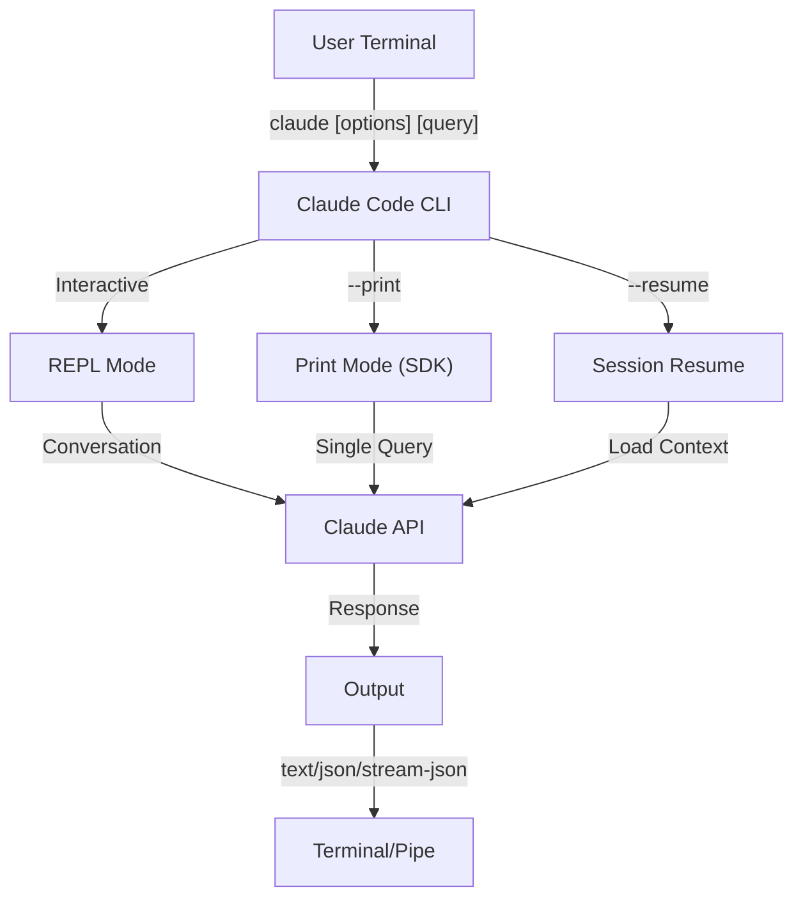
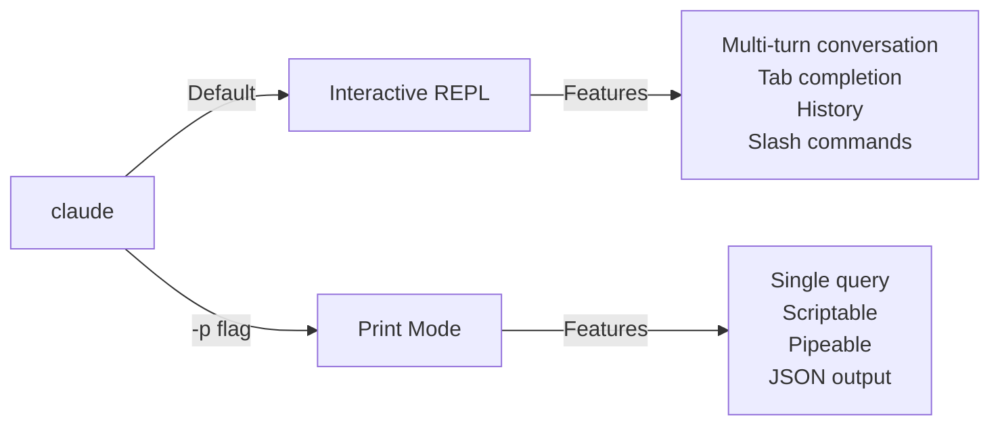

<!-- i18n-source: 10-cli/README.md -->
<!-- i18n-source-sha: TBD -->
<!-- i18n-date: 2026-07-01 -->
<picture>
  <source media="(prefers-color-scheme: dark)" srcset="../../resources/logos/claude-howto-logo-dark.svg">
  
</picture>

# CLI 참조

## 개요

Claude Code CLI(Command Line Interface)는 Claude Code와 상호작용하는 기본 방법입니다. 쿼리 실행, 세션 관리, 모델 설정, Claude를 개발 워크플로우에 통합하기 위한 강력한 옵션을 제공합니다.

## 아키텍처



## 런타임 및 패키징

**v2.1.113**부터 Claude Code CLI는 선택적 npm 의존성을 통해 **네이티브 플랫폼별 바이너리**(macOS, Linux, Windows)를 실행합니다. 바이너리는 설치 시 OS 및 아키텍처에 맞게 선택됩니다 — 구형 번들 JavaScript 런타임은 더 이상 macOS 또는 Linux에서 기본값이 아닙니다.

**사용자 대상 설치는 변경되지 않았습니다**: `npm install -g @anthropic-ai/claude-code`가 여전히 작동하며 권장 경로로 유지됩니다. 내부적으로 npm이 플랫폼에 맞는 올바른 네이티브 바이너리를 가져옵니다.

**다운로드 호스트**(v2.1.116+): 네이티브 바이너리 아티팩트는 `https://downloads.claude.ai/claude-code-releases`에서 제공됩니다.

> **기업/프록시 사용자**: 네트워크에 명시적 허용 목록이 필요한 경우 프록시 이그레스 규칙에 `downloads.claude.ai`(및 `https://downloads.claude.ai/claude-code-releases`)를 추가하세요. 이전에 `storage.googleapis.com` 또는 npm 레지스트리만 허용한 환경은 업데이트해야 합니다. 그렇지 않으면 `claude update` 및 초기 설치가 실패합니다.

구형 JavaScript 번들은 Windows와 이에 고정된 환경을 위해 계속 생성됩니다; 해당 설치는 Glob 및 Grep을 일류 도구로 계속 제공합니다([도구 및 권한 관리](#도구-및-권한-관리) 아래 Glob/Grep 각주 참조).

## CLI 명령어

| 명령어 | 설명 | 예시 |
|--------|------|------|
| `claude` | 대화형 REPL 시작 | `claude` |
| `claude "query"` | 초기 프롬프트로 REPL 시작 | `claude "이 프로젝트 설명"` |
| `claude -p "query"` | Print mode - 쿼리 후 종료 | `claude -p "이 함수 설명"` |
| `cat file \| claude -p "query"` | 파이프된 콘텐츠 처리 | `cat logs.txt \| claude -p "설명"` |
| `claude -c` | 가장 최근 대화 계속 | `claude -c` |
| `claude -c -p "query"` | Print mode에서 계속 | `claude -c -p "타입 오류 확인"` |
| `claude -r "<session>" "query"` | ID 또는 이름으로 세션 재개 | `claude -r "auth-refactor" "이 PR 마무리"` |
| `claude update` | 최신 버전으로 업데이트 | `claude update` |
| `/doctor` (slash command) | 설치, 설정, 플러그인 상태 진단. v2.1.116부터 Claude가 **응답하는 동안** 열 수 있으며, 인라인으로 상태 아이콘을 표시하고, 감지된 문제를 자동 수정하기 위해 `f` 키 입력을 허용합니다. v2.1.178은 레이아웃을 평면 트리로 새로고침하고 더 명확한 상태 아이콘과 강조 표시된 명령어를 제공합니다 | REPL 내에서 `/doctor` 실행 |
| `claude mcp` | MCP 서버 설정 (인증을 위한 `login`/`logout` 포함, v2.1.186+) | [MCP 문서](../05-mcp/) 참조 |
| `claude mcp serve` | Claude Code를 MCP 서버로 실행 | `claude mcp serve` |
| `claude agents` | **Agent View** 열기 (Research Preview, v2.1.139+) — 모든 Claude Code 세션을 상태와 함께 나열하는 다중 세션 관리자. 아래 [Agent View](#agent-view-claude-agents-v21139) 참조. | `claude agents` |
| `claude auto-mode defaults` | Auto mode 기본 규칙을 JSON으로 출력 | `claude auto-mode defaults` |
| `claude remote-control` | Remote Control 서버 시작 | `claude remote-control` |
| `claude plugin` | 플러그인 관리 (설치, 활성화, 비활성화) | `claude plugin install my-plugin` |
| `claude plugin init <name>` | `.claude/skills`에서 새 플러그인 스캐폴드 — 마켓플레이스 없이 자동 로드(v2.1.157+) | `claude plugin init my-plugin` |
| `claude plugin tag <version>` | 버전 검증과 함께 플러그인용 릴리스 git 태그 생성(v2.1.118+) | `claude plugin tag v0.3.0` |
| `claude install [version]` | 특정 네이티브 바이너리 버전 설치. `stable`, `latest` 또는 명시적 버전 문자열 허용 | `claude install 2.1.131` |
| `claude project purge [path]` | 프로젝트의 모든 로컬 Claude Code 상태 삭제 (트랜스크립트, 작업, 디버그 로그, 파일 편집 기록, 프롬프트 기록, `~/.claude.json` 항목). `[path]`를 생략하면 대화형 선택기 표시. 플래그: `--dry-run`으로 미리보기, `-y/--yes`로 확인 건너뛰기, `-i/--interactive`로 각 항목 확인, `--all`로 모든 프로젝트(v2.1.126+) | `claude project purge ~/work/repo --dry-run` |
| `claude plugin prune` | 고아가 된 자동 설치 플러그인 의존성 제거(부모 플러그인이 사라짐). `plugin uninstall --prune`은 대상 제거 후 동일한 캐스케이드를 수행(v2.1.121+) | `claude plugin prune` |
| `claude ultrareview [target]` | `/ultrareview`를 비대화형으로 실행. 결과를 stdout으로 출력, 성공 시 0 / 실패 시 1로 종료. 원시 페이로드는 `--json`, 30분 기본값 재정의는 `--timeout <minutes>` 사용(v2.1.120+) | `claude ultrareview 1234 --json` |
| `claude auth login` | 로그인 (`--email`, `--sso` 지원). v2.1.126부터 브라우저 콜백이 localhost에 도달할 수 없을 때(WSL2, SSH, 컨테이너) 터미널에 붙여넣은 OAuth 코드를 대체 수단으로 허용 | `claude auth login --email user@example.com` |
| `claude auth logout` | 현재 계정에서 로그아웃 | `claude auth logout` |
| `claude auth status` | 인증 상태 확인 (로그인 시 0, 미로그인 시 1 종료) | `claude auth status` |

## 핵심 플래그

| 플래그 | 설명 | 예시 |
|-------|------|------|
| `-p, --print` | 대화형 모드 없이 응답 출력 | `claude -p "query"` |
| `-c, --continue` | 가장 최근 대화 로드 | `claude --continue` |
| `-r, --resume` | ID 또는 이름으로 특정 세션 재개 | `claude --resume auth-refactor` |
| `-v, --version` | 버전 번호 출력 | `claude -v` |
| `-w, --worktree` | 격리된 git worktree에서 시작 | `claude -w` |
| `-n, --name` | 세션 표시 이름 | `claude -n "auth-refactor"` |
| `--from-pr <url-or-number>` | pull/merge request에 연결된 세션 재개. GitHub(cloud + Enterprise), GitLab MR, Bitbucket PR URL 허용(v2.1.119부터; 이전에는 GitHub.com만) | `claude --from-pr 42` 또는 `claude --from-pr https://gitlab.example.com/org/repo/-/merge_requests/17` |
| `--remote "task"` | claude.ai에 웹 세션 생성 | `claude --remote "API 구현"` |
| `--remote-control, --rc` | Remote Control로 대화형 세션 | `claude --rc` |
| `--teleport` | 웹 세션을 로컬에서 재개 | `claude --teleport` |
| `--teammate-mode` | 에이전트 팀 표시 모드 | `claude --teammate-mode tmux` |
| `--bare` | 최소 모드 (hooks, skills, plugins, MCP, auto memory, CLAUDE.md 건너뛰기) | `claude --bare` |
| `--safe-mode` | 모든 사용자 정의 비활성화로 시작 (CLAUDE.md, plugins, skills, hooks, MCP) — 설정 문제 격리; `CLAUDE_CODE_SAFE_MODE=1`도 가능(v2.1.169) | `claude --safe-mode` |
| `--enable-auto-mode` | Auto permission mode 잠금 해제 (Opus 4.7의 Max 구독자에게는 더 이상 필요하지 않음) | `claude --enable-auto-mode` |
| `--channels` | MCP 채널 플러그인 구독 | `claude --channels discord,telegram` |
| `--chrome` / `--no-chrome` | Chrome 브라우저 통합 활성화/비활성화 | `claude --chrome` |
| `--effort` | 생각 노력 수준 설정 | `claude --effort high` |
| `--init` / `--init-only` | 초기화 훅 실행 | `claude --init` |
| `--maintenance` | 유지보수 훅 실행 후 종료 | `claude --maintenance` |
| `--disable-slash-commands` | 모든 스킬 및 slash command 비활성화 | `claude --disable-slash-commands` |
| `--no-session-persistence` | 세션 저장 비활성화 (print mode) | `claude -p --no-session-persistence "query"` |
| `--exclude-dynamic-system-prompt-sections` | 더 나은 프롬프트 캐시 적중률을 위해 시스템 프롬프트에서 동적 섹션 제외 | `claude -p --exclude-dynamic-system-prompt-sections "query"` |

### 대화형 vs Print Mode



**대화형 모드** (기본값):
```bash
# 대화형 세션 시작
claude

# 초기 프롬프트로 시작
claude "인증 흐름 설명"
```

**Print Mode** (비대화형):
```bash
# 단일 쿼리 후 종료
claude -p "이 함수는 무엇을 하나요?"

# 파일 콘텐츠 처리
cat error.log | claude -p "이 오류 설명"

# 다른 도구와 연결
claude -p "할 일 목록" | grep "URGENT"
```

## 모델 및 설정

| 플래그 | 설명 | 예시 |
|-------|------|------|
| `--model` | 모델 설정 (sonnet, opus, haiku, 또는 전체 이름) | `claude --model opus` |
| `--fallback-model` | 기본 모델이 과부하/사용 불가능할 때 자동 모델 폴백; `fallbackModel` 설정을 통해 최대 세 개까지 설정 가능. v2.1.166부터 대화형 세션에도 적용(이전에는 print mode만) | `claude -p --fallback-model sonnet "query"` |
| `--agent` | 세션용 에이전트 지정 | `claude --agent my-custom-agent` |
| `--agents` | JSON으로 사용자 정의 subagent 정의 | [에이전트 설정](#에이전트-설정) 참조 |
| `--effort` | 노력 수준 설정 (low, medium, high, xhigh, max) | `claude --effort xhigh` |

### 모델 선택 예시

```bash
# 복잡한 작업에 Opus 4.8 사용
claude --model opus "캐싱 전략 설계"

# 빠른 작업에 Haiku 4.5 사용
claude --model haiku -p "이 JSON 포맷팅"

# 전체 모델 이름
claude --model claude-sonnet-4-6-20250929 "이 코드 리뷰"

# 안정성을 위한 폴백 포함
claude -p --model opus --fallback-model sonnet "아키텍처 분석"

# opusplan 사용 (Opus가 계획, Sonnet이 실행)
claude --model opusplan "캐싱 레이어 설계 및 구현"
```

> **게이트웨이 모델 검색 (v2.1.129+, 옵트인)**: `ANTHROPIC_BASE_URL`이 Anthropic 호환 게이트웨이를 가리킬 때 `CLAUDE_CODE_ENABLE_GATEWAY_MODEL_DISCOVERY=1`을 설정하여 게이트웨이의 `/v1/models` 엔드포인트에서 `/model`을 채웁니다. env var가 없으면 `/model`이 내장 정적 목록으로 폴백됩니다. 플래그는 옵트인입니다(v2.1.129에서 변경됨). 검색 호출이 사용자가 사용할 자격이 없는 모델을 표시할 수 있기 때문입니다. v2.1.126에서 암시적으로 만들었지만 해당 동작은 되돌려졌습니다.

## 시스템 프롬프트 사용자 정의

| 플래그 | 설명 | 예시 |
|-------|------|------|
| `--system-prompt` | 전체 기본 프롬프트 대체 | `claude --system-prompt "당신은 Python 전문가입니다"` |
| `--system-prompt-file` | 파일에서 프롬프트 로드 (print mode) | `claude -p --system-prompt-file ./prompt.txt "query"` |
| `--append-system-prompt` | 기본 프롬프트에 추가 | `claude --append-system-prompt "항상 TypeScript 사용"` |

### 시스템 프롬프트 예시

```bash
# 완전한 사용자 정의 페르소나
claude --system-prompt "당신은 시니어 보안 엔지니어입니다. 취약점에 집중하세요."

# 특정 지침 추가
claude --append-system-prompt "항상 코드 예제와 함께 단위 테스트 포함"

# 파일에서 복잡한 프롬프트 로드
claude -p --system-prompt-file ./prompts/code-reviewer.txt "main.py 리뷰"
```

### 시스템 프롬프트 플래그 비교

| 플래그 | 동작 | 대화형 | Print |
|-------|------|--------|-------|
| `--system-prompt` | 전체 기본 시스템 프롬프트 대체 | ✅ | ✅ |
| `--system-prompt-file` | 파일의 프롬프트로 대체 | ❌ | ✅ |
| `--append-system-prompt` | 기본 시스템 프롬프트에 추가 | ✅ | ✅ |

**`--system-prompt-file`은 print mode에서만 사용하세요. 대화형 모드에서는 `--system-prompt` 또는 `--append-system-prompt`를 사용하세요.**

## 도구 및 권한 관리

| 플래그 | 설명 | 예시 |
|-------|------|------|
| `--tools` | 사용 가능한 내장 도구 제한 | `claude -p --tools "Bash,Edit,Read" "query"` |
| `--allowedTools` | 프롬프트 없이 실행되는 도구 | `"Bash(git log:*)" "Read"` |
| `--disallowedTools` | 컨텍스트에서 제거된 도구 | `"Bash(rm:*)" "Edit"` |
| `--dangerously-skip-permissions` | 모든 권한 프롬프트 건너뛰기 | `claude --dangerously-skip-permissions` |
| `--permission-mode` | 지정된 permission mode로 시작 | `claude --permission-mode auto` |
| `--permission-prompt-tool` | 권한 처리를 위한 MCP 도구 | `claude -p --permission-prompt-tool mcp_auth "query"` |
| `--enable-auto-mode` | Auto permission mode 잠금 해제 | `claude --enable-auto-mode` |

> **Glob / Grep 각주 (v2.1.113+)**: 네이티브 macOS/Linux 빌드에서 `Glob` 및 `Grep`은 별도의 일류 도구보다는 Bash 도구를 통해 호출되는 내장 `bfs` 및 `ugrep` 바이너리로 제공됩니다. Windows 및 npm-번들(JS) 설치에서는 여전히 독립형 도구로 노출됩니다. Subagent `allowedTools` / `disallowedTools` 목록의 경우 백엔드 대체가 투명하므로 모든 플랫폼에서 설정에서 `Glob` / `Grep`을 계속 참조할 수 있습니다.

> **PowerShell 자동 승인 (v2.1.119)**: PowerShell 도구 명령어는 Bash 명령어와 정확히 동일한 방식으로 permission mode에서 자동 승인될 수 있습니다. PowerShell 권한 범위를 지정하기 위해 `Bash(...)` 규칙에 이미 사용하는 것과 동일한 매처 구문을 사용하세요 — 예: `PowerShell(Get-ChildItem:*)`.

> **`--permission-mode`가 재개 시 적용됨 (v2.1.132+)**: `claude -p --continue --permission-mode plan`(및 `--resume`)이 이제 플래그를 존중합니다. 이전 버전은 세션 재개 시 `--permission-mode`를 조용히 무시하여, plan-mode 세션이 플래그를 다시 전달하지 않고 재개되면 조용히 다운그레이드되었습니다 — 수정되었습니다.

### 권한 예시

```bash
# 코드 리뷰를 위한 읽기 전용 모드
claude --permission-mode plan "이 코드베이스 리뷰"

# 안전한 도구만으로 제한
claude --tools "Read,Grep,Glob" -p "모든 TODO 주석 찾기"

# 프롬프트 없이 특정 git 명령어 허용
claude --allowedTools "Bash(git status:*)" "Bash(git log:*)"

# 위험한 작업 차단
claude --disallowedTools "Bash(rm -rf:*)" "Bash(git push --force:*)"
```

> **매개변수 매칭 `Tool(param:value)` (v2.1.178)**: 권한 규칙은 `Tool`(모든 사용) 또는 `Tool(specifier)` 형식을 따릅니다. v2.1.178부터 specifier는 명령어나 경로 패턴뿐만 아니라 도구의 입력 **매개변수**도 매칭할 수 있습니다 — 와일드카드 지원과 함께 `Tool(param:value)` 형식 사용. 이는 `Bash(...)` 명령어 접두사(예: `Bash(npm run test *)`) 및 `Read(...)` 경로 glob(예: `Read(./.env.*)`)에 이미 사용하는 매칭을 일반화하여 다른 도구도 인수로 범위를 지정할 수 있습니다. 규칙을 작성하기 전에 [권한 참조](https://code.claude.com/docs/en/settings)에서 현재 도구별 예시 문자열을 확인하세요. 정확한 매개변수 이름은 도구마다 다릅니다.

## 출력 및 형식

| 플래그 | 설명 | 옵션 | 예시 |
|-------|------|------|------|
| `--output-format` | 출력 형식 지정 (print mode) | `text`, `json`, `stream-json` | `claude -p --output-format json "query"` |
| `--input-format` | 입력 형식 지정 (print mode) | `text`, `stream-json` | `claude -p --input-format stream-json` |
| `--verbose` | 상세 로깅 활성화 | | `claude --verbose` |
| `--include-partial-messages` | 스트리밍 이벤트 포함 | `stream-json` 필요 | `claude -p --output-format stream-json --include-partial-messages "query"` |
| `--json-schema` | 스키마와 일치하는 검증된 JSON 획득 | | `claude -p --json-schema '{"type":"object"}' "query"` |
| `--max-budget-usd` | Print mode 최대 지출 | | `claude -p --max-budget-usd 5.00 "query"` |

### 출력 형식 예시

```bash
# 일반 텍스트 (기본값)
claude -p "이 코드 설명"

# 프로그래밍적 사용을 위한 JSON
claude -p --output-format json "main.py의 모든 함수 목록"

# 실시간 처리를 위한 스트리밍 JSON
claude -p --output-format stream-json "긴 리포트 생성"

# 스키마 검증이 있는 구조화된 출력
claude -p --json-schema '{"type":"object","properties":{"bugs":{"type":"array"}}}' \
  "이 코드의 버그를 찾아 JSON으로 반환"
```

## 워크스페이스 및 디렉토리

| 플래그 | 설명 | 예시 |
|-------|------|------|
| `--add-dir` | 추가 작업 디렉토리 추가 | `claude --add-dir ../apps ../lib` |
| `--setting-sources` | 쉼표로 구분된 설정 소스 | `claude --setting-sources user,project` |

> **`/config` 지속성 (v2.1.119)**: `/config` 명령어를 통해 대화형으로 이루어진 변경 사항이 이제 `~/.claude/settings.json`에 기록되며 정상 우선순위 체인(정책 → 로컬 → 프로젝트 → 사용자)에 참여합니다. v2.1.119 이전에는 일부 `/config` 변경이 세션 전용이었습니다. 전체 우선순위 순서는 [메모리 및 설정](../02-memory/README.md)을 참조하세요.
| `--settings` | 파일 또는 JSON에서 설정 로드 | `claude --settings ./settings.json` |
| `--plugin-dir` | 디렉토리에서 플러그인 로드 (반복 가능) | `claude --plugin-dir ./my-plugin` |

### 다중 디렉토리 예시

```bash
# 여러 프로젝트 디렉토리에서 작업
claude --add-dir ../frontend ../backend ../shared "모든 API 엔드포인트 찾기"

# 사용자 정의 설정 로드
claude --settings '{"model":"opus","verbose":true}' "복잡한 작업"
```

## MCP 설정

| 플래그 | 설명 | 예시 |
|-------|------|------|
| `--mcp-config` | JSON에서 MCP 서버 로드 | `claude --mcp-config ./mcp.json` |
| `--strict-mcp-config` | 지정된 MCP 설정만 사용 | `claude --strict-mcp-config --mcp-config ./mcp.json` |
| `--channels` | MCP 채널 플러그인 구독 | `claude --channels discord,telegram` |

### MCP 예시

```bash
# GitHub MCP 서버 로드
claude --mcp-config ./github-mcp.json "열린 PR 목록"

# 엄격 모드 - 지정된 서버만
claude --strict-mcp-config --mcp-config ./production-mcp.json "스테이징에 배포"
```

## 세션 관리

| 플래그 | 설명 | 예시 |
|-------|------|------|
| `--session-id` | 특정 세션 ID 사용 (UUID) | `claude --session-id "550e8400-..."` |
| `--fork-session` | 재개 시 새 세션 생성 | `claude --resume abc123 --fork-session` |

### 세션 예시

```bash
# 마지막 대화 계속
claude -c

# 이름이 있는 세션 재개
claude -r "feature-auth" "로그인 구현 계속"

# 실험을 위해 세션 포크
claude --resume feature-auth --fork-session "대체 접근 방식 시도"

# 특정 세션 ID 사용
claude --session-id "550e8400-e29b-41d4-a716-446655440000" "계속"
```

### 세션 포크

실험을 위해 기존 세션에서 브랜치 생성:

```bash
# 다른 접근 방식을 시도하기 위해 세션 포크
claude --resume abc123 --fork-session "대체 구현 시도"

# 사용자 정의 메시지로 포크
claude -r "feature-auth" --fork-session "다른 아키텍처로 테스트"
```

**사용 사례:**
- 원본 세션을 잃지 않고 대체 구현 시도
- 여러 접근 방식을 병렬로 실험
- 성공적인 작업에서 변형을 위한 브랜치 생성
- 메인 세션에 영향을 주지 않고 호환성 깨는 변경 테스트

원본 세션은 변경되지 않으며, 포크는 새로운 독립 세션이 됩니다.

### 프로젝트 상태 정리 (v2.1.126+)

`claude project purge`는 프로젝트의 모든 로컬 Claude Code 상태(트랜스크립트, 작업 목록, 디버그 로그, 파일 편집 기록, 프롬프트 기록 라인, 프로젝트의 `~/.claude.json` 항목)를 삭제합니다. 먼저 `--dry-run`으로 삭제 미리보기; `--all`은 머신의 모든 프로젝트를 처리합니다.

```bash
# 삭제될 내용 미리보기 (안전)
claude project purge ~/work/repo --dry-run

# 특정 프로젝트 상태 삭제, 프롬프트 없음
claude project purge ~/work/repo --yes

# 모든 프로젝트를 대화형으로 처리
claude project purge --all --interactive
```

## 고급 기능

| 플래그 | 설명 | 예시 |
|-------|------|------|
| `--chrome` | Chrome 브라우저 통합 활성화 | `claude --chrome` |
| `--no-chrome` | Chrome 브라우저 통합 비활성화 | `claude --no-chrome` |
| `--ide` | 사용 가능한 경우 IDE에 자동 연결 | `claude --ide` |
| `--max-turns` | 에이전트 턴 제한 (비대화형) | `claude -p --max-turns 3 "query"` |
| `--debug` | 필터링으로 디버그 모드 활성화 | `claude --debug "api,mcp"` |
| `--enable-lsp-logging` | 상세 LSP 로깅 활성화 | `claude --enable-lsp-logging` |
| `--betas` | API 요청용 베타 헤더 | `claude --betas interleaved-thinking` |
| `--plugin-dir` | 디렉토리에서 플러그인 로드 (반복 가능) | `claude --plugin-dir ./my-plugin` |
| `--enable-auto-mode` | Auto permission mode 잠금 해제 | `claude --enable-auto-mode` |
| `--effort` | 생각 노력 수준 설정 | `claude --effort high` |
| `--bare` | 최소 모드 (hooks, skills, plugins, MCP, auto memory, CLAUDE.md 건너뛰기) | `claude --bare` |
| `--channels` | MCP 채널 플러그인 구독 | `claude --channels discord` |
| `--tmux` | worktree용 tmux 세션 생성 | `claude --tmux` |
| `--fork-session` | 재개 시 새 세션 ID 생성 | `claude --resume abc --fork-session` |
| `--max-budget-usd` | 최대 지출 (print mode) | `claude -p --max-budget-usd 5.00 "query"` |
| `--json-schema` | 검증된 JSON 출력 | `claude -p --json-schema '{"type":"object"}' "q"` |

### 플랫폼 및 테마 참고 (v2.1.112)

- **Windows의 PowerShell 도구**: 전용 PowerShell 도구가 Windows에서 출시 중이며 환경 변수로 제어 가능
- **자동 (터미널 일치) 테마**: 새로운 "자동 (터미널 일치)" 테마가 Claude Code의 라이트/다크 모양을 터미널과 동기화
- **조용한 권한 프롬프트**: 읽기 전용 `Bash` 호출 및 `Glob` 패턴이 더 이상 권한 프롬프트를 트리거하지 않음

### 고급 예시

```bash
# 자율 동작 제한
claude -p --max-turns 5 "이 모듈 리팩토링"

# API 호출 디버그
claude --debug "api" "테스트 쿼리"

# IDE 통합 활성화
claude --ide "이 파일 도와주세요"
```

## 에이전트 설정

`--agents` 플래그는 세션에 대한 사용자 정의 subagent를 정의하는 JSON 객체를 허용합니다.

### 에이전트 JSON 형식

```json
{
  "agent-name": {
    "description": "필수: 이 에이전트를 호출할 시기",
    "prompt": "필수: 에이전트의 시스템 프롬프트",
    "tools": ["선택적", "도구", "배열"],
    "model": "선택적: sonnet|opus|haiku"
  }
}
```

**필수 필드:**
- `description` - 이 에이전트를 사용할 시기에 대한 자연어 설명
- `prompt` - 에이전트의 역할과 동작을 정의하는 시스템 프롬프트

**선택적 필드:**
- `tools` - 사용 가능한 도구 배열 (생략 시 모두 상속)
  - 형식: `["Read", "Grep", "Glob", "Bash"]`
- `model` - 사용할 모델: `sonnet`, `opus`, 또는 `haiku`

### 전체 에이전트 예시

```json
{
  "code-reviewer": {
    "description": "전문 코드 리뷰어. 코드 변경 후 적극적으로 사용.",
    "prompt": "당신은 시니어 코드 리뷰어입니다. 코드 품질, 보안 및 모범 사례에 집중하세요.",
    "tools": ["Read", "Grep", "Glob", "Bash"],
    "model": "sonnet"
  },
  "debugger": {
    "description": "오류 및 테스트 실패를 위한 디버깅 전문가.",
    "prompt": "당신은 전문 디버거입니다. 오류를 분석하고, 근본 원인을 식별하며, 수정 사항을 제공하세요.",
    "tools": ["Read", "Edit", "Bash", "Grep"],
    "model": "opus"
  },
  "documenter": {
    "description": "가이드 생성을 위한 문서화 전문가.",
    "prompt": "당신은 기술 작가입니다. 명확하고 포괄적인 문서를 만드세요.",
    "tools": ["Read", "Write"],
    "model": "haiku"
  }
}
```

### 에이전트 명령어 예시

```bash
# 인라인으로 사용자 정의 에이전트 정의
claude --agents '{
  "security-auditor": {
    "description": "취약점 분석을 위한 보안 전문가",
    "prompt": "당신은 보안 전문가입니다. 취약점을 찾고 수정을 제안하세요.",
    "tools": ["Read", "Grep", "Glob"],
    "model": "opus"
  }
}' "이 코드베이스를 보안 이슈에 대해 감사"

# 파일에서 에이전트 로드
claude --agents "$(cat ~/.claude/agents.json)" "인증 모듈 리뷰"

# 다른 플래그와 결합
claude -p --agents "$(cat agents.json)" --model sonnet "성능 분석"
```

### 에이전트 우선순위

여러 에이전트 정의가 있을 때 다음 우선순위로 로드됩니다:
1. **CLI 정의** (`--agents` 플래그) - 세션별
2. **프로젝트 레벨** (`.claude/agents/`) - 현재 프로젝트
3. **사용자 레벨** (`~/.claude/agents/`) - 모든 프로젝트

CLI 정의 에이전트는 세션에 대해 프로젝트 및 사용자 에이전트를 재정의합니다. 프로젝트 레벨 에이전트는 이름이 충돌할 때 사용자 레벨 에이전트를 재정의합니다. 플러그인 레벨 에이전트를 포함한 전체 우선순위 표는 [Lesson 04 — Subagents](../04-subagents/README.md#파일-위치)를 참조하세요.

### Agent View (`claude agents`, v2.1.139+)

> **Research Preview** — 기능은 일상 사용에 충분히 안정적이지만 변경될 수 있습니다.

`claude agents`는 **Agent View**를 엽니다 — 머신의 모든 Claude Code 세션을 현재 상태(`running`, `blocked on you`, `done`)와 함께 표시하는 단일 목록입니다. 백그라운드 에이전트, 예약 작업 또는 `--bg`로 시작된 세션을 실행할 때 여러 터미널 탭을 관리하는 것을 대체합니다.

```bash
# Agent View 열기
claude agents
```

보기에서 세션을 전달할 때(또는 `claude --bg <prompt>`를 통해) `claude` 자체에 전달하는 것과 동일한 설정 플래그를 전달할 수 있습니다. Agent View 전달 경로에 도입된 플래그:

| 플래그 | 시작 | 설명 |
|-------|------|------|
| `--cwd <path>` | v2.1.141 | 세션 목록(또는 새 세션)을 특정 작업 디렉토리로 범위 지정 |
| `--add-dir <path>` | v2.1.142 | 전달된 세션의 워크스페이스에 디렉토리 추가 |
| `--settings <path>` | v2.1.142 | 전달된 세션에 특정 `settings.json` 사용 |
| `--mcp-config <path>` | v2.1.142 | 전달된 세션에 특정 MCP 설정 사용 |
| `--plugin-dir <path>` | v2.1.142 | 전달된 세션에 특정 플러그인 디렉토리 사용 |
| `--permission-mode <mode>` | v2.1.142 | 전달된 세션에 permission mode 설정 (`plan`, `acceptEdits`, `auto` 등) |
| `--model <model>` | v2.1.142 | 전달된 세션에 모델 고정 |
| `--effort <level>` | v2.1.142 | 전달된 세션에 노력 수준 고정 (`low`/`medium`/`high`/`xhigh`/`max`) |
| `--dangerously-skip-permissions` | v2.1.142 | 권한 프롬프트 없이 전달된 세션 실행 (샌드박스에서만 사용) |
| `--json` | v2.1.145 | 스크립팅용 기계 가독 JSON으로 에이전트 목록 출력 (상태 표시줄, 세션 선택기, tmux-resurrect 통합) |

작업을 완료했지만 백그라운드 셸을 열어둔 세션은 "Working"에서 "Completed"로 이동합니다(v2.1.141 수정). 연결된 에이전트 세션 내에서 `Shift+Tab`은 auto mode를 포함한 permission modes를 순환합니다(v2.1.143).

**세션 고정** — `claude agents`에서 세션에 `Ctrl+T`를 눌러 고정(v2.1.147). 고정된 백그라운드 세션은 유휴 상태에서도 계속 활성화되고, Claude Code 업데이트를 적용하기 위해 제자리에서 재시작되며, 메모리 부족 시 고정되지 않은 세션 이후에만 정리됩니다. (이 `Ctrl+T`는 Agent View로 범위가 지정되며, 메인 세션에서는 작업 목록 보기를 전환합니다.)

---

## 고가치 사용 사례

### 1. CI/CD 통합

자동화된 코드 리뷰, 테스트 및 문서화를 위해 CI/CD 파이프라인에서 Claude Code를 사용하세요.

**GitHub Actions 예시:**

```yaml
name: AI 코드 리뷰

on: [pull_request]

jobs:
  review:
    runs-on: ubuntu-latest
    steps:
      - uses: actions/checkout@v4

      - name: Claude Code 설치
        run: npm install -g @anthropic-ai/claude-code

      - name: 코드 리뷰 실행
        env:
          ANTHROPIC_API_KEY: ${{ secrets.ANTHROPIC_API_KEY }}
        run: |
          claude -p --output-format json \
            --max-turns 1 \
            "이 PR의 변경 사항을 검토:
            - 보안 취약점
            - 성능 문제
            - 코드 품질
            'issues' 배열이 있는 JSON으로 출력" > review.json

      - name: 리뷰 댓글 게시
        uses: actions/github-script@v7
        with:
          script: |
            const fs = require('fs');
            const review = JSON.parse(fs.readFileSync('review.json', 'utf8'));
            // 리뷰 댓글 처리 및 게시
```

**Jenkins Pipeline:**

```groovy
pipeline {
    agent any
    stages {
        stage('AI 리뷰') {
            steps {
                sh '''
                    claude -p --output-format json \
                      --max-turns 3 \
                      "테스트 커버리지를 분석하고 누락된 테스트를 제안" \
                      > coverage-analysis.json
                '''
            }
        }
    }
}
```

**Headless `ultrareview` (v2.1.120+):**

```yaml
# .github/workflows/ultrareview.yml
- name: Claude ultrareview
  run: claude ultrareview ${{ github.event.pull_request.number }} --json > review.json
```

`claude ultrareview`는 깨끗한 리뷰 시 0, 발견 사항이 보고되면 1로 종료되므로 바로 사용 가능한 PR 게이트입니다. `--timeout <minutes>`를 사용하여 30분 기본값을 재정의하세요.

### 2. 스크립트 파이핑

분석을 위해 파일, 로그 및 데이터를 Claude를 통해 처리하세요.

**로그 분석:**

```bash
# 오류 로그 분석
tail -1000 /var/log/app/error.log | claude -p "이 오류들을 요약하고 수정 제안"

# 액세스 로그에서 패턴 찾기
cat access.log | claude -p "의심스러운 접근 패턴 식별"

# git 기록 분석
git log --oneline -50 | claude -p "최근 개발 활동 요약"
```

**코드 처리:**

```bash
# 특정 파일 리뷰
cat src/auth.ts | claude -p "이 인증 코드를 보안 이슈에 대해 리뷰"

# 문서 생성
cat src/api/*.ts | claude -p "마크다운으로 API 문서 생성"

# TODO 찾기 및 우선순위 지정
grep -r "TODO" src/ | claude -p "중요도별로 TODO 우선순위 지정"
```

### 3. 다중 세션 워크플로우

여러 대화 스레드로 복잡한 프로젝트 관리.

```bash
# 기능 브랜치 세션 시작
claude -r "feature-auth" "사용자 인증 구현"

# 나중에 세션 계속
claude -r "feature-auth" "비밀번호 재설정 기능 추가"

# 대체 접근 방식 시도를 위해 포크
claude --resume feature-auth --fork-session "대신 OAuth 시도"

# 다른 기능 세션 간 전환
claude -r "feature-payments" "Stripe 통합 계속"
```

### 4. 사용자 정의 에이전트 설정

팀의 워크플로우에 맞는 전문화된 에이전트를 정의하세요.

```bash
# 에이전트 설정을 파일로 저장
cat > ~/.claude/agents.json << 'EOF'
{
  "reviewer": {
    "description": "PR 리뷰용 코드 리뷰어",
    "prompt": "코드를 품질, 보안 및 유지보수성에 대해 리뷰하세요.",
    "model": "opus"
  },
  "documenter": {
    "description": "문서화 전문가",
    "prompt": "명확하고 포괄적인 문서를 생성하세요.",
    "model": "sonnet"
  },
  "refactorer": {
    "description": "코드 리팩토링 전문가",
    "prompt": "깔끔한 코드 리팩토링을 제안하고 구현하세요.",
    "tools": ["Read", "Edit", "Glob"]
  }
}
EOF

# 세션에서 에이전트 사용
claude --agents "$(cat ~/.claude/agents.json)" "인증 모듈 리뷰"
```

### 5. 배치 처리

일관된 설정으로 여러 쿼리 처리.

```bash
# 여러 파일 처리
for file in src/*.ts; do
  echo "처리 중: $file..."
  claude -p --model haiku "이 파일 요약: $(cat $file)" >> summaries.md
done

# 배치 코드 리뷰
find src -name "*.py" -exec sh -c '
  echo "## $1" >> review.md
  cat "$1" | claude -p "간단한 코드 리뷰" >> review.md
' _ {} \;

# 모든 모듈에 대한 테스트 생성
for module in $(ls src/modules/); do
  claude -p "src/modules/$module에 대한 단위 테스트 생성" > "tests/$module.test.ts"
done
```

### 6. 보안 중심 개발

안전한 작업을 위해 권한 제어 사용.

```bash
# 읽기 전용 보안 감사
claude --permission-mode plan \
  --tools "Read,Grep,Glob" \
  "이 코드베이스를 보안 취약점에 대해 감사"

# 위험한 명령어 차단
claude --disallowedTools "Bash(rm:*)" "Bash(curl:*)" "Bash(wget:*)" \
  "이 프로젝트 정리 도와주세요"

# 제한된 자동화
claude -p --max-turns 2 \
  --allowedTools "Read" "Glob" \
  "모든 하드코딩된 자격증명 찾기"
```

### 7. JSON API 통합

`jq` 파싱으로 도구를 위한 프로그래밍 가능한 API로 Claude 사용.

```bash
# 구조화된 분석 획득
claude -p --output-format json \
  --json-schema '{"type":"object","properties":{"functions":{"type":"array"},"complexity":{"type":"string"}}}' \
  "main.py 분석하고 함수 목록과 복잡도 등급 반환"

# 처리를 위해 jq와 통합
claude -p --output-format json "모든 API 엔드포인트 나열" | jq '.endpoints[]'

# 스크립트에서 사용
RESULT=$(claude -p --output-format json "이 코드는 안전한가요? {secure: boolean, issues: []}로 답변" < code.py)
if echo "$RESULT" | jq -e '.secure == false' > /dev/null; then
  echo "보안 문제 발견!"
  echo "$RESULT" | jq '.issues[]'
fi
```

### jq 파싱 예시

`jq`를 사용하여 Claude의 JSON 출력 파싱 및 처리:

```bash
# 특정 필드 추출
claude -p --output-format json "이 코드 분석" | jq '.result'

# 배열 요소 필터링
claude -p --output-format json "이슈 나열" | jq -r '.issues[] | select(.severity=="high")'

# 여러 필드 추출
claude -p --output-format json "프로젝트 설명" | jq -r '.{name, version, description}'

# CSV로 변환
claude -p --output-format json "함수 나열" | jq -r '.functions[] | [.name, .lineCount] | @csv'

# 조건부 처리
claude -p --output-format json "보안 확인" | jq 'if .vulnerabilities | length > 0 then "UNSAFE" else "SAFE" end'

# 중첩된 값 추출
claude -p --output-format json "성능 분석" | jq '.metrics.cpu.usage'

# 전체 배열 처리
claude -p --output-format json "TODO 찾기" | jq '.todos | length'

# 출력 변환
claude -p --output-format json "개선 사항 나열" | jq 'map({title: .title, priority: .priority})'
```

---

## 모델

Claude Code는 다양한 기능을 가진 여러 모델을 지원:

| 모델 | ID | 컨텍스트 창 | 참고 |
|-------|-----|------------|------|
| Opus 4.8 | `claude-opus-4-8` | 1M 토큰 | 가장 강력함; 적응형 노력 수준 `low → max`; 기본 노력 수준 `high` (v2.1.154) |
| Sonnet 4.6 | `claude-sonnet-4-6` | 1M 토큰 | 속도와 기능의 균형; Pro/Max 구독자의 기본 노력 수준이 v2.1.117에서 `medium`에서 `high`로 상향 |
| Haiku 4.5 | `claude-haiku-4-5` | 200K 토큰 | 가장 빠름, 빠른 작업에 최적; 노력 수준 없음 |
| Fable 5 | `claude-fable-5` | — | Mythos-class 모델, 일반 사용에 안전하게 제작 (v2.1.170) |

### 모델 선택

```bash
# 짧은 이름 사용
claude --model opus "복잡한 아키텍처 검토"
claude --model sonnet "이 기능 구현"
claude --model haiku -p "이 JSON 포맷팅"

# opusplan 별칭 사용 (Opus가 계획, Sonnet이 실행)
claude --model opusplan "API 설계 및 구현"

# 세션 중 빠른 모드 전환
/fast
```

> **빠른 모드가 이제 Opus 4.8에서 실행 (v2.1.154)**: v2.1.154부터 `/fast`가 기본적으로 **Opus 4.8**을 research preview로 실행합니다 — 표준 요율의 약 2배로 ~2.5배 출력 속도. 이전에는 v2.1.142에서 Opus 4.6에서 Opus 4.7로 전환되었습니다. `CLAUDE_CODE_OPUS_4_6_FAST_MODE_OVERRIDE` env var는 **v2.1.154에서 폐기되고 2026-06-01에 제거되었습니다**; 이제 Opus 4.6에서 빠른 모드를 사용하려면 `/model claude-opus-4-6[1m]`을 실행한 후 `/fast on`을 실행하세요.

### 노력 수준 (Opus 4.8 / Opus 4.7)

Opus 4.8과 Opus 4.7은 적응형 추론을 노력 수준으로 지원하며, 가장 가벼운 것부터 가장 무거운 것 순서: `low` (○), `medium` (◐), `high` (●), `xhigh`, `max`. **기본값**은 Opus 4.8(v2.1.154부터), Opus 4.6, Sonnet 4.6에서 `high`, Opus 4.7에서 `xhigh`. `xhigh`는 Opus 4.8 및 Opus 4.7에서 사용 가능; `max`는 Opus 4.8/4.7/4.6 및 Sonnet 4.6에서 작동 (세션 전용). Haiku 4.5에는 노력 수준이 없음. Opus 4.6/Sonnet 4.6에서 Pro/Max 구독자의 기본 노력 수준은 v2.1.117에서 `medium`에서 `high`로 상향되었습니다.

```bash
# CLI 플래그로 노력 수준 설정
claude --effort high "복잡한 리뷰"

# Slash command로 노력 수준 설정
/effort high

# 환경 변수로 노력 수준 설정
export CLAUDE_CODE_EFFORT_LEVEL=high   # low, medium, high, xhigh (Opus 4.8/4.7), 또는 max — Opus 4.8 기본값은 high
```

프롬프트의 "ultrathink" 키워드는 심층 추론을 활성화합니다. `/effort` 메뉴는 `ultracode`도 제공하는데, 이는 **모델 노력 수준이 아님** — `xhigh`를 보내고 Claude가 동적 워크플로우를 오케스트레이션하도록 함(세션 전용).

---

## 주요 환경 변수

| 변수 | 설명 |
|-------|------|
| `ANTHROPIC_API_KEY` | 인증용 API 키 |
| `ANTHROPIC_MODEL` | 기본 모델 재정의 |
| `ANTHROPIC_CUSTOM_MODEL_OPTION` | API용 사용자 정의 모델 옵션 |
| `ANTHROPIC_DEFAULT_OPUS_MODEL` | 기본 Opus 모델 ID 재정의 |
| `ANTHROPIC_DEFAULT_SONNET_MODEL` | 기본 Sonnet 모델 ID 재정의 |
| `ANTHROPIC_DEFAULT_HAIKU_MODEL` | 기본 Haiku 모델 ID 재정의 |
| `MAX_THINKING_TOKENS` | Extended thinking 토큰 예산 설정 |
| `CLAUDE_CODE_EFFORT_LEVEL` | 노력 수준 설정 (`low`/`medium`/`high`/`xhigh`/`max`) — Opus 4.8 기본값은 `high` (Opus 4.7은 `xhigh`); `xhigh`는 Opus 4.8/4.7 필요; `max`는 Opus 4.8/4.7/4.6 및 Sonnet 4.6에서 작동 |
| `CLAUDE_CODE_SIMPLE` | 최소 모드, `--bare` 플래그로 설정 |
| `CLAUDE_CODE_SAFE_MODE` | `1`로 설정하면 모든 사용자 정의 비활성화로 시작 (CLAUDE.md, plugins, skills, hooks, MCP) — `--safe-mode`의 환경 변수 형태, 설정 문제 격리용 (v2.1.169) |
| `CLAUDE_CODE_DISABLE_BUNDLED_SKILLS` | `1`로 설정하면 번들된 스킬, 워크플로우 및 명령어를 모델에서 숨김 (v2.1.169) |
| `CLAUDE_CODE_DISABLE_AUTO_MEMORY` | 자동 CLAUDE.md 업데이트 비활성화 |
| `CLAUDE_CODE_DISABLE_BACKGROUND_TASKS` | 백그라운드 작업 실행 비활성화 |
| `CLAUDE_CODE_DISABLE_CRON` | 예약/cron 작업 비활성화 |
| `CLAUDE_CODE_DISABLE_GIT_INSTRUCTIONS` | git 관련 지침 비활성화 |
| `CLAUDE_CODE_DISABLE_TERMINAL_TITLE` | 터미널 제목 업데이트 비활성화 |
| `CLAUDE_CODE_DISABLE_1M_CONTEXT` | 1M 토큰 컨텍스트 창 비활성화 |
| `CLAUDE_CODE_DISABLE_MOUSE_CLICKS` | 전체 화면 모드에서 마우스 클릭/드래그/호버 비활성화; 휠 스크롤은 여전히 작동 (v2.1.195+) |
| `CLAUDE_CODE_DISABLE_NONSTREAMING_FALLBACK` | 비스트리밍 폴백 비활성화 |
| `CLAUDE_CODE_ENABLE_TASKS` | 작업 목록 기능 활성화 |
| `CLAUDE_CODE_TASK_LIST_ID` | 세션 간에 공유되는 이름이 있는 작업 디렉토리 |
| `CLAUDE_CODE_ENABLE_PROMPT_SUGGESTION` | 프롬프트 제안 전환 (`true`/`false`) |
| `CLAUDE_CODE_EXPERIMENTAL_AGENT_TEAMS` | 실험적 에이전트 팀 활성화 |
| `CLAUDE_CODE_NEW_INIT` | 새 초기화 흐름 사용 |
| `CLAUDE_CODE_SUBAGENT_MODEL` | Subagent 실행용 모델 |
| `CLAUDE_CODE_PLUGIN_SEED_DIR` | 플러그인 시드 파일용 디렉토리 |
| `CLAUDE_CODE_SUBPROCESS_ENV_SCRUB` | 서브프로세스에서 제거할 환경 변수 |
| `CLAUDE_AUTOCOMPACT_PCT_OVERRIDE` | 자동 압축 비율 재정의 |
| `CLAUDE_STREAM_IDLE_TIMEOUT_MS` | 스트림 유휴 시간 초과 (밀리초) |
| `SLASH_COMMAND_TOOL_CHAR_BUDGET` | Slash command 도구용 문자 예산 |
| `ENABLE_TOOL_SEARCH` | 도구 검색 기능 활성화 |
| `MAX_MCP_OUTPUT_TOKENS` | MCP 도구 출력 최대 토큰 |
| `CLAUDE_CODE_PERFORCE_MODE` | `1`로 설정하여 Perforce 모드 활성화 — 파일을 기본적으로 읽기 전용으로 처리 (Perforce/P4 버전 관리 워크플로우용) (v2.1.98 추가) |
| `DISABLE_UPDATES` | 수동 `claude update`를 포함한 모든 업데이트 경로 차단. 백그라운드 자동 업데이터만 차단하는 `DISABLE_AUTOUPDATER`보다 엄격함 (v2.1.118+) |
| `CLAUDE_CODE_HIDE_CWD` | `1`로 설정하면 시작 로고에서 현재 작업 디렉토리를 숨김 (프라이버시/화면 공유용) (v2.1.119+) |
| `CLAUDE_CODE_FORK_SUBAGENT` | `1`로 설정하여 외부 빌드(Bedrock, Vertex, Foundry)에서 포크된 subagent 활성화. 포크된 subagent가 GA인 Anthropic API에는 영향 없음 (v2.1.117+) |
| `CLAUDE_CODE_DISABLE_ALTERNATE_SCREEN` | `1`로 설정하여 전체 화면 대체 화면 렌더러를 선택 해제; 세션이 정상 터미널 스크롤백에 유지됨. 트랜스크립트를 로그로 파이핑하거나 `script(1)`와 페어링할 때 유용 (v2.1.132+) |
| `CLAUDE_CODE_SESSION_ID` | Claude Code가 시작한 모든 Bash 도구 서브프로세스에 설정; hook 입력 JSON의 `session_id`와 동일. Bash 로그를 hook 텔레메트리와 상호 참조하는 데 사용 (v2.1.132+) |
| `CLAUDE_CODE_ENABLE_FEEDBACK_SURVEY_FOR_OTEL` | `1`로 설정하여 OpenTelemetry 데이터를 캡처하는 조직에서 Anthropic의 세션 품질 설문조사 재활성화. OTEL 배포에서 기본적으로 꺼짐 (v2.1.136+) |
| `OTEL_LOG_TOOL_DETAILS` | `1`로 설정하여 OpenTelemetry 이벤트에서 사용자 정의 및 MCP 명령어 이름의 편집 해제 (v2.1.117+). 편집이 기본값으로 유지됨 |
| `ANTHROPIC_BEDROCK_SERVICE_TIER` | Bedrock 서비스 계층 선택: `default`, `flex`, 또는 `priority` (v2.1.122+) |
| `AI_AGENT` | 외부 CLI(예: `gh`)가 트래픽을 Claude Code에 귀속시킬 수 있도록 서브프로세스에 자동 설정 (v2.1.120+) |
| `CLAUDE_CODE_FORCE_SYNC_OUTPUT` | `1`로 설정하여 자동 감지가 실패하는 터미널(예: Emacs `eat`)에 대해 동기 출력 강제 (v2.1.129+) |
| `CLAUDE_CODE_PACKAGE_MANAGER_AUTO_UPDATE` | `1`로 설정하여 Homebrew/WinGet 설치에서 백그라운드 업그레이드 활성화 (일반적으로 자동 업데이트되지 않음) (v2.1.129+) |
| `CLAUDE_CODE_ENABLE_GATEWAY_MODEL_DISCOVERY` | `1`로 설정하여 `ANTHROPIC_BASE_URL`이 설정된 경우 게이트웨이 `/v1/models` 검색 옵트인. 없으면 `/model`이 내장 정적 목록 표시 (v2.1.129+) |
| `CLAUDE_CODE_ENABLE_AUTO_MODE` | `1`로 설정하여 Opus 4.7/4.8에 대해 Bedrock, Vertex, Foundry에서 auto mode 옵트인 (v2.1.158+) |
| `CLAUDE_CLIENT_PRESENCE_FILE` | 머신에 있을 때 모바일 푸시 알림을 억제하기 위해 마커 파일을 가리킴 (v2.1.181+). 참고: 이름은 `CLAUDE_CLIENT_PRESENCE_FILE`이며 `CLAUDE_CODE_CLIENT_PRESENCE_FILE`이 아님 |
| `CLAUDE_CODE_MAX_RETRIES` | 최대 API 재시도 횟수. v2.1.186 기준 최대 15 |
| `CLAUDE_CODE_RETRY_WATCHDOG` | `CLAUDE_CODE_MAX_RETRIES`를 높이는 대안으로 무인 세션에 권장되는 재시도 제어 (v2.1.186+) |
| `CLAUDE_CODE_MCP_TOOL_IDLE_TIMEOUT` | 응답 없이 중단되는 원격 MCP 도구 호출에 대한 5분 유휴 중단 재정의 (v2.1.187+) |
| `CLAUDE_CODE_OPUS_4_6_FAST_MODE_OVERRIDE` | **제거됨 (v2.1.160부터 무효).** 이전에 빠른 모드(`/fast`)를 Opus 4.6에 고정. 이제 Opus 4.6에서 빠른 모드를 사용하려면 `/model claude-opus-4-6[1m]`을 실행한 후 `/fast on`을 실행하세요 |

> **Vertex AI의 `ENABLE_TOOL_SEARCH` (v2.1.119+)**: 도구 검색은 **Google Cloud Vertex AI** 배포에서 **기본적으로 비활성화**되어 있습니다. Vertex에서 도구 검색 기능을 원하는 사용자는 `export ENABLE_TOOL_SEARCH=true`로 명시적으로 옵트인해야 합니다. 직접 Anthropic API에서는 기본적으로 활성화되어 있습니다.

---

## Settings.json 키

이 키들은 플래그나 env var로 전달되는 대신 `settings.json` 파일(사용자 범위는 `~/.claude/settings.json`, 프로젝트 범위는 `.claude/settings.json`)에 있습니다. 아래 표는 최근 추가된 몇 가지 UI/UX 키를 다룹니다; 관리형 `enforceAvailableModels` 키는 [고급 기능 → 관리형 설정](../09-advanced-features/README.md#관리형-설정-엔터프라이즈)을 참조하세요.

| 키 | 설명 |
|-----|------|
| `respondToBashCommands` | (v2.1.186) `!` bash 명령어의 출력에 자동 응답. 기본값 `true`. 컨텍스트 전용(v2.1.186 이전) 동작을 위해 `false` 설정. [고급 기능 → Bash 모드](../09-advanced-features/README.md#bash-모드) 참조 |
| `wheelScrollAccelerationEnabled` | (v2.1.174) 전체 화면 렌더러에서 마우스 휠 스크롤 가속을 비활성화하려면 `false`로 설정. 빠른 휠 움직임이 overshoot할 때 유용 |
| `footerLinksRegexes` | (v2.1.176) 푸터 행에서 일치하는 링크를 배지로 렌더링하는 정규식 배열. 사용자 또는 관리 설정에서 설정 가능 |
| `language` | Claude의 선호 응답 언어 및 음성 받아쓰기 언어 설정 (예: `"french"`, `"japanese"`). **v2.1.176**부터 자동 생성된 세션 제목에 사용되는 언어도 고정 |

```json
{
  "wheelScrollAccelerationEnabled": false,
  "language": "french",
  "footerLinksRegexes": ["https://jira\\.example\\.com/.*"]
}
```

---

## 빠른 참조

### 가장 일반적인 명령어

```bash
# 대화형 세션
claude

# 빠른 질문
claude -p "어떻게..."

# 대화 계속
claude -c

# 파일 처리
cat file.py | claude -p "리뷰"

# 스크립트용 JSON 출력
claude -p --output-format json "query"
```

### 플래그 조합

| 사용 사례 | 명령어 |
|-----------|--------|
| 빠른 코드 리뷰 | `cat file \| claude -p "리뷰"` |
| 구조화된 출력 | `claude -p --output-format json "query"` |
| 안전한 탐색 | `claude --permission-mode plan` |
| 안전한 자율 작업 | `claude --enable-auto-mode --permission-mode auto` |
| CI/CD 통합 | `claude -p --max-turns 3 --output-format json` |
| 작업 재개 | `claude -r "session-name"` |
| 사용자 정의 모델 | `claude --model opus "복잡한 작업"` |
| 최소 모드 | `claude --bare "빠른 쿼리"` |
| 예산 제한 실행 | `claude -p --max-budget-usd 2.00 "코드 분석"` |

---

## 문제 해결

### 명령어를 찾을 수 없음

**문제:** `claude: command not found`

**해결책:**
- Claude Code 설치: `npm install -g @anthropic-ai/claude-code`
- PATH에 npm 글로벌 bin 디렉토리가 포함되어 있는지 확인
- 전체 경로로 실행 시도: `npx claude`

### API 키 문제

**문제:** 인증 실패

**해결책:**
- API 키 설정: `export ANTHROPIC_API_KEY=your-key`
- 키가 유효하고 충분한 크레딧이 있는지 확인
- 요청된 모델에 대한 키 권한 확인

### 세션을 찾을 수 없음

**문제:** 세션을 재개할 수 없음

**해결책:**
- 사용 가능한 세션을 나열하여 올바른 이름/ID 찾기
- 비활성 기간 후 세션이 만료될 수 있음
- `-c`를 사용하여 가장 최근 세션 계속

### 출력 형식 문제

**문제:** JSON 출력이 잘못됨

**해결책:**
- `--json-schema`를 사용하여 구조 강제
- 프롬프트에 명시적 JSON 지침 추가
- `--output-format json` 사용 (프롬프트에서 JSON을 요청하는 것만으로는 부족)

### 권한 거부됨

**문제:** 도구 실행 차단됨

**해결책:**
- `--permission-mode` 설정 확인
- `--allowedTools` 및 `--disallowedTools` 플래그 검토
- 자동화에는 `--dangerously-skip-permissions` 사용 (주의해서)

---

## 추가 자료

- **[공식 CLI 참조](https://code.claude.com/docs/en/cli-reference)** - 완전한 명령어 참조
- **[Headless Mode 문서](https://code.claude.com/docs/en/headless)** - 자동화된 실행
- **[Slash Commands](../01-slash-commands/)** - Claude 내 사용자 정의 단축키
- **[메모리 가이드](../02-memory/)** - CLAUDE.md를 통한 영구적 컨텍스트
- **[MCP 프로토콜](../05-mcp/)** - 외부 도구 통합
- **[고급 기능](../09-advanced-features/)** - Planning mode, extended thinking
- **[Subagents 가이드](../04-subagents/)** - 위임된 작업 실행

---

*[Claude How To](../) 가이드 시리즈의 일부*

---

**마지막 업데이트**: 2026년 6월 28일
**Claude Code 버전**: 2.1.195
**출처**:
- https://code.claude.com/docs/en/cli-reference
- https://code.claude.com/docs/en/env-vars
- https://code.claude.com/docs/en/changelog#2-1-174
- https://code.claude.com/docs/en/changelog#2-1-176
- https://code.claude.com/docs/en/changelog
- https://code.claude.com/docs/en/settings
- https://github.com/anthropics/claude-code/blob/main/CHANGELOG.md
- https://docs.anthropic.com/en/docs/claude-code/cli-reference
- https://code.claude.com/docs/en/troubleshooting
- https://code.claude.com/docs/en/slash-commands
- https://code.claude.com/docs/en/model-config
- https://platform.claude.com/docs/en/about-claude/models/overview
- https://www.anthropic.com/news/claude-opus-4-8
- https://github.com/anthropics/claude-code/releases/tag/v2.1.117
- https://github.com/anthropics/claude-code/releases/tag/v2.1.139
- https://github.com/anthropics/claude-code/releases/tag/v2.1.142
- https://github.com/anthropics/claude-code/releases/tag/v2.1.154
- https://code.claude.com/docs/en/plugins
- https://code.claude.com/docs/en/overview
**호환 모델**: Claude Sonnet 4.6, Claude Opus 4.8, Claude Haiku 4.5
