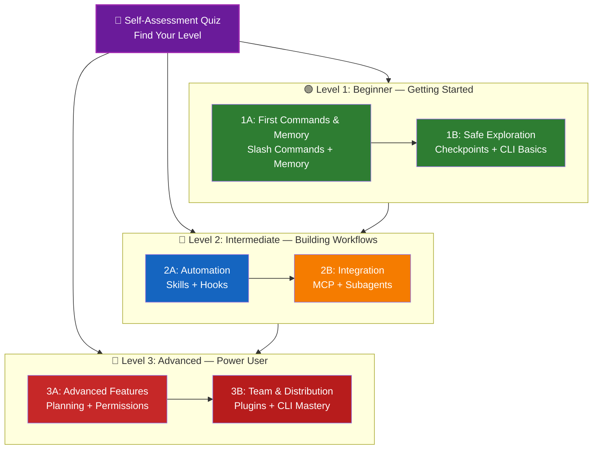

<picture>
  <source media="(prefers-color-scheme: dark)" srcset="../resources/logos/claude-howto-logo-dark.svg">
  
</picture>
<!-- i18n-source: LEARNING-ROADMAP.md -->
<!-- i18n-source-sha: TBD -->
<!-- i18n-date: 2026-07-01 -->

# 📚 Claude Code 학습 로드맵

**Claude Code를 처음 사용하시나요?** 이 가이드는 자신의 속도에 맞춰 Claude Code 기능을 마스터할 수 있도록 도와줍니다. 완전한 초보자든 경험 많은 개발자든, 아래의 자기 평가 퀴즈로 시작하여 자신에게 맞는 경로를 찾으세요.

---

## 🧭 내 수준 찾기

모든 사람이 같은 곳에서 시작하지는 않습니다. 이 빠른 자기 평가를 통해 올바른 진입점을 찾으세요.

**다음 질문에 솔직하게 답해보세요:**

- [ ] Claude Code를 시작하고 대화할 수 있다 (`claude`)
- [ ] CLAUDE.md 파일을 생성하거나 편집한 적이 있다
- [ ] 내장 슬래시 명령어를 3개 이상 사용해본 적이 있다 (예: /help, /compact, /model)
- [ ] 커스텀 슬래시 명령어나 스킬(SKILL.md)을 만든 적이 있다
- [ ] MCP 서버를 설정한 적이 있다 (예: GitHub, 데이터베이스)
- [ ] ~/.claude/settings.json에 훅을 설정한 적이 있다
- [ ] 커스텀 서브에이전트(.claude/agents/)를 만들거나 사용한 적이 있다
- [ ] 스크립팅이나 CI/CD를 위해 출력 모드(`claude -p`)를 사용한 적이 있다

**내 수준:**

| 체크 수 | 수준 | 시작 위치 | 완료 시간 |
|---------|------|----------|----------|
| 0-2 | **레벨 1: 초급** — 시작하기 | [마일스톤 1A](#마일스톤-1a-첫-명령어-메모리) | ~3시간 |
| 3-5 | **레벨 2: 중급** — 워크플로우 구축 | [마일스톤 2A](#마일스톤-2a-자동화-스킬-훅) | ~5시간 |
| 6-8 | **레벨 3: 고급** — 파워 유저 및 팀 리드 | [마일스톤 3A](#마일스톤-3a-고급-기능) | ~5시간 |

> **팁**: 확실하지 않다면 한 단계 낮춰서 시작하세요. 이미 아는 내용을 빠르게 복습하는 것이 기본 개념을 놓치는 것보다 낫습니다.

> **대화형 버전**: Claude Code에서 `/self-assessment`를 실행하면 모든 10개 기능 영역에 걸친 능력을 평가하고 맞춤형 학습 경로를 생성하는 대화형 퀴즈를 이용할 수 있습니다.

---

## 🎯 학습 철학

이 저장소의 폴더는 세 가지 핵심 원칙에 따라 **권장 학습 순서**로 번호가 매겨져 있습니다:

1. **의존성** — 기초 개념이 먼저
2. **복잡성** — 쉬운 기능을 먼저, 고급 기능은 나중에
3. **사용 빈도** — 가장 일반적인 기능을 먼저 학습

이 접근 방식은 즉각적인 생산성 향상을 누리면서 탄탄한 기초를 다질 수 있도록 보장합니다.

---

## 🗺️ 학습 경로



**색상 범례:**
- 💜 보라: 자기 평가 퀴즈
- 🟢 초록: 레벨 1 — 초급 경로
- 🔵 파랑 / 🟡 금색: 레벨 2 — 중급 경로
- 🔴 빨강: 레벨 3 — 고급 경로

---

## 📊 전체 로드맵 표

| 단계 | 기능 | 난이도 | 시간 | 레벨 | 의존성 | 학습 이유 | 주요 이점 |
|------|------|--------|------|------|--------|----------|---------|
| **1** | [슬래시 명령어](01-slash-commands/) | ⭐ 초급 | 30분 | 레벨 1 | 없음 | 빠른 생산성 향상 (60+ 내장 + 5개 번들 스킬) | 즉각적 자동화, 팀 표준 |
| **2** | [메모리](02-memory/) | ⭐⭐ 초급+ | 45분 | 레벨 1 | 없음 | 모든 기능에 필수 | 지속적 컨텍스트, 선호도 |
| **3** | [체크포인트](08-checkpoints/) | ⭐⭐ 중급 | 45분 | 레벨 1 | 세션 관리 | 안전한 탐험 | 실험, 복구 |
| **4** | [CLI 기초](10-cli/) | ⭐⭐ 초급+ | 30분 | 레벨 1 | 없음 | 핵심 CLI 사용법 | 대화형 및 출력 모드 |
| **5** | [스킬](03-skills/) | ⭐⭐ 중급 | 1시간 | 레벨 2 | 슬래시 명령어 | 자동화된 전문성 | 재사용 가능한 기능, 일관성 |
| **6** | [훅](06-hooks/) | ⭐⭐ 중급 | 1시간 | 레벨 2 | 도구, 명령어 | 워크플로우 자동화 (29개 이벤트, 5가지 유형) | 검증, 품질 게이트 |
| **7** | [MCP](05-mcp/) | ⭐⭐⭐ 중급+ | 1시간 | 레벨 2 | 설정 | 실시간 데이터 접근 | 실시간 통합, API |
| **8** | [서브에이전트](04-subagents/) | ⭐⭐⭐ 중급+ | 1.5시간 | 레벨 2 | 메모리, 명령어 | 복잡한 작업 처리 (Bash 포함 6개 내장) | 위임, 전문화된 전문성 |
| **9** | [고급 기능](09-advanced-features/) | ⭐⭐⭐⭐⭐ 고급 | 2-3시간 | 레벨 3 | 이전 모두 | 파워 유저 도구 | 계획, 오토 모드, 채널, 음성 받아쓰기, 권한 |
| **10** | [플러그인](07-plugins/) | ⭐⭐⭐⭐ 고급 | 2시간 | 레벨 3 | 이전 모두 | 완전한 솔루션 | 팀 온보딩, 배포 |
| **11** | [CLI 마스터리](10-cli/) | ⭐⭐⭐ 고급 | 1시간 | 레벨 3 | 권장: 모두 | 명령줄 사용 마스터 | 스크립팅, CI/CD, 자동화 |

**총 학습 시간**: ~11-13시간 (또는 자신의 레벨로 바로 이동하여 시간 절약)

---

## 🟢 레벨 1: 초급 — 시작하기

**대상**: 퀴즈 체크 0-2개 사용자
**시간**: ~3시간
**초점**: 즉각적인 생산성, 기초 이해
**결과**: 일상적인 사용에 익숙해지며 레벨 2 준비 완료

### 마일스톤 1A: 첫 명령어 & 메모리

**주제**: 슬래시 명령어 + 메모리
**시간**: 1-2시간
**난이도**: ⭐ 초급
**목표**: 커스텀 명령어와 지속적 컨텍스트를 통한 즉각적인 생산성 향상

#### 달성할 사항
✅ 반복 작업용 커스텀 슬래시 명령어 생성
✅ 팀 표준을 위한 프로젝트 메모리 설정
✅ 개인 선호도 설정
✅ Claude가 컨텍스트를 자동으로 로드하는 방식 이해

#### 실습 문제

```bash
# 연습 1: 첫 번째 슬래시 명령어 설치
mkdir -p .claude/commands
cp 01-slash-commands/optimize.md .claude/commands/

# 연습 2: 프로젝트 메모리 생성
cp 02-memory/project-CLAUDE.md ./CLAUDE.md

# 연습 3: 사용해보기
# Claude Code에서 입력: /optimize
```

#### 성공 기준
- [ ] `/optimize` 명령어를 성공적으로 호출
- [ ] Claude가 CLAUDE.md의 프로젝트 표준을 기억
- [ ] 슬래시 명령어와 메모리를 각각 언제 사용할지 이해

#### 다음 단계
익숙해지면 다음을 읽으세요:
- [01-slash-commands/README.md](01-slash-commands/README.md)
- [02-memory/README.md](02-memory/README.md)

> **이해도 확인**: Claude Code에서 `/lesson-quiz slash-commands` 또는 `/lesson-quiz memory`를 실행하여 학습 내용을 테스트하세요.

---

### 마일스톤 1B: 안전한 탐험

**주제**: 체크포인트 + CLI 기초
**시간**: 1시간
**난이도**: ⭐⭐ 초급+
**목표**: 안전하게 실험하고 핵심 CLI 명령어 사용 방법 학습

#### 달성할 사항
✅ 안전한 실험을 위한 체크포인트 생성 및 복원
✅ 대화형 모드와 출력 모드 이해
✅ 기본 CLI 플래그와 옵션 사용
✅ 파이핑을 통한 파일 처리

#### 실습 문제

```bash
# 연습 1: 체크포인트 워크플로우 시도
# Claude Code에서:
# 변경 사항을 실험한 후 Esc+Esc 또는 /rewind 사용
# 실험 전 체크포인트 선택
# "코드와 대화 복원" 선택하여 돌아가기

# 연습 2: 대화형 vs 출력 모드
claude "explain this project"           # 대화형 모드
claude -p "explain this function"       # 출력 모드 (비대화형)

# 연습 3: 파이핑을 통한 파일 내용 처리
cat error.log | claude -p "explain this error"
```

#### 성공 기준
- [ ] 체크포인트를 생성하고 복원
- [ ] 대화형 모드와 출력 모드 모두 사용
- [ ] 파일을 Claude에 파이핑하여 분석
- [ ] 안전한 실험을 위해 체크포인트를 사용해야 할 때 이해

#### 다음 단계
- 읽기: [08-checkpoints/README.md](08-checkpoints/README.md)
- 읽기: [10-cli/README.md](10-cli/README.md)
- **레벨 2 준비 완료!** [마일스톤 2A](#마일스톤-2a-자동화-스킬-훅)로 진행

> **이해도 확인**: Claude Code에서 `/lesson-quiz checkpoints` 또는 `/lesson-quiz cli`를 실행하여 레벨 2 준비가 되었는지 확인하세요.

---

## 🔵 레벨 2: 중급 — 워크플로우 구축

**대상**: 퀴즈 체크 3-5개 사용자
**시간**: ~5시간
**초점**: 자동화, 통합, 작업 위임
**결과**: 자동화된 워크플로우, 외부 통합, 레벨 3 준비 완료

### 사전 요구사항 확인

레벨 2를 시작하기 전에 다음 레벨 1 개념에 익숙한지 확인하세요:

- [ ] 슬래시 명령어를 생성하고 사용할 수 있음 ([01-slash-commands/](01-slash-commands/))
- [ ] CLAUDE.md를 통해 프로젝트 메모리를 설정했음 ([02-memory/](02-memory/))
- [ ] 체크포인트를 생성하고 복원하는 방법을 알고 있음 ([08-checkpoints/](08-checkpoints/))
- [ ] 명령줄에서 `claude`와 `claude -p`를 사용할 수 있음 ([10-cli/](10-cli/))

> **빈틈이 있나요?** 계속하기 전에 위의 링크된 튜토리얼을 검토하세요.

---

### 마일스톤 2A: 자동화 (스킬 + 훅)

**주제**: 스킬 + 훅
**시간**: 2-3시간
**난이도**: ⭐⭐ 중급
**목표**: 일반적인 워크플로우와 품질 검사 자동화

#### 달성할 사항
✅ YAML frontmatter로 전문화된 기능 자동 호출 (`effort` 및 `shell` 필드 포함)
✅ 29개 훅 이벤트에 걸친 이벤트 기반 자동화 설정
✅ 5가지 훅 유형 모두 사용 (command, http, mcp_tool, prompt, agent)
✅ 코드 품질 표준 적용
✅ 워크플로우를 위한 커스텀 훅 생성

#### 실습 문제

```bash
# 연습 1: 스킬 설치
cp -r 03-skills/code-review-specialist ~/.claude/skills/

# 연습 2: 훅 설정
mkdir -p ~/.claude/hooks
cp 06-hooks/pre-tool-check.sh ~/.claude/hooks/
chmod +x ~/.claude/hooks/pre-tool-check.sh

# 연습 3: 설정에서 훅 구성
# ~/.claude/settings.json에 추가:
{
  "hooks": {
    "PreToolUse": [
      {
        "matcher": "Bash",
        "hooks": [
          {
            "type": "command",
            "command": "~/.claude/hooks/pre-tool-check.sh"
          }
        ]
      }
    ]
  }
}
```

#### 성공 기준
- [ ] 관련 상황에서 코드 리뷰 스킬이 자동 호출됨
- [ ] PreToolUse 훅이 도구 실행 전에 실행됨
- [ ] 스킬 자동 호출과 훅 이벤트 트리거의 차이점 이해

#### 다음 단계
- 자신만의 커스텀 스킬 만들기
- 워크플로우에 추가 훅 설정
- 읽기: [03-skills/README.md](03-skills/README.md)
- 읽기: [06-hooks/README.md](06-hooks/README.md)

> **이해도 확인**: 계속 진행하기 전에 Claude Code에서 `/lesson-quiz skills` 또는 `/lesson-quiz hooks`를 실행하여 지식을 테스트하세요.

---

### 마일스톤 2B: 통합 (MCP + 서브에이전트)

**주제**: MCP + 서브에이전트
**시간**: 2-3시간
**난이도**: ⭐⭐⭐ 중급+
**목표**: 외부 서비스 통합 및 복잡한 작업 위임

#### 달성할 사항
✅ GitHub, 데이터베이스 등에서 실시간 데이터 접근
✅ 전문화된 AI 에이전트에 작업 위임
✅ MCP와 서브에이전트를 각각 언제 사용할지 이해
✅ 통합 워크플로우 구축

#### 실습 문제

```bash
# 연습 1: GitHub MCP 설정
export GITHUB_TOKEN="your_github_token"
claude mcp add github -- npx -y @modelcontextprotocol/server-github

# 연습 2: MCP 통합 테스트
# Claude Code에서: /mcp__github__list_prs

# 연습 3: 서브에이전트 설치
mkdir -p .claude/agents
cp 04-subagents/*.md .claude/agents/
```

#### 통합 연습
다음 전체 워크플로우를 시도해보세요:
1. MCP를 사용하여 GitHub PR 가져오기
2. Claude가 code-reviewer 서브에이전트에 리뷰 위임
3. 훅을 사용하여 자동으로 테스트 실행

#### 성공 기준
- [ ] MCP를 통해 GitHub 데이터 쿼리 성공
- [ ] Claude가 복잡한 작업을 서브에이전트에 위임
- [ ] MCP와 서브에이전트의 차이점 이해
- [ ] MCP + 서브에이전트 + 훅을 워크플로우에 결합

#### 다음 단계
- 추가 MCP 서버 설정 (데이터베이스, Slack 등)
- 도메인에 맞는 커스텀 서브에이전트 생성
- 읽기: [05-mcp/README.md](05-mcp/README.md)
- 읽기: [04-subagents/README.md](04-subagents/README.md)
- **레벨 3 준비 완료!** [마일스톤 3A](#마일스톤-3a-고급-기능)로 진행

> **이해도 확인**: Claude Code에서 `/lesson-quiz mcp` 또는 `/lesson-quiz subagents`를 실행하여 레벨 3 준비가 되었는지 확인하세요.

---

## 🔴 레벨 3: 고급 — 파워 유저 & 팀 리드

**대상**: 퀴즈 체크 6-8개 사용자
**시간**: ~5시간
**초점**: 팀 도구, CI/CD, 엔터프라이즈 기능, 플러그인 개발
**결과**: 파워 유저, 팀 워크플로우 및 CI/CD 설정 가능

### 사전 요구사항 확인

레벨 3을 시작하기 전에 다음 레벨 2 개념에 익숙한지 확인하세요:

- [ ] 자동 호출이 있는 스킬을 생성하고 사용할 수 있음 ([03-skills/](03-skills/))
- [ ] 이벤트 기반 자동화를 위한 훅을 설정했음 ([06-hooks/](06-hooks/))
- [ ] 외부 데이터를 위한 MCP 서버를 설정할 수 있음 ([05-mcp/](05-mcp/))
- [ ] 작업 위임을 위한 서브에이전트를 사용할 수 있음 ([04-subagents/](04-subagents/))

> **빈틈이 있나요?** 계속하기 전에 위의 링크된 튜토리얼을 검토하세요.

---

### 마일스톤 3A: 고급 기능

**주제**: 고급 기능 (계획, 권한, 확장 사고, 오토 모드, 채널, 음성 받아쓰기, 원격/데스크탑/웹)
**시간**: 2-3시간
**난이도**: ⭐⭐⭐⭐⭐ 고급
**목표**: 고급 워크플로우 및 파워 유저 도구 마스터

#### 달성할 사항
✅ 복잡한 기능을 위한 계획 모드
✅ 6가지 모드의 세분화된 권한 제어 (default, acceptEdits, plan, auto, dontAsk, bypassPermissions)
✅ Alt+T / Option+T 전환으로 확장 사고
✅ 백그라운드 태스크 관리
✅ 학습된 선호도를 위한 자동 메모리
✅ 백그라운드 안전 분류기를 사용한 오토 모드
✅ 구조화된 다중 세션 워크플로우를 위한 채널
✅ 핸즈프리 상호작용을 위한 음성 받아쓰기
✅ 원격 제어, 데스크탑 앱, 웹 세션
✅ 다중 에이전트 협업을 위한 에이전트 팀

#### 실습 문제

```bash
# 연습 1: 계획 모드 사용
/plan Implement user authentication system

# 연습 2: 권한 모드 시도 (6가지 사용 가능: default, acceptEdits, plan, auto, dontAsk, bypassPermissions)
claude --permission-mode plan "analyze this codebase"
claude --permission-mode acceptEdits "refactor the auth module"
claude --permission-mode auto "implement the feature"

# 연습 3: 확장 사고 활성화
# 세션 중 Alt+T (macOS는 Option+T)를 눌러 전환

# 연습 4: 고급 체크포인트 워크플로우
# 1. "깨끗한 상태" 체크포인트 생성
# 2. 계획 모드를 사용하여 기능 설계
# 3. 서브에이전트 위임으로 구현
# 4. 백그라운드에서 테스트 실행
# 5. 테스트 실패 시 체크포인트로 되감기
# 6. 대체 접근 방식 시도

# 연습 5: 오토 모드 시도 (백그라운드 안전 분류기)
claude --permission-mode auto "implement user settings page"

# 연습 6: 에이전트 팀 활성화
export CLAUDE_AGENT_TEAMS=1
# Claude에게 요청: "팀 접근 방식으로 기능 X를 구현해줘"

# 연습 7: 예약된 태스크
/loop 5m /check-status
# 또는 지속적인 예약 태스크를 위해 CronCreate 사용

# 연습 8: 다중 세션 워크플로우를 위한 채널
# 채널을 사용하여 세션 간 작업 구성

# 연습 9: 음성 받아쓰기
# Claude Code와 핸즈프리 상호작용을 위해 음성 입력 사용
```

#### 성공 기준
- [ ] 복잡한 기능에 계획 모드 사용
- [ ] 권한 모드 설정 (plan, acceptEdits, auto, dontAsk)
- [ ] Alt+T / Option+T로 확장 사고 전환
- [ ] 백그라운드 안전 분류기를 사용한 오토 모드 사용
- [ ] 장기 작업에 백그라운드 태스크 사용
- [ ] 다중 세션 워크플로우를 위한 채널 탐색
- [ ] 핸즈프리 입력을 위한 음성 받아쓰기 시도
- [ ] 원격 제어, 데스크탑 앱, 웹 세션 이해
- [ ] 에이전트 팀 활성화 및 협업 작업에 사용
- [ ] 반복 작업이나 예약 모니터링에 `/loop` 사용

#### 다음 단계
- 읽기: [09-advanced-features/README.md](09-advanced-features/README.md)

> **이해도 확인**: Claude Code에서 `/lesson-quiz advanced`를 실행하여 파워 유저 기능의 숙련도를 테스트하세요.

---

### 마일스톤 3B: 팀 & 배포 (플러그인 + CLI 마스터리)

**주제**: 플러그인 + CLI 마스터리 + CI/CD
**시간**: 2-3시간
**난이도**: ⭐⭐⭐⭐ 고급
**목표**: 팀 도구 구축, 플러그인 생성, CI/CD 통합 마스터

#### 달성할 사항
✅ 완전한 번들 플러그인 설치 및 생성
✅ 스크립팅 및 자동화를 위한 CLI 마스터
✅ `claude -p`로 CI/CD 통합 설정
✅ 자동화 파이프라인을 위한 JSON 출력
✅ 세션 관리 및 배치 처리

#### 실습 문제

```bash
# 연습 1: 완전한 플러그인 설치
# Claude Code에서: /plugin install pr-review

# 연습 2: CI/CD를 위한 출력 모드
claude -p "Run all tests and generate report"

# 연습 3: 스크립트용 JSON 출력
claude -p --output-format json "list all functions"

# 연습 4: 세션 관리 및 재개
claude -r "feature-auth" "continue implementation"

# 연습 5: 제약 조건이 있는 CI/CD 통합
claude -p --max-turns 3 --output-format json "review code"

# 연습 6: 배치 처리
for file in *.md; do
  claude -p --output-format json "summarize this: $(cat $file)" > ${file%.md}.summary.json
done
```

#### CI/CD 통합 연습
간단한 CI/CD 스크립트를 만드세요:
1. `claude -p`를 사용하여 변경된 파일 검토
2. 결과를 JSON으로 출력
3. `jq`로 특정 이슈 처리
4. GitHub Actions 워크플로우에 통합

#### 성공 기준
- [ ] 플러그인을 설치하고 사용
- [ ] 팀을 위한 플러그인을 만들거나 수정
- [ ] CI/CD에서 출력 모드(`claude -p`) 사용
- [ ] 스크립팅을 위한 JSON 출력 생성
- [ ] 이전 세션 성공적으로 재개
- [ ] 배치 처리 스크립트 생성
- [ ] Claude를 CI/CD 워크플로우에 통합

#### CLI 실제 사용 사례
- **코드 리뷰 자동화**: CI/CD 파이프라인에서 코드 리뷰 실행
- **로그 분석**: 오류 로그 및 시스템 출력 분석
- **문서 생성**: 배치 문서 생성
- **테스트 인사이트**: 테스트 실패 분석
- **성능 분석**: 성능 메트릭 검토
- **데이터 처리**: 데이터 파일 변환 및 분석

#### 다음 단계
- 읽기: [07-plugins/README.md](07-plugins/README.md)
- 읽기: [10-cli/README.md](10-cli/README.md)
- 팀 전체 CLI 단축키 및 플러그인 생성
- 배치 처리 스크립트 설정

> **이해도 확인**: Claude Code에서 `/lesson-quiz plugins` 또는 `/lesson-quiz cli`를 실행하여 숙련도를 확인하세요.

---

## 🧪 지식 테스트

이 저장소에는 Claude Code에서 언제든지 사용할 수 있는 두 가지 대화형 스킬이 포함되어 있습니다:

| 스킬 | 명령어 | 목적 |
|------|--------|------|
| **자기 평가** | `/self-assessment` | 모든 10개 기능에 걸친 전반적인 능력 평가. 퀵 (2분) 또는 딥 (5분) 모드를 선택하여 맞춤형 스킬 프로필과 학습 경로를 얻으세요. |
| **레슨 퀴즈** | `/lesson-quiz [레슨]` | 특정 레슨에 대한 이해도를 10개 질문으로 테스트. 레슨 전(사전 테스트), 도중(진행 확인), 또는 후(숙달 확인)에 사용하세요. |

**예제:**
```
/self-assessment                  # 전반적인 수준 찾기
/lesson-quiz hooks                # 레슨 06: 훅 퀴즈
/lesson-quiz 03                   # 레슨 03: 스킬 퀴즈
/lesson-quiz advanced-features    # 레슨 09 퀴즈
```

---

## ⚡ 빠른 시작 경로

### 15분만 있다면
**목표**: 첫 번째 성과 얻기

1. 슬래시 명령어 하나 복사: `cp 01-slash-commands/optimize.md .claude/commands/`
2. Claude Code에서 시도: `/optimize`
3. 읽기: [01-slash-commands/README.md](01-slash-commands/README.md)

**결과**: 작동하는 슬래시 명령어를 갖게 되고 기본 사항을 이해합니다

---

### 1시간 있다면
**목표**: 필수 생산성 도구 설정

1. **슬래시 명령어** (15분): `/optimize`와 `/pr` 복사 및 테스트
2. **프로젝트 메모리** (15분): 프로젝트 표준으로 CLAUDE.md 생성
3. **스킬 설치** (15분): code-review-specialist 스킬 설정
4. **함께 사용해보기** (15분): 어떻게 조화롭게 작동하는지 확인

**결과**: 명령어, 메모리, 자동 스킬로 기본적인 생산성 향상

---

### 주말이 있다면
**목표**: 대부분의 기능에 능숙해지기

**토요일 오전** (3시간):
- 마일스톤 1A 완료: 슬래시 명령어 + 메모리
- 마일스톤 1B 완료: 체크포인트 + CLI 기초

**토요일 오후** (3시간):
- 마일스톤 2A 완료: 스킬 + 훅
- 마일스톤 2B 완료: MCP + 서브에이전트

**일요일** (4시간):
- 마일스톤 3A 완료: 고급 기능
- 마일스톤 3B 완료: 플러그인 + CLI 마스터리 + CI/CD
- 팀을 위한 커스텀 플러그인 구축

**결과**: 다른 사람을 교육하고 복잡한 워크플로우를 자동화할 수 있는 Claude Code 파워 유저가 됩니다

---

## 💡 학습 팁

### ✅ Do

- **먼저 퀴즈를 풀어** 시작점 찾기
- **각 마일스톤의 실습 문제를 완료**하세요
- **간단하게 시작하고** 점진적으로 복잡성 추가
- **다음으로 넘어가기 전에 각 기능을 테스트**
- **워크플로우에 효과가 있었던 내용을 기록**
- **고급 주제를 배울 때** 이전 개념을 다시 참조
- **체크포인트를 사용하여 안전하게 실험**
- **팀과 지식 공유**

### ❌ Don't

- **상위 레벨로 건너뛸 때 사전 요구사항 확인을 건너뛰지 말 것**
- **모든 것을 한 번에 배우려 하지 말 것** — 압도적입니다
- **이해하지 않고 설정을 복사하지 말 것** — 디버그 방법을 알 수 없습니다
- **테스트를 잊지 말 것** — 항상 기능이 작동하는지 확인
- **마일스톤을 서두르지 말 것** — 이해하는 데 시간을 투자
- **문서를 무시하지 말 것** — 각 README에 valuable한 세부 정보가 있음
- **혼자서 작업하지 말 것** — 팀원과 논의

---

## 🎓 학습 스타일

### 시각 학습자
- 각 README의 mermaid 다이어그램 공부
- 명령어 실행 흐름 관찰
- 자신만의 워크플로우 다이어그램 그리기
- 위의 시각적 학습 경로 활용

### 실습 학습자
- 모든 실습 문제 완료
- 변형을 시도하며 실험
- 문제를 만들고 고쳐보기 (체크포인트 사용!)
- 자신만의 예제 만들기

### 읽기 학습자
- 각 README를 꼼꼼히 읽기
- 코드 예제 연구
- 비교 표 검토
- 자료에 링크된 블로그 포스트 읽기

### 사회적 학습자
- 페어 프로그래밍 세션 설정
- 팀원에게 개념 가르치기
- Claude Code 커뮤니티 토론 참여
- 커스텀 설정 공유

---

## 📈 진행 상황 추적

다음 체크리스트를 사용하여 레벨별 진행 상황을 추적하세요. 언제든지 `/self-assessment`를 실행하여 업데이트된 스킬 프로필을 확인하거나 각 튜토리얼 후 `/lesson-quiz [레슨]`을 실행하여 이해도를 확인하세요.

### 🟢 레벨 1: 초급
- [ ] [01-slash-commands](01-slash-commands/) 완료
- [ ] [02-memory](02-memory/) 완료
- [ ] 첫 번째 커스텀 슬래시 명령어 생성
- [ ] 프로젝트 메모리 설정
- [ ] **마일스톤 1A 달성**
- [ ] [08-checkpoints](08-checkpoints/) 완료
- [ ] [10-cli](10-cli/) 기초 완료
- [ ] 체크포인트 생성 및 복원
- [ ] 대화형 모드와 출력 모드 사용
- [ ] **마일스톤 1B 달성**

### 🔵 레벨 2: 중급
- [ ] [03-skills](03-skills/) 완료
- [ ] [06-hooks](06-hooks/) 완료
- [ ] 첫 번째 스킬 설치
- [ ] PreToolUse 훅 설정
- [ ] **마일스톤 2A 달성**
- [ ] [05-mcp](05-mcp/) 완료
- [ ] [04-subagents](04-subagents/) 완료
- [ ] GitHub MCP 연결
- [ ] 커스텀 서브에이전트 생성
- [ ] 워크플로우에서 통합 결합
- [ ] **마일스톤 2B 달성**

### 🔴 레벨 3: 고급
- [ ] [09-advanced-features](09-advanced-features/) 완료
- [ ] 계획 모드 성공적으로 사용
- [ ] 권한 모드 설정 (auto 포함 6개 모드)
- [ ] 안전 분류기와 함께 오토 모드 사용
- [ ] 확장 사고 전환 사용
- [ ] 채널 및 음성 받아쓰기 탐색
- [ ] **마일스톤 3A 달성**
- [ ] [07-plugins](07-plugins/) 완료
- [ ] [10-cli](10-cli/) 고급 사용 완료
- [ ] 출력 모드(`claude -p`) CI/CD 설정
- [ ] 자동화를 위한 JSON 출력 생성
- [ ] Claude를 CI/CD 파이프라인에 통합
- [ ] 팀 플러그인 생성
- [ ] **마일스톤 3B 달성**

---

## 🆘 일반적인 학습 문제

### 문제 1: "한 번에 너무 많은 개념"
**해결책**: 한 번에 한 마일스톤에 집중하세요. 진행하기 전에 모든 연습을 완료하세요.

### 문제 2: "어떤 기능을 언제 사용해야 할지 모르겠어요"
**해결책**: 메인 README의 [사용 사례 매트릭스](README.md#이걸로-무엇을-만들-수-있나요)를 참조하세요.

### 문제 3: "설정이 작동하지 않아요"
**해결책**: [문제 해결](README.md#문제점) 섹션을 확인하고 파일 위치를 검증하세요.

### 문제 4: "개념이 겹치는 것 같아요"
**해결책**: [기능 비교](README.md#지금-claude-code-마스터링-시작하기) 표를 검토하여 차이점을 이해하세요.

### 문제 5: "모든 것을 기억하기 어려워요"
**해결책**: 자신만의 치트 시트를 만드세요. 체크포인트를 사용하여 안전하게 실험하세요.

### 문제 6: "경험은 있지만 어디서부터 시작해야 할지 모르겠어요"
**해결책**: 위의 [자기 평가 퀴즈](#내-수준-찾기)를 보세요. 자신의 레벨로 건너뛰고 사전 요구사항 확인으로 빈틈을 파악하세요.

---

## 🎯 완료 후 다음 단계

모든 마일스톤을 완료한 후:

1. **팀 문서 작성** — 팀의 Claude Code 설정 문서화
2. **커스텀 플러그인 구축** — 팀의 워크플로우 패키징
3. **원격 제어 탐색** — 외부 도구에서 프로그래밍 방식으로 Claude Code 세션 제어
4. **웹 세션 시도** — 브라우저 기반 인터페이스를 통한 원격 개발에 Claude Code 사용
5. **데스크탑 앱 사용** — 네이티브 데스크탑 애플리케이션을 통해 Claude Code 기능 접근
6. **오토 모드 사용** — 백그라운드 안전 분류기로 Claude가 자율적으로 작업하도록 설정
7. **자동 메모리 활용** — Claude가 시간이 지남에 따라 선호도를 자동으로 학습하도록 설정
8. **에이전트 팀 설정** — 복잡한 다면적 작업에 여러 에이전트 조정
9. **채널 사용** — 구조화된 다중 세션 워크플로우에서 작업 구성
10. **음성 받아쓰기 시도** — Claude Code와 핸즈프리 음성 입력 상호작용
11. **예약 태스크 사용** — `/loop` 및 cron 도구로 반복 검사 자동화
12. **예제 기여** — 커뮤니티와 공유
13. **다른 사람 멘토링** — 팀원 학습 지원
14. **워크플로우 최적화** — 사용에 기반한 지속적 개선
15. **최신 상태 유지** — Claude Code 릴리스 및 새 기능 팔로우

---

## 📚 추가 자료

### 공식 문서
- [Claude Code 문서](https://code.claude.com/docs/en/overview)
- [Anthropic 문서](https://docs.anthropic.com)
- [MCP 프로토콜 명세](https://modelcontextprotocol.io)

### 블로그 포스트
- [Claude Code 슬래시 명령어 알아보기](https://medium.com/@luongnv89/discovering-claude-code-slash-commands-cdc17f0dfb29)

### 커뮤니티
- [Anthropic Cookbook](https://github.com/anthropics/anthropic-cookbook)
- [MCP 서버 저장소](https://github.com/modelcontextprotocol/servers)

---

## 💬 피드백 및 지원

- **문제를 발견했나요?** 저장소에 이슈를 생성하세요
- **제안이 있나요?** 풀 리퀘스트를 제출하세요
- **도움이 필요하나요?** 문서를 확인하거나 커뮤니티에 물어보세요

---

**최종 업데이트**: 2026년 6월 2일
**Claude Code 버전**: 2.1.160
**출처**:
- https://code.claude.com/docs/en/overview
- https://code.claude.com/docs/en/hooks
- https://github.com/anthropics/claude-code/releases/tag/v2.1.144
- https://github.com/anthropics/claude-code/releases/tag/v2.1.145
**호환 모델**: Claude Sonnet 4.6, Claude Opus 4.8, Claude Haiku 4.5
**관리자**: Claude How-To 기여자
**라이선스**: 교육 목적, 무료 사용 및 수정 가능

---

[← 메인 README로 돌아가기](README.md)
