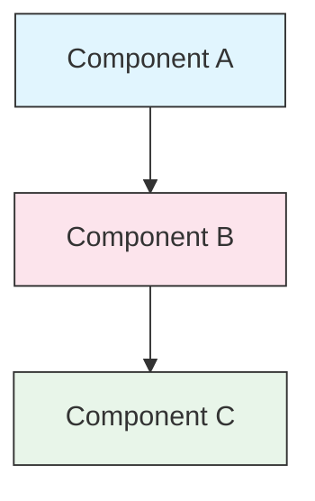

<!-- i18n-source: STYLE_GUIDE.md -->
<!-- i18n-source-sha: TBD -->
<!-- i18n-date: 2026-07-01 -->
<picture>
  <source media="(prefers-color-scheme: dark)" srcset="../resources/logos/claude-howto-logo-dark.svg">
  
</picture>

# 스타일 가이드

> Claude How To에 기여하기 위한 규칙과 포맷팅 규칙입니다. 이 가이드를 따라 콘텐츠를 일관되고 전문적이며 유지보수하기 쉽게 유지하세요.

---

## 목차

- [파일 및 폴더 이름 지정](#파일-및-폴더-이름-지정)
- [문서 구조](#문서-구조)
- [제목](#제목)
- [텍스트 포맷팅](#텍스트-포맷팅)
- [목록](#목록)
- [표](#표)
- [코드 블록](#코드-블록)
- [링크 및 상호 참조](#링크-및-상호-참조)
- [다이어그램](#다이어그램)
- [이모지 사용법](#이모지-사용법)
- [YAML 프론트매터](#yaml-프론트매터)
- [이미지 및 미디어](#이미지-및-미디어)
- [톤과 어조](#톤과-어조)
- [커밋 메시지](#커밋-메시지)
- [작성자 체크리스트](#작성자-체크리스트)

---

## 파일 및 폴더 이름 지정

### 레슨 폴더

레슨 폴더는 **두 자리 숫자 접두사** 뒤에 **kebab-case** 설명자를 사용합니다:

```
01-slash-commands/
02-memory/
03-skills/
04-subagents/
05-mcp/
```

숫자는 초급에서 고급으로의 학습 경로 순서를 반영합니다.

### 파일 이름

| 유형 | 규칙 | 예시 |
|------|------|------|
| **레슨 README** | `README.md` | `01-slash-commands/README.md` |
| **기능 파일** | Kebab-case `.md` | `code-reviewer.md`, `generate-api-docs.md` |
| **쉘 스크립트** | Kebab-case `.sh` | `format-code.sh`, `validate-input.sh` |
| **설정 파일** | 표준 이름 | `.mcp.json`, `settings.json` |
| **메모리 파일** | 범위 접두사 | `project-CLAUDE.md`, `personal-CLAUDE.md` |
| **최상위 문서** | UPPER_CASE `.md` | `CATALOG.md`, `QUICK_REFERENCE.md`, `CONTRIBUTING.md` |
| **이미지 에셋** | Kebab-case | `pr-slash-command.png`, `claude-howto-logo.svg` |

### 규칙

- 모든 파일 및 폴더 이름에 **소문자** 사용 (`README.md`, `CATALOG.md` 같은 최상위 문서 제외)
- 단어 구분자로 **하이픈**(`-`) 사용, 밑줄이나 공백 사용 금지
- 설명적이면서도 간결하게 이름 유지

---

## 문서 구조

### 루트 README

루트 `README.md`는 다음 순서를 따릅니다:

1. 로고 (`<picture>` 요소, 다크/라이트 변형)
2. H1 제목
3. 소개 인용문 (한 줄 가치 제안)
4. "왜 이 가이드인가?" 섹션 (비교 표 포함)
5. 가로줄 (`---`)
6. 목차
7. 기능 카탈로그
8. 빠른 탐색
9. 학습 경로
10. 기능 섹션
11. 시작하기
12. 모범 사례 / 문제 해결
13. 기여 / 라이선스

### 레슨 README

각 레슨 `README.md`는 다음 순서를 따릅니다:

1. H1 제목 (예: `# Slash Commands`)
2. 간략한 개요 단락
3. 빠른 참조 표 (선택 사항)
4. 아키텍처 다이어그램 (Mermaid)
5. 상세 섹션 (H2)
6. 실용 예제 (번호 매기기, 4-6개 예제)
7. 모범 사례 (Do's and Don'ts 표)
8. 문제 해결
9. 관련 가이드 / 공식 문서
10. 문서 메타데이터 푸터

### 기능/예제 파일

개별 기능 파일 (예: `optimize.md`, `pr.md`):

1. YAML 프론트매터 (해당하는 경우)
2. H1 제목
3. 목적 / 설명
4. 사용법
5. 코드 예제
6. 커스터마이징 팁

### 섹션 구분자

가로줄(`---`)을 사용하여 주요 문서 영역을 구분:

```markdown
---

## 새로운 주요 섹션
```

소개 인용문 뒤와 논리적으로 구분되는 문서 부분 사이에 배치하세요.

---

## 제목

### 계층

| 레벨 | 사용처 | 예시 |
|------|--------|------|
| `#` H1 | 페이지 제목 (문서당 하나) | `# Slash Commands` |
| `##` H2 | 주요 섹션 | `## 모범 사례` |
| `###` H3 | 하위 섹션 | `### 스킬 추가하기` |
| `####` H4 | 하위-하위 섹션 (드물게) | `#### 설정 옵션` |

### 규칙

- **문서당 H1 하나** — 페이지 제목만
- **레벨 건너뛰기 금지** — H2에서 H4로 건너뛰지 마세요
- **제목을 간결하게** — 2-5단어 목표
- **문장형 케이스 사용** — 첫 단어와 고유 명사만 대문자로 (예외: 기능 이름은 그대로 유지)
- **루트 README 섹션 헤더에만 이모지 접두사 추가** ([이모지 사용법](#이모지-사용법) 참조)

---

## 텍스트 포맷팅

### 강조

| 스타일 | 사용 시기 | 예시 |
|--------|---------|------|
| **굵게** (`**text**`) | 주요 용어, 표의 레이블, 중요한 개념 | `**설치 방법**:` |
| *기울임* (`*text*`) | 기술 용어 첫 사용, 책/문서 제목 | `*frontmatter*` |
| `코드` (`` `text` ``) | 파일 이름, 명령어, 설정 값, 코드 참조 | `` `CLAUDE.md` `` |

### 인용문으로 강조

중요한 사항에는 굵은 접두사가 있는 인용문 사용:

```markdown
> **참고**: 사용자 정의 slash command는 v2.0부터 skills에 통합되었습니다.

> **중요**: API 키나 자격증명을 커밋하지 마세요.

> **팁**: 최대 효과를 위해 memory와 skills을 함께 사용하세요.
```

지원되는 강조 유형: **참고**, **중요**, **팁**, **경고**.

### 단락

- 단락을 짧게 유지 (2-4문장)
- 단락 사이에 빈 줄 추가
- 핵심 내용을 먼저 제시한 후 맥락 제공
- "무엇"뿐만 아니라 "왜"를 설명

---

## 목록

### 순서 없는 목록

중첩에는 대시(`-`)와 2칸 들여쓰기 사용:

```markdown
- 첫 번째 항목
- 두 번째 항목
  - 중첩된 항목
  - 다른 중첩 항목
    - 깊은 중첩 (3단계 이상 피하기)
- 세 번째 항목
```

### 순서 있는 목록

순차적 단계, 지침, 순위 항목에는 번호 목록 사용:

```markdown
1. 첫 번째 단계
2. 두 번째 단계
   - 하위 포인트 세부사항
   - 다른 하위 포인트
3. 세 번째 단계
```

### 설명 목록

키-값 스타일 목록에는 굵은 레이블 사용:

```markdown
- **성능 병목** - O(n^2) 연산, 비효율적인 루프 식별
- **메모리 누수** - 해제되지 않은 리소스, 순환 참조 발견
- **알고리즘 개선** - 더 나은 알고리즘 또는 데이터 구조 제안
```

### 규칙

- 일관된 들여쓰기 유지 (레벨당 2칸)
- 목록 전후에 빈 줄 추가
- 목록 항목을 구조적으로 병렬로 유지 (모두 동사로 시작하거나 모두 명사 등)
- 3단계 이상 중첩 피하기

---

## 표

### 표준 형식

```markdown
| 열 1 | 열 2 | 열 3 |
|------|------|------|
| 데이터 | 데이터 | 데이터 |
```

### 일반적인 표 패턴

**기능 비교 (3-4열):**

```markdown
| 기능 | 호출 | 지속성 | 최적 사용 |
|------|------|--------|-----------|
| **Slash Commands** | 수동 (`/cmd`) | 세션 전용 | 빠른 단축키 |
| **Memory** | 자동 로드 | 세션 간 | 장기 학습 |
```

**권장 사항 및 금지 사항:**

```markdown
| 권장 | 금지 |
|------|------|
| 설명적인 이름 사용 | 모호한 이름 사용 |
| 파일 집중 유지 | 단일 파일 과부하 |
```

**빠른 참조:**

```markdown
| 항목 | 세부사항 |
|------|---------|
| **목적** | API 문서 생성 |
| **범위** | 프로젝트 레벨 |
| **난이도** | 중급 |
```

### 규칙

- **행 레이블(첫 번째 열)인 경우 표 헤더 굵게**
- 읽기 쉽게 소스에서 파이프 정렬 (선택 사항이지만 권장)
- 셀 내용을 간결하게 유지; 세부사항은 링크 사용
- 셀 내부의 명령어와 파일 경로에 `코드 포맷팅` 사용

---

## 코드 블록

### 언어 태그

구문 강조를 위해 항상 언어 태그 지정:

| 언어 | 태그 | 사용처 |
|------|------|--------|
| Shell | `bash` | CLI 명령어, 스크립트 |
| Python | `python` | Python 코드 |
| JavaScript | `javascript` | JS 코드 |
| TypeScript | `typescript` | TS 코드 |
| JSON | `json` | 설정 파일 |
| YAML | `yaml` | 프론트매터, 설정 |
| Markdown | `markdown` | Markdown 예제 |
| SQL | `sql` | 데이터베이스 쿼리 |
| 일반 텍스트 | (태그 없음) | 예상 출력, 디렉토리 트리 |

### 규칙

```bash
# 명령어가 하는 일을 설명하는 주석
claude mcp add notion --transport http https://mcp.notion.com/mcp
```

- 명확하지 않은 명령어 앞에 **주석 줄** 추가
- 모든 예제를 **복사하여 바로 사용 가능**하게 작성
- 관련이 있을 때 **간단한 버전과 고급 버전 모두** 표시
- 이해를 돕는 경우 **예상 출력** 포함 (태그 없는 코드 블록 사용)

### 설치 블록

설치 지침에는 이 패턴 사용:

```bash
# 파일을 프로젝트에 복사
cp 01-slash-commands/*.md .claude/commands/
```

### 다단계 워크플로우

```bash
# 1단계: 디렉토리 생성
mkdir -p .claude/commands

# 2단계: 템플릿 복사
cp 01-slash-commands/*.md .claude/commands/

# 3단계: 설치 확인
ls .claude/commands/
```

---

## 링크 및 상호 참조

### 내부 링크 (상대 경로)

모든 내부 링크에는 상대 경로 사용:

```markdown
[Slash Commands](01-slash-commands/)
[Skills Guide](03-skills/)
[Memory Architecture](02-memory/README.md#메모리-아키텍처)
```

레슨 폴더에서 루트 또는 형제로:

```markdown
[메인 가이드로 돌아가기](README.md)
[관련: Skills](03-skills/)
```

### 외부 링크 (절대 URL)

설명적인 앵커 텍스트와 함께 전체 URL 사용:

```markdown
[Anthropic 공식 문서](https://code.claude.com/docs/en/overview)
```

- 앵커 텍스트로 "click here" 또는 "this link" 사용 금지
- 맥락 없이도 의미가 통하는 설명적인 텍스트 사용

### 섹션 앵커

GitHub 스타일 앵커를 사용하여 동일한 문서 내 섹션에 링크:

```markdown
[기능 카탈로그](#feature-catalog)
[모범 사례](#모범-사례)
```

### 관련 가이드 패턴

레슨 끝에 관련 가이드 섹션으로 마무리:

```markdown
## 관련 가이드

- [Slash Commands](01-slash-commands/) - 빠른 단축키
- [Memory](02-memory/) - 영구적 맥락
- [Skills](03-skills/) - 재사용 가능한 기능
```

---

## 다이어그램

### Mermaid

모든 다이어그램에 Mermaid 사용. 지원되는 유형:

- `graph TB` / `graph LR` — 아키텍처, 계층, 흐름
- `sequenceDiagram` — 상호작용 흐름
- `timeline` — 시간 순서

### 스타일 규칙

스타일 블록을 사용하여 일관된 색상 적용:



**색상 팔레트:**

| 색상 | Hex | 사용처 |
|------|-----|--------|
| 연한 파랑 | `#e1f5fe` | 기본 컴포넌트, 입력 |
| 연한 분홍 | `#fce4ec` | 처리, 미들웨어 |
| 연한 초록 | `#e8f5e9` | 출력, 결과 |
| 연한 노랑 | `#fff9c4` | 설정, 선택 사항 |
| 연한 보라 | `#f3e5f5` | 사용자 대면, UI |

### 규칙

- 노드 레이블에는 `["레이블 텍스트"]` 사용 (특수 문자 허용)
- 레이블 내 줄바꿈에는 `<br/>` 사용
- 다이어그램을 간단하게 유지 (최대 10-12개 노드)
- 접근성을 위해 다이어그램 아래에 간단한 텍스트 설명 추가
- 계층 구조에는 위에서 아래로(`TB`), 워크플로우에는 왼쪽에서 오른쪽으로(`LR`) 사용

---

## 이모지 사용법

### 이모지 사용 위치

이모지는 **드물고 목적에 맞게** 사용 — 특정 맥락에서만:

| 맥락 | 이모지 | 예시 |
|------|--------|------|
| 루트 README 섹션 헤더 | 카테고리 아이콘 | `## 📚 학습 경로` |
| 스킬 레벨 표시기 | 색상 원 | 🟢 초급, 🔵 중급, 🔴 고급 |
| 권장/금지 사항 | 체크/엑스 표시 | ✅ 권장, ❌ 금지 |
| 난이도 평가 | 별 | ⭐⭐⭐ |

### 표준 이모지 세트

| 이모지 | 의미 |
|--------|------|
| 📚 | 학습, 가이드, 문서 |
| ⚡ | 시작하기, 빠른 참조 |
| 🎯 | 기능, 빠른 참조 |
| 🎓 | 학습 경로 |
| 📊 | 통계, 비교 |
| 🚀 | 설치, 빠른 명령어 |
| 🟢 | 초급 레벨 |
| 🔵 | 중급 레벨 |
| 🔴 | 고급 레벨 |
| ✅ | 권장 사례 |
| ❌ | 피해야 할 사항 / 안티패턴 |
| ⭐ | 난이도 등급 단위 |

### 규칙

- **본문 텍스트나 단락에 이모지 사용 금지**
- **루트 README의 헤더에만 이모지 사용** (레슨 README에서는 사용 금지)
- **장식용 이모지 추가 금지** — 모든 이모지는 의미를 전달해야 함
- 위 표와 일관된 이모지 사용 유지

---

## YAML 프론트매터

### 기능 파일 (Skills, Commands, Agents)

```yaml
---
name: 고유-식별자
description: 이 기능이 하는 일과 사용 시기
allowed-tools: Bash, Read, Grep
---
```

### 선택적 필드

```yaml
---
name: my-feature
description: 간단한 설명
argument-hint: "[file-path] [options]"
allowed-tools: Bash, Read, Grep, Write, Edit
model: opus                        # opus, sonnet, 또는 haiku
disable-model-invocation: true     # 사용자 전용 호출
user-invocable: false              # 사용자 메뉴에서 숨김
context: fork                      # 격리된 subagent에서 실행
agent: Explore                     # context: fork의 에이전트 유형
---
```

### 규칙

- 프론트매터를 파일의 맨 위에 배치
- `name` 필드에 **kebab-case** 사용
- `description`을 한 문장으로 유지
- 필요한 필드만 포함

---

## 이미지 및 미디어

### 로고 패턴

로고로 시작하는 모든 문서는 다크/라이트 모드 지원을 위해 `<picture>` 요소 사용:

```html
<picture>
  <source media="(prefers-color-scheme: dark)" srcset="resources/logos/claude-howto-logo-dark.svg">
  
</picture>
```

### 스크린샷

- 관련 레슨 폴더에 저장 (예: `01-slash-commands/pr-slash-command.png`)
- kebab-case 파일 이름 사용
- 설명적인 대체 텍스트 포함
- 다이어그램은 SVG, 스크린샷은 PNG 선호

### 규칙

- 항상 이미지에 대체 텍스트 제공
- 이미지 파일 크기를 합리적으로 유지 (PNG의 경우 < 500KB)
- 이미지 참조에 상대 경로 사용
- 이미지를 참조하는 문서와 같은 디렉토리 또는 공유 이미지의 경우 `assets/`에 저장

---

## 톤과 어조

### 글쓰기 스타일

- **전문적이면서도 접근하기 쉽게** — 전문 용어 과부하 없는 기술적 정확성
- **능동태** — "파일을 만드세요" (not "파일이 생성되어야 합니다")
- **직접적인 지침** — "이 명령어를 실행하세요" (not "이 명령어를 실행하고 싶을 수도 있습니다")
- **초보자 친화적** — 독자가 Claude Code는 처음이지만 프로그래밍은 처음이 아니라고 가정

### 콘텐츠 원칙

| 원칙 | 예시 |
|------|------|
| **보여주기, 말하지 않기** | 추상적 설명 대신 작동하는 예제 제공 |
| **점진적 복잡성** | 간단하게 시작하고, 이후 섹션에서 깊이 추가 |
| **"왜"를 설명** | "...을 위해 memory를 사용하세요"가 아닌 "...을 위해 memory를 사용하는 이유는..." |
| **복사하여 바로 사용 가능** | 모든 코드 블록이 직접 붙여넣었을 때 작동해야 함 |
| **실제 맥락** | 인위적인 예제가 아닌 실제 시나리오 사용 |

### 어휘

- "Claude Code" 사용 ("Claude CLI" 또는 "the tool" 사용 금지)
- "skill" 사용 ("custom command" — 레거시 용어 — 사용 금지)
- 번호가 매겨진 섹션에는 "lesson" 또는 "guide" 사용
- 개별 기능 파일에는 "example" 사용

---

## 커밋 메시지

[Conventional Commits](https://www.conventionalcommits.org/) 따르기:

```
type(scope): description
```

### 유형

| 유형 | 사용처 |
|------|--------|
| `feat` | 새로운 기능, 예제, 또는 가이드 |
| `fix` | 버그 수정, 정정, 깨진 링크 |
| `docs` | 문서 개선 |
| `refactor` | 동작 변경 없는 구조 변경 |
| `style` | 포맷팅 변경만 |
| `test` | 테스트 추가 또는 변경 |
| `chore` | 빌드, 의존성, CI |

### 범위

범위로 레슨 이름 또는 파일 영역 사용:

```
feat(slash-commands): API 문서 생성기 추가
docs(memory): 개인 선호도 예제 개선
fix(README): 목차 링크 수정
docs(skills): 포괄적인 코드 리뷰 스킬 추가
```

---

## 문서 메타데이터 푸터

레슨 README는 메타데이터 블록으로 끝납니다:

```markdown
---
**마지막 업데이트**: 2026년 5월 29일
**Claude Code 버전**: 2.1.156
**호환 모델**: Claude Sonnet 4.6, Claude Opus 4.8, Claude Haiku 4.5
```

- 월 + 일 + 연도 형식 사용 (예: "2026년 5월 20일")
- 기능이 변경될 때 버전 업데이트
- 모든 호환 모델 나열

---

## 작성자 체크리스트

콘텐츠를 제출하기 전에 다음을 확인:

- [ ] 파일/폴더 이름이 kebab-case 사용
- [ ] 문서가 H1 제목으로 시작 (파일당 하나)
- [ ] 제목 계층 구조가 올바름 (건너뛴 레벨 없음)
- [ ] 모든 코드 블록에 언어 태그가 있음
- [ ] 코드 예제가 복사하여 바로 사용 가능함
- [ ] 내부 링크가 상대 경로 사용
- [ ] 외부 링크에 설명적인 앵커 텍스트가 있음
- [ ] 표가 올바르게 포맷팅됨
- [ ] 이모지가 표준 세트를 따름 (사용하는 경우)
- [ ] Mermaid 다이어그램이 표준 색상 팔레트 사용
- [ ] 민감한 정보 없음 (API 키, 자격증명)
- [ ] YAML 프론트매터가 유효함 (해당하는 경우)
- [ ] 이미지에 대체 텍스트가 있음
- [ ] 단락이 짧고 집중되어 있음
- [ ] 관련 가이드 섹션이 관련 레슨에 연결됨
- [ ] 커밋 메시지가 conventional commits 형식을 따름

---

**마지막 업데이트**: 2026년 5월 29일
**Claude Code 버전**: 2.1.156
**출처**:
- https://code.claude.com/docs/en/overview
- https://code.claude.com/docs/en/changelog
- https://www.anthropic.com/news/claude-opus-4-8
- https://github.com/anthropics/claude-code/releases/tag/v2.1.154
**호환 모델**: Claude Sonnet 4.6, Claude Opus 4.8, Claude Haiku 4.5
