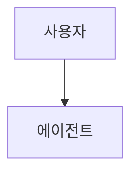
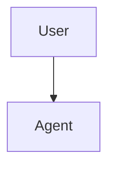

# 번역 용어집 및 스타일 가이드

# Translation Glossary & Style Guide

> **중요:** 이 문서는 Claude Code 문서를 한국어로 번역할 때의 규칙을 정의합니다. 작업 시작 전에 반드시 읽어주세요.

## 기본 방침

- **문체:** ~한다 체(평서체)
- **용어 방침:** 외래어 표기법 준수, IT 업계에서 정착된 영어 차용어 우선
- **코드 유지:** 실행 코드는 100% 유지. 주석과 설명문만 번역
- **Mermaid 다이어그램:** 레이블 텍스트는 영어 그대로 유지
- **원본 추적:** 각 파일 상단에 `i18n-source-sha`를 삽입하여 재동기화 가능하게 함

---

## 기술 용어집

모든 파일에서 통일하기 위한 대역표:

| English | 한국어 | 비고 |
|---------|--------|------|
| slash command | 슬래시 명령어 | Claude Code 기능명 |
| hook | 훅 | IT 업계 정착 |
| skill | 스킬 | Claude Code 기능명 |
| subagent | 서브에이전트 | Claude Code 기능명 |
| agent | 에이전트 | 일반적인 외래어 표기 |
| memory | 메모리 | Claude Code 기능명(기억 영역 의미) |
| checkpoint | 체크포인트 | 세션 스냅샷 |
| plugin | 플러그인 | 일반 용어 |
| pull request / PR | 풀 리퀘스트 / PR | GitHub 용어 |
| commit | 커밋 | Git 용어 |
| branch | 브랜치 | Git 용어 |
| merge | 병합 / 머지 | '병합' 우선 |
| MCP (Model Context Protocol) | MCP | 프로토콜명은 그대로 |
| CLAUDE.md | CLAUDE.md | 파일명은 그대로 |
| prompt | 프롬프트 | 정착된 외래어 |
| workflow | 워크플로 | 정착된 외래어 |
| repository | 리포지토리 | Git 용어 |
| issue | 이슈 | GitHub 용어 |
| release | 릴리스 | 정착된 외래어 |
| API | API | 그대로 |
| CLI | CLI | Command-Line Interface, 그대로 |
| CI/CD | CI/CD | 그대로 |
| pre-commit hook | pre-commit 훅 | 도구명 유지 |
| environment variable | 환경 변수 | 역어 정착 |
| dependencies | 의존성 | 역어 정착 |
| template | 템플릿 | 외래어 |
| worktree | 워크트리 | Git 용어 |
| frontmatter | 프론트매터 | YAML 상단 블록 |
| token | 토큰 | 외래어 |
| context window | 컨텍스트 윈도우 | 외래어 |
| fork | 포크 | Git 용어 |
| clone | 클론 | Git 용어 |
| sandbox | 샌드박스 | 외래어 |
| boilerplate | 보일러플레이트 | 외래어 |
| debugging | 디버깅 | 외래어 |
| linting | 린팅 | 외래어 |
| refactoring | 리팩터링 | 외래어 |
| build | 빌드 | 외래어 |
| deploy | 배포 / 디플로이 | '배포' 우선 |
| feature | 기능 | 문맥에 따라 '기능' 또는 '피처' |
| user | 사용자 | 역어 정착 |
| developer | 개발자 | 역어 정착 |
| documentation | 문서 | '문서' 우선 |
| roadmap | 로드맵 | 외래어 |
| ecosystem | 에코시스템 | 외래어 |
| permission | 권한 | 역어 정착 |
| settings | 설정 | 역어 정착 |
| configuration | 설정 / 구성 | '설정' 우선 |
| trigger | 트리거 | 외래어 |
| event | 이벤트 | 외래어 |
| script | 스크립트 | 외래어 |
| handler | 핸들러 | 외래어 |
| wrapper | 래퍼 | 외래어 |
| pipeline | 파이프라인 | 외래어 |
| best practice | 모범 사례 | 역어 |
| use case | 사용 사례 / 유스케이스 | '사용 사례' 우선 |
| trade-off | 트레이드오프 | 외래어 |
| debugging | 디버깅 | 외래어 |
| deployment | 배포 | 역어 정착 |
| authentication | 인증 | 역어 정착 |
| authorization | 권한 부여 | 역어 정착 |
| encryption | 암호화 | 역어 정착 |
| dependency | 의존성 | 역어 정착 |

---

## Claude Code 고유 명사 (절대 변경 불가)

다음은 Claude Code의 **제품명·기능명**이며, **번역하지 않고 영어 표기 그대로** 유지:

| 표기 | 종류 | 비고 |
|------|------|------|
| Claude | 제품명 | '클로드'로 표기하지 않음 |
| Claude Code | 제품명 | 그대로 |
| Anthropic | 회사명 | 그대로 |
| CLAUDE.md | 파일명 | 대문자 유지 |
| SKILL.md | 파일명 | 대문자 유지 |
| MCP / Model Context Protocol | 프로토콜명 | 약어 사용, 첫 등장 시 병기 |
| `.claude/` | 디렉토리명 | 그대로 |
| `~/.claude/` | 경로 | 그대로 |
| `claude.ai` / `code.claude.com` | URL | 그대로 |
| Sonnet / Opus / Haiku | 모델명 | 번역하지 않음 |

단, **기능 카테고리**는 한국어화합니다:

| English | 한국어 | 비고 |
|---------|--------|------|
| Slash Commands (기능명) | 슬래시 명령어 | 제목에서도 번역 |
| Memory (기능명) | 메모리 | '기억'으로 번역하지 않음 |
| Skills (기능명) | 스킬 | 그대로 |
| Subagents (기능명) | 서브에이전트 | '하위 에이전트' 지양 |
| Hooks (기능명) | 훅 | 그대로 |
| Plugins (기능명) | 플러그인 | 그대로 |
| Checkpoints (기능명) | 체크포인트 | 그대로 |
| Advanced Features (카테고리) | 고급 기능 | 번역함 |
| CLI Reference (카테고리) | CLI 레퍼런스 | 번역함 |

---

## 모듈명 처리

각 모듈의 제목·URL에서의 처리:

| 원본 제목 | 한국어 번역 | URL (변경 불가) |
|-----------|-----------|--------------|
| 01 Slash Commands | 슬래시 명령어 | `01-slash-commands/` |
| 02 Memory | 메모리 | `02-memory/` |
| 03 Skills | 스킬 | `03-skills/` |
| 04 Subagents | 서브에이전트 | `04-subagents/` |
| 05 MCP | MCP | `05-mcp/` |
| 06 Hooks | 훅 | `06-hooks/` |
| 07 Plugins | 플러그인 | `07-plugins/` |
| 08 Checkpoints | 체크포인트 | `08-checkpoints/` |
| 09 Advanced Features | 고급 기능 | `09-advanced-features/` |
| 10 CLI | CLI | `10-cli/` |

**중요:** 디렉토리명·파일 경로는 절대 변경하지 않습니다. 한국어화하는 것은 제목·본문 중의 언급뿐입니다.

---

## 번역 규칙

### 1. 코드와 명령어

**황금룰:** 실행 가능한 코드는 100% 유지합니다. 번역하는 것은 주석과 설명문뿐입니다.

**올바른 예 (✅):**

````markdown
이 명령어를 실행하려면:

```bash
/optimize
```

이 명령어는 코드를 분석합니다.
````

**잘못된 예 (❌):**

````markdown
이 명령어를 실행하려면:

```bash
/최적화  # 명령어명은 절대 번역하지 않음
```
````

### 2. 코드 내 주석

주석은 한국어로 번역합니다:

```python
# ✅ 올바름 — 주석 번역
# 이 슬래시 명령어는 코드를 최적화합니다
def optimize_code():
    pass

# ❌ 오류 — 함수명은 번역하지 않음
def 최적화_코드():  # 함수명은 변경하지 않음
    pass
```

### 3. 함수명·변수명·클래스명

영어 그대로 유지합니다:

```python
# ✅ 올바름
def create_subagent(name: str, system_prompt: str):
    pass

# ❌ 오류
def 서브에이전트_생성(이름: str, 시스템_프롬프트: str):
    pass
```

### 4. Mermaid 다이어그램

**100% 그대로 유지합니다.** mermaid 블록 내 텍스트는 일절 번역하지 않습니다.

````markdown
<!-- ❌ 오류 -->


<!-- ✅ 올바름 -->

````

**중요:** Mermaid 주석은 `%%`를 사용합니다. `#`은 파서 오류가 발생합니다.

### 5. 파일 경로와 URL

그대로 유지합니다:

```markdown
<!-- ✅ 올바름 -->
설정은 `.claude/settings.json`을 참조하세요.

<!-- ❌ 오류 -->
설정은 `.claude/설정.json`을 참조하세요.
```

### 6. 테이블

구조(열·행 수)는 그대로 유지합니다. 텍스트 내용은 번역하고, 기술적인 값은 그대로 둡니다:

```markdown
| 명령어 | 설명 | 예 |
|-------|------|-----|
| `/help` | 도움말 표시 | `/help memory` |
| `/clear` | 세션 초기화 | `/clear` |
```

### 7. 파일 간 링크

`kr/` 내에서는 상대 경로를 사용합니다:

```markdown
<!-- 모듈 간 -->
[메모리](02-memory/)

<!-- 영어 원본으로 -->
[English version](../../README.md)

<!-- 코드 파일 — 원본 참조, 복사하지 않음 -->
[`format-code.sh`](../../06-hooks/format-code.sh)
```

### 8. 버전 추적용 프론트매터

각 번역 파일 상단에 원본 버전 추적용 HTML 주석을 추가합니다:

```markdown
<!-- i18n-source: 01-slash-commands/README.md -->
<!-- i18n-source-sha: a1b2c3d4 -->
<!-- i18n-date: 2026-04-27 -->

# 번역된 파일의 제목
```

SHA는 원본이 된 영어 파일의 단축 커밋 해시입니다. 획득 방법: `git log --oneline -1 -- <영어 파일 경로>`.

### 9. 문체 규칙

- **기본 문체:** ~한다 체(평서체). 예: "~이다", "~한다", "~됐다"
- **독자 호칭:** '당신'은 사용하지 않고, 명령형이나 "~할 수 있다", "~하기 바란다" 사용
- **제목·항목:** 체언 종지 가능 ("설치", "설정 방법" 등)
- **본문:** 평서체로 통일
- **중복 표현 회피:** "실행한다" > "실행을 수행한다"
- **기술 약어:** 첫 등장 시 "정식 명칭(약어)", 이후는 약어만
- **숫자:** 반각 숫자 사용 (10개, 3단계 등)
- **문장 부호:** "다."와 "요?" 사용 (마침표와 물음표)
- **괄호:** 전각（）을 사용하지만, 코드 내는 반각 ()

### 10. 높임말과 평서체의 경계

- **본문·설명:** 평서체
  - "이 기능은 CLAUDE.md 파일에서 설정을 읽어옵니다"
- **항목 끝:** 체언 종지 또는 평서체
  - "설치 절차", "메모리 관리 방법"
- **코드 주석 내:** 평서체 또는 간결한 체언 종지
  - `# 이 훅은 커밋 전에 실행됩니다`
- **제목:** 체언 종지 또는 의문형
  - "## 시작하기", "## 왜 필요한가"

---

## DO / DON'T

### ✅ DO: 설명문을 번역하세요

```markdown
슬래시 명령어는 Claude 대화 세션 중 동작을 제어하는 단축키입니다.
```

### ✅ DO: 코드 내 주석을 번역하세요

```python
# ✅ 올바름
# 이 함수는 새 서브에이전트를 생성합니다
def create_subagent():
    pass
```

### ❌ DON'T: 함수명을 번역하지 마세요

```python
# ❌ 오류
def 서브에이전트_생성():
    pass

# ✅ 올바름
def create_subagent():
    pass
```

### ❌ DON'T: Mermaid 다이어그램을 번역하지 마세요

````markdown
<!-- ❌ 오류 -->


<!-- ✅ 올바름 -->

````

### ❌ DON'T: 기계 번역을 무검증으로 사용하지 마세요

기계 번역(Google 번역, DeepL, Papago 등)은 다음 문제를 일으키기 쉽습니다:

- 기술 용어의 오역
- 코드 맥락 이해 부족
- 명령어 의미 왜곡
- Markdown 형식 손상

**기계 번역 후는 반드시 사람이 확인·편집할 것.**

### ❌ DON'T: 커밋 메시지 예시를 번역하지 마세요

Conventional Commits 형식은 규약이므로 영어 그대로 유지합니다:

```markdown
<!-- ✅ 올바름 -->
- `feat(slash-commands): Add API documentation generator`

<!-- ❌ 오류 -->
- `기능추가(slash-commands): API 문서 생성 기능 추가`
```

### ❌ DON'T: CLI 출력 예시를 번역하지 마세요

실제 명령어 출력을 보여주는 예시는 영어 그대로 유지합니다(재현성 때문):

```text
✅ 올바름:
$ claude --version
2.1.119

❌ 오류:
$ claude --version
버전 2.1.119
```

---

## 커밋 전 체크리스트

- [ ] 기술적 정확성이 유지되었는가
- [ ] 한국어로서 자연스럽게 읽히는가
- [ ] 용어가 glossary와 일치하는가
- [ ] 코드는 100% 그대로인가(변경 없음)
- [ ] Mermaid 다이어그램은 변경되지 않았는가
- [ ] 내부 링크가 작동하는가
- [ ] 외부 링크가 유지되었는가
- [ ] Markdown 형식이 올바른가
- [ ] 코드 내 주석이 번역되었는가
- [ ] 함수명·변수명·클래스명은 영어 그대로인가
- [ ] 파일 경로와 URL은 변경되지 않았는가
- [ ] 프론트매터 `i18n-source-sha`를 추가했는가
- [ ] pre-commit 검사가 모두 통과하는가

---

## 문제 발생 시

번역 중 의문이 생기면:

1. 이 문서의 glossary 확인
2. 다른 모듈의 유사 파일이 어떻게 번역되었는지 확인
3. `ja/`, `vi/`, `zh/`, `uk/`의 해당 파일 참조
4. 필요하다면 GitHub Issue를 생성하여 논의

---

**최종 업데이트:** 2026-07-01
**언어:** 한국어 (ko-KR)
