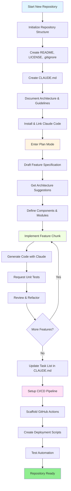
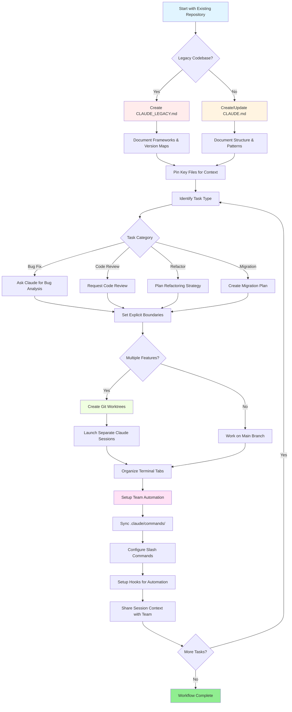

<!-- i18n-source: resources.md -->
<!-- i18n-source-sha: TBD -->
<!-- i18n-date: 2026-07-01 -->

<picture>
  <source media="(prefers-color-scheme: dark)" srcset="../resources/logos/claude-howto-logo-dark.svg">
  
</picture>

# 유용한 리소스 목록

## 공식 문서

| 리소스 | 설명 | 링크 |
|----------|-------------|------|
| Claude Code Docs | 공식 Claude Code 문서 | [code.claude.com/docs/en/overview](https://code.claude.com/docs/en/overview) |
| Anthropic Docs | 전체 Anthropic 문서 | [docs.anthropic.com](https://docs.anthropic.com) |
| MCP Protocol | Model Context Protocol 명세 | [modelcontextprotocol.io](https://modelcontextprotocol.io) |
| MCP Servers | 공식 MCP 서버 구현 | [github.com/modelcontextprotocol/servers](https://github.com/modelcontextprotocol/servers) |
| Anthropic Cookbook | 코드 예제 및 튜토리얼 | [github.com/anthropics/anthropic-cookbook](https://github.com/anthropics/anthropic-cookbook) |
| Claude Code Skills | 커뮤니티 스킬 저장소 | [github.com/anthropics/skills](https://github.com/anthropics/skills) |
| Agent Teams | 멀티 에이전트 조정 및 협업 | [code.claude.com/docs/en/agent-teams](https://code.claude.com/docs/en/agent-teams) |
| Scheduled Tasks | /loop 및 cron을 통한 반복 작업 | [code.claude.com/docs/en/scheduled-tasks](https://code.claude.com/docs/en/scheduled-tasks) |
| Chrome Integration | 브라우저 자동화 | [code.claude.com/docs/en/chrome](https://code.claude.com/docs/en/chrome) |
| Keybindings | 키보드 단축키 커스터마이징 | [code.claude.com/docs/en/keybindings](https://code.claude.com/docs/en/keybindings) |
| Desktop App | 네이티브 데스크톱 애플리케이션 | [code.claude.com/docs/en/desktop](https://code.claude.com/docs/en/desktop) |
| Remote Control | 원격 세션 제어 | [code.claude.com/docs/en/remote-control](https://code.claude.com/docs/en/remote-control) |
| Auto Mode | 자동 권한 관리 | [code.claude.com/docs/en/permissions](https://code.claude.com/docs/en/permissions) |
| Channels | 다중 채널 통신 | [code.claude.com/docs/en/channels](https://code.claude.com/docs/en/channels) |
| Voice Dictation | Claude Code 음성 입력 | [code.claude.com/docs/en/voice-dictation](https://code.claude.com/docs/en/voice-dictation) |

## Anthropic 엔지니어링 블로그

| 글 | 설명 | 링크 |
|---------|-------------|------|
| Code Execution with MCP | MCP 컨텍스트 블로트를 코드 실행으로 해결하는 방법 — 98.7% 토큰 감소 | [anthropic.com/engineering/code-execution-with-mcp](https://www.anthropic.com/engineering/code-execution-with-mcp) |

---

## 30분 만에 Claude Code 마스터하기

_동영상_: https://www.youtube.com/watch?v=6eBSHbLKuN0

_**모든 팁**_
- **고급 기능 및 단축키 탐색**
  - 릴리스 노트에서 Claude의 새로운 코드 편집 및 컨텍스트 기능을 정기적으로 확인하세요.
  - 채팅, 파일, 편집기 뷰 간에 빠르게 전환할 수 있는 키보드 단축키를 학습하세요.

- **효율적인 설정**
  - 쉽게 검색할 수 있도록 명확한 이름/설명으로 프로젝트별 세션을 생성하세요.
  - 가장 많이 사용하는 파일이나 폴더를 고정하여 Claude가 항상 접근할 수 있게 하세요.
  - Claude의 통합 기능 (예: GitHub, 주요 IDE)을 설정하여 코딩 프로세스를 간소화하세요.

- **효과적인 코드베이스 Q&A**
  - 아키텍처, 디자인 패턴, 특정 모듈에 대해 Claude에게 자세한 질문을 하세요.
  - 질문에 파일 및 줄 번호 참조를 사용하세요 (예: "`app/models/user.py`의 로직은 무엇을 하나요?").
  - 대규모 코드베이스의 경우 요약이나 매니페스트를 제공하여 Claude가 집중할 수 있도록 도우세요.
  - **예시 프롬프트**: _"src/auth/AuthService.ts:45-120에 구현된 인증 흐름을 설명해줄 수 있나요? src/middleware/auth.ts의 미들웨어와 어떻게 통합되나요?"_

- **코드 편집 및 리팩토링**
  - 코드 블록에 인라인 주석이나 요청을 사용하여 집중 편집을 받으세요 ("명확성을 위해 이 함수 리팩토링").
  - 전후 비교를 나란히 요청하세요.
  - 주요 편집 후 품질 보증을 위해 Claude가 테스트나 문서를 생성하게 하세요.
  - **예시 프롬프트**: _"api/users.js의 getUserData 함수를 프로미스 대신 async/await를 사용하도록 리팩토링해줘. 전후 비교를 보여주고 리팩토링된 버전의 단위 테스트를 생성해줘."_

- **컨텍스트 관리**
  - 현재 작업에 관련된 것만 붙여넣은 코드/컨텍스트를 제한하세요.
  - 최상의 성능을 위해 구조화된 프롬프트를 사용하세요 ("여기 파일 A, 여기 함수 B, 내 질문은 X").
  - 컨텍스트 제한을 초과하지 않도록 프롬프트 창에서 큰 파일을 제거하거나 접으세요.
  - **예시 프롬프트**: _"여기 models/User.js의 User 모델과 utils/validation.js의 validateUser 함수가 있습니다. 제 질문은: 이전 버전과의 호환성을 유지하면서 이메일 검증을 어떻게 추가할 수 있을까요?"_

- **팀 도구 통합**
  - Claude 세션을 팀의 저장소 및 문서에 연결하세요.
  - 내장 템플릿을 사용하거나 반복적인 엔지니어링 작업을 위한 맞춤 템플릿을 만드세요.
  - 세션 기록과 프롬프트를 팀원과 공유하여 협업하세요.

- **성능 향상**
  - Claude에게 명확하고 목표 지향적인 지침을 제공하세요 (예: "이 클래스를 다섯 가지 요점으로 요약해").
  - 컨텍스트 창에서 불필요한 주석과 상용구를 제거하세요.
  - Claude의 출력이 빗나가면 컨텍스트를 재설정하거나 더 나은 정렬을 위해 질문을 다시 표현하세요.
  - **예시 프롬프트**: _"src/db/Manager.ts의 DatabaseManager 클래스를 주요 책임과 핵심 메서드에 초점을 맞춰 다섯 가지 요점으로 요약해줘."_

- **실용적인 사용 예제**
  - 디버깅: 오류와 스택 트레이스를 붙여넣고 가능한 원인과 수정 방법을 물어보세요.
  - 테스트 생성: 복잡한 로직에 대해 속성 기반, 단위 또는 통합 테스트를 요청하세요.
  - 코드 리뷰: Claude에게 위험한 변경 사항, 엣지 케이스 또는 코드 냄새를 식별하도록 요청하세요.
  - **예시 프롬프트**:
    - _"이 오류가 발생합니다: 'TypeError: Cannot read property 'map' of undefined at line 42 in components/UserList.jsx'. 여기 스택 트레이스와 관련 코드가 있습니다. 무엇이 원인이고 어떻게 수정할 수 있을까요?"_
    - _"PaymentProcessor 클래스에 대한 포괄적인 단위 테스트를 생성해줘. 실패한 트랜잭션, 타임아웃, 잘못된 입력에 대한 엣지 케이스를 포함해줘."_
    - _"이 풀 리퀘스트 diff를 검토하고 잠재적인 보안 이슈, 성능 병목, 코드 냄새를 식별해줘."_

- **워크플로우 자동화**
  - Claude 프롬프트를 사용하여 반복적인 작업 (포맷팅, 정리, 반복적인 이름 변경 등)을 스크립트화하세요.
  - Claude를 사용하여 코드 diff를 기반으로 PR 설명, 릴리스 노트 또는 문서를 초안 작성하세요.
  - **예시 프롬프트**: _"git diff를 기반으로 변경 사항 요약, 수정된 파일 목록, 테스트 단계, 잠재적 영향이 포함된 상세한 PR 설명을 작성해줘. 또한 버전 2.3.0의 릴리스 노트도 생성해줘."_

**팁**: 최상의 결과를 위해 여러 관행을 결합하세요—중요한 파일을 고정하고 목표를 요약하는 것부터 시작한 후, 집중된 프롬프트와 Claude의 리팩토링 도구를 사용하여 코드베이스와 자동화를 점진적으로 개선하세요.

**Claude Code 권장 워크플로우**

### Claude Code 권장 워크플로우

#### 새 저장소의 경우

1. **저장소 및 Claude 통합 초기화**
   - 필수 구조로 새 저장소 설정: README, LICENSE, .gitignore, 루트 설정 파일.
   - 아키텍처, 상위 수준 목표, 코딩 가이드라인을 설명하는 `CLAUDE.md` 파일 생성.
   - Claude Code를 설치하고 저장소에 연결하여 코드 제안, 테스트 스캐폴딩, 워크플로우 자동화 활용.

2. **계획 모드 및 스펙 사용**
   - 계획 모드(`shift-tab` 또는 `/plan`)를 사용하여 기능 구현 전에 상세한 명세를 초안 작성.
   - Claude에게 아키텍처 제안과 초기 프로젝트 레이아웃 요청.
   - 명확하고 목표 지향적인 프롬프트 시퀀스 유지—컴포넌트 개요, 주요 모듈, 책임 요청.

3. **반복적 개발 및 리뷰**
   - 핵심 기능을 작은 단위로 구현하고, Claude에게 코드 생성, 리팩토링, 문서화 요청.
   - 각 증분 후 단위 테스트와 예제 요청.
   - CLAUDE.md에서 실행 중인 작업 목록 유지.

4. **CI/CD 및 배포 자동화**
   - Claude를 사용하여 GitHub Actions, npm/yarn 스크립트 또는 배포 워크플로우 스캐폴딩.
   - CLAUDE.md를 업데이트하고 해당 명령어/스크립트를 요청하여 파이프라인을 쉽게 조정.

#### 기존 저장소의 경우

1. **저장소 및 컨텍스트 설정**
   - `CLAUDE.md`를 추가하거나 업데이트하여 저장소 구조, 코딩 패턴, 주요 파일 문서화. 레거시 저장소의 경우 프레임워크, 버전 맵, 지침, 버그, 업그레이드 노트를 포함한 `CLAUDE_LEGACY.md` 사용.
   - Claude가 컨텍스트로 사용해야 하는 주요 파일을 고정하거나 강조 표시.

2. **컨텍스트 기반 코드 Q&A**
   - 특정 파일/함수를 참조하는 코드 리뷰, 버그 설명, 리팩토링 또는 마이그레이션 계획을 Claude에게 요청.
   - Claude에게 명시적 경계 설정 (예: "이 파일만 수정" 또는 "새 의존성 없음").

3. **브랜치, 워크트리 및 멀티 세션 관리**
   - 격리된 기능 또는 버그 수정을 위해 여러 git 워크트리를 사용하고 워크트리별로 별도의 Claude 세션 실행.
   - 병렬 워크플로우를 위해 터미널 탭/창을 브랜치나 기능별로 정리.

4. **팀 도구 및 자동화**
   - 팀 간 일관성을 위해 `.claude/commands/`를 통해 사용자 정의 명령어 동기화.
   - Claude의 슬래시 명령어나 훅을 통해 반복 작업, PR 생성, 코드 포맷팅 자동화.
   - 협력적 문제 해결 및 리뷰를 위해 세션과 컨텍스트를 팀원과 공유.

**팁**:
- 각 새 기능이나 수정 사항을 스펙과 계획 모드 프롬프트로 시작하세요.
- 레거시 및 복잡한 저장소의 경우 CLAUDE.md/CLAUDE_LEGACY.md에 상세한 지침을 저장하세요.
- 명확하고 집중된 지침을 제공하고 복잡한 작업을 다단계 계획으로 나누세요.
- 정기적으로 세션을 정리하고, 컨텍스트를 정리하고, 완료된 워크트리를 제거하여 복잡성을 피하세요.

이 단계들은 새 코드베이스와 기존 코드베이스 모두에서 Claude Code와의 원활한 워크플로우를 위한 핵심 권장 사항을 담고 있습니다.

---

## 새로운 기능 및 역량 (2026년 5월)

### 주요 기능 리소스

| 기능 | 설명 | 더 알아보기 |
|---------|-------------|------------|
| **Auto Memory** | Claude가 세션 간에 환경 설정을 자동으로 학습하고 기억 | [메모리 가이드](02-memory/) |
| **Remote Control** | 외부 도구 및 스크립트에서 Claude Code 세션을 프로그래밍 방식으로 제어 | [고급 기능](09-advanced-features/) |
| **Web Sessions** | 브라우저 기반 인터페이스를 통해 Claude Code에 접속하여 원격 개발 | [CLI 레퍼런스](10-cli/) |
| **Desktop App** | 향상된 UI를 갖춘 Claude Code 네이티브 데스크톱 애플리케이션 | [Claude Code Docs](https://code.claude.com/docs/en/desktop) |
| **Extended Thinking** | `Alt+T`/`Option+T` 또는 `MAX_THINKING_TOKENS` env var를 통한 심층 추론 토글 | [고급 기능](09-advanced-features/) |
| **Permission Modes** | 세분화된 제어: default, acceptEdits, plan, auto, dontAsk, bypassPermissions | [고급 기능](09-advanced-features/) |
| **7-Tier Memory** | Managed Policy, Project, Project Rules, User, User Rules, Local, Auto Memory | [메모리 가이드](02-memory/) |
| **Hook Events** | 29개 이벤트: PreToolUse, PostToolUse, PostToolUseFailure, Stop, StopFailure, SubagentStart, SubagentStop, Notification, Elicitation 등 | [훅 가이드](06-hooks/) |
| **Agent Teams** | 복잡한 작업을 위해 함께 작업하는 여러 에이전트 조정 | [서브에이전트 가이드](04-subagents/) |
| **Scheduled Tasks** | `/loop` 및 cron 도구로 반복 작업 설정 | [고급 기능](09-advanced-features/) |
| **Chrome Integration** | Headless Chromium을 통한 브라우저 자동화 | [고급 기능](09-advanced-features/) |
| **Keyboard Customization** | 코드 시퀀스를 포함한 키바인딩 커스터마이징 | [고급 기능](09-advanced-features/) |
| **Monitor Tool** | 백그라운드 명령어의 stdout 스트림을 감시하고 폴링 대신 이벤트에 반응 (v2.1.98+) | [고급 기능](09-advanced-features/) |
| **/goal mode** | 세션 수준 완료 조건 등록; 조건이 충족될 때까지 Claude가 계속 작업 (v2.1.139+) | [슬래시 명령어](01-slash-commands/) |
| **claude agents (Agent View)** | 터미널에서 백그라운드 에이전트 목록, 검사, 재개; `--json`으로 기계 판독 가능 출력 (v2.1.139+, `--json` 추가 v2.1.145) | [code.claude.com/docs/en/agent-view](https://code.claude.com/docs/en/agent-view) |
| **/run, /verify, /run-skill-generator** | 프로젝트 실행, 수정 확인 확인, 프로젝트별 run/verify 스킬 생성을 위한 번들 스킬 (v2.1.145+) | [스킬 가이드](03-skills/) |

---
**최종 업데이트**: 2026년 6월 2일
**Claude Code 버전**: 2.1.160
**출처**:
- https://code.claude.com/docs/en/overview
- https://code.claude.com/docs/en/changelog
- https://code.claude.com/docs/en/agent-view
- https://github.com/anthropics/claude-code/releases/tag/v2.1.144
- https://github.com/anthropics/claude-code/releases/tag/v2.1.145
**호환 모델**: Claude Sonnet 4.6, Claude Opus 4.8, Claude Haiku 4.5
